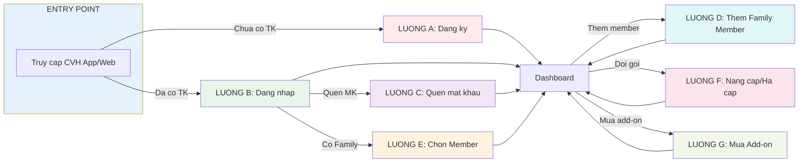
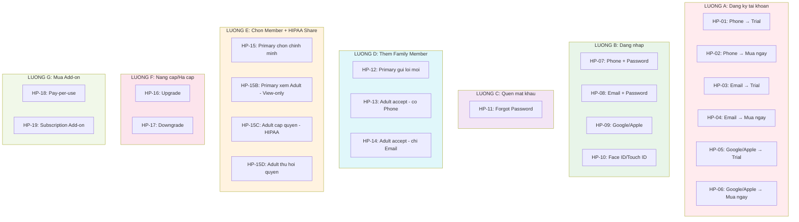

FUNCTION DANG KY TAI KHOAN (ACCOUNT REGISTRATION)

**Version:** 2.2.0
**Ngay tao:** 2025-01-02
**Cap nhat:** 2025-01-09
**Chuan bi boi:** BA IT (Dung)
**Nguon:** Account_Registration_Touchpoint_Flow_v2.md (v2.9)

---

## CHANGE LOG

| Version | Ngay       | Thay doi                                                                |
| ------- | ---------- | ----------------------------------------------------------------------- |
| 2.2.0   | 2025-01-09 | Them sub-flows: 2.5.1 HIPAA Grant, 2.5.2 Revoke, them HP-15C/D (22 HPs) |
| 2.1.0   | 2025-01-09 | FIX LUONG E: Cap nhat HIPAA Share, View-only mode, them HP-15B (20 HPs) |
| 2.0.0   | 2025-01-07 | Them section Happy Paths (19 HPs), cap nhat structure                   |
| 1.0.0   | 2025-01-02 | Khoi tao document voi 7 luong (A-G)                                     |

---

## CHANGE LOG

| Version | Ngay       | Thay doi                                              |
| ------- | ---------- | ----------------------------------------------------- |
| 2.0.0   | 2025-01-07 | Them section Happy Paths (19 HPs), cap nhat structure |
| 1.0.0   | 2025-01-02 | Khoi tao document voi 7 luong (A-G)                   |

---

**## 2.1 Tong quan Function**

**Mo ta:** Chuc nang dang ky va quan ly tai khoan nguoi dung CVH Healthcare. Ho tro nguoi dung >= 18 tuoi dang ky, dang nhap, quan ly gia dinh, va lua chon goi dich vu.

|            | Noi dung                                                                                             |
| ---------- | ---------------------------------------------------------------------------------------------------- |
| **INPUT**  | Nguoi dung >= 18 tuoi co nhu cau su dung dich vu y te tu xa (chua co tai khoan hoac da co tai khoan) |
| **OUTPUT** | Nguoi dung co tai khoan active, co goi dich vu phu hop, co the truy cap va su dung he thong          |

> **Luu y quan trong (v2.8):**
>
> - App chi danh cho nguoi >= 18 tuoi
> - Phone la primary identifier (bat buoc), Email la optional
> - OTP chi gui qua SMS (khong gui qua Email)
> - Khong ho tro Minor (nguoi < 18 tuoi)

---

**## 2.2 Cac tinh huong (Scenarios)**

| Tinh huong | Mo ta                                                        | Dan den Luong                       | Cau hoi |
| ---------- | ------------------------------------------------------------ | ----------------------------------- | ------- |
| A          | Nguoi dung moi muon tao tai khoan (Phone/Email/Google-Apple) | Luong A: Dang ky tai khoan          |         |
| B          | Nguoi dung da co tai khoan muon truy cap he thong            | Luong B: Dang nhap                  |         |
| C          | Nguoi dung quen mat khau can dat lai                         | Luong C: Quen mat khau              |         |
| D          | Primary muon them thanh vien truong thanh vao Family         | Luong D: Them Family Member (Adult) |         |
| E          | Nguoi dung co Family Members muon chon context               | Luong E: Chon Member khi Login      |         |
| F          | Nguoi dung muon thay doi goi dich vu hien tai                | Luong F: Nang cap/Ha cap goi        |         |
| G          | Nguoi dung muon mua them dich vu le hoac add-on              | Luong G: Mua Add-on Service         |         |

---

**## 2.3 Bang tong hop cac Luong**

| Luong | Ten                        | INPUT                               | OUTPUT                               | So tram | Cau hoi |
| ----- | -------------------------- | ----------------------------------- | ------------------------------------ | ------- | ------- |
| **A** | Dang ky tai khoan          | Nguoi dung >= 18 tuoi co Phone      | Tai khoan active + goi dich vu       | 14      |         |
| **B** | Dang nhap                  | Nguoi dung da co tai khoan          | Dang nhap thanh cong, vao Dashboard  | 5       |         |
| **C** | Quen mat khau              | Nguoi dung quen mat khau            | Mat khau duoc dat lai                | 7       |         |
| **D** | Them Family Member (Adult) | Primary gui loi moi cho Adult       | Adult co tai khoan, lien ket billing | 10      |         |
| **E** | Chon Member khi Login      | Nguoi dung co Family Members        | Dashboard load voi context dung      | 4       |         |
| **F** | Nang cap/Ha cap goi        | Nguoi dung muon thay doi goi        | Goi dich vu duoc cap nhat            | 9       |         |
| **G** | Mua Add-on Service         | Nguoi dung muon mua dich vu bo sung | Dich vu add-on duoc kich hoat        | 9       |         |

---

**## 2.4 So do cac Luong SONG SANG**



---

## 2.5 DANH SACH HAPPY PATHS

> **Happy Path** = Luong E2E KHONG co if/else, di thang tu dau den cuoi thanh cong.
> Moi Happy Path la 1 kich ban cu the ma user co the trai nghiem.

### 2.5.1 Tong hop Happy Paths

| HP ID      | Ten Happy Path                     | Luong | Dieu kien                                         | Duration  | Trang thai |
| ---------- | ---------------------------------- | ----- | ------------------------------------------------- | --------- | ---------- |
| **HP-01**  | New User → Phone → Trial           | A     | Dang ky Phone + Chon Trial                        | 5-8 min   | Done       |
| **HP-02**  | New User → Phone → Mua ngay        | A     | Dang ky Phone + Chon Mua goi                      | 8-12 min  | Done       |
| **HP-03**  | New User → Email → Trial           | A     | Dang ky Email + Chon Trial                        | 5-8 min   | Done       |
| **HP-04**  | New User → Email → Mua ngay        | A     | Dang ky Email + Chon Mua goi                      | 8-12 min  | Done       |
| **HP-05**  | New User → Google/Apple → Trial    | A     | Dang ky Social + Chon Trial                       | 4-6 min   | Done       |
| **HP-06**  | New User → Google/Apple → Mua ngay | A     | Dang ky Social + Chon Mua goi                     | 6-10 min  | Done       |
| **HP-07**  | Login Phone + Password             | B     | Co TK, dang nhap Phone                            | 1-2 min   | Done       |
| **HP-08**  | Login Email + Password             | B     | Co TK, dang nhap Email                            | 1-2 min   | Done       |
| **HP-09**  | Login Google/Apple                 | B     | Co TK, dang nhap Social                           | 30s-1 min | Done       |
| **HP-10**  | Login + Face ID/Touch ID           | B     | Da bat Biometric                                  | 5-10 sec  | Done       |
| **HP-11**  | Forgot Password                    | C     | Quen MK, reset qua OTP SMS                        | 2-3 min   | Done       |
| **HP-12**  | Primary gui loi moi Family         | D     | Primary → Chon goi → Thanh toan → Gui link        | 5-8 min   | Done       |
| **HP-13**  | Adult accept (co Phone)            | D     | Adult click link → OTP → Tao TK                   | 3-5 min   | Done       |
| **HP-14**  | Adult accept (chi Email)           | D     | Adult click link → Nhap Phone → OTP → Tao TK      | 4-6 min   | Done       |
| **HP-15**  | Primary chon context (chinh minh)  | E     | Login → Chon "Chinh toi" → Dashboard Primary      | 30s-1 min | Done       |
| **HP-15B** | Primary xem Adult (da share)       | E     | Login → Chon Adult da share → Dashboard View-only | 30s-1 min | Done       |
| **HP-15C** | Adult cap quyen cho Primary        | E     | Adult bat toggle → Ky HIPAA → Share active        | 1-2 min   | Done       |
| **HP-15D** | Adult thu hoi quyen                | E     | Adult tat toggle → Xac nhan → Revoke              | 30s-1 min | Done       |
| **HP-16**  | Upgrade goi                        | F     | Chon goi cao hon → Thanh toan proration           | 2-3 min   | Done       |
| **HP-17**  | Downgrade goi                      | F     | Chon goi thap hon → Co hieu luc ky sau            | 1-2 min   | Done       |
| **HP-18**  | Mua Pay-per-use                    | G     | Chon dich vu le → Thanh toan → Dung ngay          | 2-3 min   | Done       |
| **HP-19**  | Mua Subscription Add-on            | G     | Dang ky Chronic Management $30/thang              | 2-3 min   | Done       |

### 2.5.2 So do Happy Paths theo Luong



### 2.5.3 Phan bo Happy Paths theo Luong

| Luong    | Ten Luong                 | So HP  | HP IDs                        |
| -------- | ------------------------- | ------ | ----------------------------- |
| A        | Dang ky tai khoan         | 6      | HP-01 → HP-06                 |
| B        | Dang nhap                 | 4      | HP-07 → HP-10                 |
| C        | Quen mat khau             | 1      | HP-11                         |
| D        | Them Family Member        | 3      | HP-12 → HP-14                 |
| E        | Chon Member + HIPAA Share | 4      | HP-15, HP-15B, HP-15C, HP-15D |
| F        | Nang cap/Ha cap goi       | 2      | HP-16 → HP-17                 |
| G        | Mua Add-on Service        | 2      | HP-18 → HP-19                 |
| **TONG** |                           | **22** |                               |

### 2.5.4 Lien ket den Function Specs

| HP ID                         | Function Specs lien quan                                                          |
| ----------------------------- | --------------------------------------------------------------------------------- |
| HP-01 → HP-06                 | REG_01, REG_02, REG_03, REG_04, REG_05, REG_07, REG_08A/B, REG_09, REG_10, REG_11 |
| HP-07 → HP-10                 | REG_03A, REG_11                                                                   |
| HP-11                         | REG_03B                                                                           |
| HP-12 → HP-14                 | REG_FAM                                                                           |
| HP-15, HP-15B, HP-15C, HP-15D | REG_12 (HIPAA Share, View-only mode, Grant/Revoke Access)                         |
| HP-16 → HP-17                 | REG_12                                                                            |
| HP-18 → HP-19                 | REG_12                                                                            |

---

**## LUONG A: Dang ky tai khoan**

**Tinh huong:** Nguoi dung >= 18 tuoi muon tao tai khoan moi de su dung dich vu CVH Healthcare

|            | Noi dung                                                                 |
| ---------- | ------------------------------------------------------------------------ |
| **INPUT**  | Nguoi dung >= 18 tuoi co Phone (bat buoc), muon dang ky                  |
| **OUTPUT** | Tai khoan duoc tao thanh cong, goi dich vu duoc kich hoat, vao Dashboard |

**So tram:** 14

**### Hanh trinh day du:**

```
Truy cap -> Nhap Phone/Email -> Xac nhan -> Nhap thong tin -> Gui OTP -> Xac thuc OTP -> Tao tai khoan -> Chon hinh thuc -> [Trial/Mua goi] -> Thanh toan -> Kich hoat -> Face ID -> Email chao mung -> Dashboard -> END
```

**### Chi tiet tung tram:**

| #   | Tram                     | Mo ta                                                    | Actor           | Input           | Output              | Cau hoi |
| --- | ------------------------ | -------------------------------------------------------- | --------------- | --------------- | ------------------- | ------- |
| 1   | Truy cap he thong        | KH mo website CVH hoac mobile app                        | KH              | URL/App         | Trang chu           |         |
| 2   | Chon phuong thuc dang ky | KH nhap Phone/Email hoac chon Google/Apple               | KH              | Phone/Email     | Phuong thuc da chon |         |
| 3   | Xac nhan Phone/Email     | He thong kiem tra format va ton tai                      | System          | Phone/Email     | Validation result   |         |
| 4   | Nhap thong tin co ban    | KH nhap: Mat khau, Ho ten, DOB (>= 18 tuoi)              | KH              | Form data       | Thong tin co ban    |         |
| 5   | Gui OTP SMS              | He thong gui OTP qua SMS (chi SMS)                       | System          | Phone           | OTP da gui          |         |
| 6   | Xac thuc OTP             | KH nhap ma OTP 6 so                                      | KH              | OTP code        | OTP verified        |         |
| 7   | Tao tai khoan            | He thong tao ma benh nhan, luu thong tin, tao ho so y te | System          | Thong tin KH    | Account created     |         |
| 8   | Chon hinh thuc su dung   | KH chon: Dung thu mien phi hoac Mua ngay                 | KH              | Selection       | Hinh thuc da chon   |         |
| 9   | Chon goi dich vu         | KH chon goi: Connect $39 / Plus $99 / Premium $149       | KH              | Goi chon        | Order created       |         |
| 10  | Thanh toan               | Chuyen Payment Gateway, xu ly thanh toan                 | Payment Gateway | Payment info    | Payment result      |         |
| 11  | Kich hoat goi            | He thong kich hoat goi (Trial 14 ngay hoac Paid)         | System          | Payment success | Goi active          |         |
| 12  | Thiet lap Face ID        | Hoi bat Face ID / Touch ID (tuy chon)                    | KH              | Selection       | Biometric setup     |         |
| 13  | Gui email chao mung      | Gui email voi thong tin tai khoan va goi                 | System          | Account info    | Email sent          |         |
| 14  | Vao Dashboard            | Redirect KH vao Dashboard                                | System          | Account active  | Dashboard loaded    |         |

**Dac diem:**
**- Ho tro 3 phuong thuc: Phone, Email, Google/Apple**
**- Phone la bat buoc (primary identifier)**
**- OTP chi gui qua SMS**
**- Trial 14 ngay mien phi**
**- Goi Paid: Connect $39, Plus $99, Premium $149**

---

**## LUONG B: Dang nhap**

**Tinh huong:** Nguoi dung da co tai khoan muon dang nhap vao he thong

|            | Noi dung                                      |
| ---------- | --------------------------------------------- |
| **INPUT**  | Nguoi dung da co tai khoan (Phone hoac Email) |
| **OUTPUT** | Dang nhap thanh cong, vao duoc Dashboard      |

**So tram:** 5

**### Hanh trinh day du:**

```
Nhap Phone/Email -> Nhap mat khau -> Xac thuc -> Face ID (tuy chon) -> Dashboard -> END
```

**### Chi tiet tung tram:**

**| # | Tram | Mo ta | Actor | Input | Output | Cau hoi |**
**|---|------|-------|-------|-------|--------|---------|**
**| 1 | Nhap Phone/Email | KH nhap Phone hoac Email vao o input | KH | Phone/Email | Account found | |**
**| 2 | Nhap mat khau | KH nhap mat khau, co option Ghi nho dang nhap | KH | Password | Credentials | |**
**| 3 | Xac thuc dang nhap | He thong kiem tra mat khau va trang thai tai khoan | System | Credentials | Auth result | |**
**| 4 | Xac thuc sinh trac hoc | Neu da bat Face ID/Touch ID, hien thi xac thuc | System | Biometric | Auth complete | |**
**| 5 | Vao Dashboard | Dang nhap thanh cong, hien thi Dashboard | System | Auth complete | Dashboard | |**

**Dac diem:**
**- Ho tro Phone + Password, Email + Password, Google/Apple**
**- Toi da 5 lan nhap sai -> Khoa 30 phut**
**- Neu co Family Members -> Hien thi man chon member (LUONG E)**

---

**## LUONG C: Quen mat khau**

**Tinh huong:** Nguoi dung quen mat khau can dat lai

|            | Noi dung                                         |
| ---------- | ------------------------------------------------ |
| **INPUT**  | Nguoi dung quen mat khau (nhap Phone hoac Email) |
| **OUTPUT** | Mat khau duoc dat lai, dang nhap thanh cong      |

**So tram:** 7

**### Hanh trinh day du:**

```
Chon Quen mat khau -> Nhap Phone/Email -> Gui OTP SMS -> Nhap OTP -> Tao mat khau moi -> Cap nhat mat khau -> Tu dong dang nhap -> END
```

**### Chi tiet tung tram:**

**| # | Tram | Mo ta | Actor | Input | Output | Cau hoi |**
**|---|------|-------|-------|-------|--------|---------|**
**| 1 | Chon Quen mat khau | KH nhan "Quen mat khau?" tai man dang nhap | KH | Click | Reset flow started | |**
**| 2 | Nhap Phone/Email | KH nhap Phone hoac Email da dang ky | KH | Phone/Email | Account lookup | |**
**| 3 | Gui OTP SMS | He thong gui OTP qua SMS (chi SMS) | System | Phone | OTP sent | |**
**| 4 | Nhap OTP | KH nhap ma OTP 6 so (hieu luc 5 phut) | KH | OTP code | OTP verified | |**
**| 5 | Tao mat khau moi | KH nhap mat khau moi (min 8, 1 hoa, 1 so) | KH | New password | Password created | |**
**| 6 | Cap nhat mat khau | Luu mat khau moi, dang xuat tat ca thiet bi | System | New password | Password updated | |**
**| 7 | Tu dong dang nhap | Dang nhap tu dong, chuyen vao Dashboard | System | Credentials | Dashboard | |**

**Dac diem:**
**- OTP chi gui qua SMS (ke ca khi nhap Email)**
**- Hieu luc OTP: 5 phut**
**- Toi da 3 lan nhap sai -> Khoa 30 phut**
**- Tu dong dang xuat tat ca thiet bi khac**

---

**## LUONG D: Them Family Member (Adult)**

**Tinh huong:** Primary muon them thanh vien truong thanh (>= 18 tuoi) vao Family - Invitation Model

|            | Noi dung                                             |
| ---------- | ---------------------------------------------------- |
| **INPUT**  | Primary gui loi moi cho Adult (>= 18 tuoi)           |
| **OUTPUT** | Adult tu tao tai khoan, lien ket billing voi Primary |

**So tram:** 10

**### Hanh trinh day du:**

```
Vao Quan ly gia dinh -> Them thanh vien -> Nhap thong tin Adult -> Chon goi (Pre-paid) -> Thanh toan -> Tao Invitation -> Gui Link SMS/Email -> Adult click link -> Xac thuc OTP -> Tao tai khoan -> END
```

**### Chi tiet tung tram:**

**| # | Tram | Mo ta | Actor | Input | Output | Cau hoi |**
**|---|------|-------|-------|-------|--------|---------|**
**| 1 | Vao Quan ly gia dinh | Primary vao Dashboard -> Cai dat -> Quan ly gia dinh | Primary | Navigation | Family screen | |**
**| 2 | Chon Them thanh vien | Primary nhan "+ MOI THANH VIEN MOI" | Primary | Click | Add member form | |**
**| 3 | Nhap thong tin Adult | Nhap: Ho ten, Phone/Email, DOB (>= 18 tuoi), Quan he | Primary | Form data | Adult info | |**
**| 4 | Chon goi cho Adult | Chon goi: Connect $39 / Plus $99 / Premium $149 | Primary | Goi chon | Package selected | |**
**| 5 | Thanh toan | Primary thanh toan goi cho Adult TRUOC khi gui moi | Primary | Payment | Payment success | |**
**| 6 | Tao Invitation | He thong tao invitation record voi token | System | Adult info | Invitation created | |**
**| 7 | Gui Link SMS/Email | Gui link https://cvh.app/invite/xxx qua SMS/Email | System | Invitation | Link sent | |**
**| 8 | Adult click link | Adult click link tu tin nhan, validate invitation | Adult | Link click | Invitation validated | |**
**| 9 | Xac thuc OTP + Tao Password | Adult xac thuc OTP, tao mat khau, ky Consent | Adult | OTP + Password | Account ready | |**
**| 10 | Tao tai khoan Adult | Tao account, gan goi, lien ket family, vao Dashboard | System | Adult info | Adult active | |**

**Dac diem:**
**- Invitation Model (chuan Global Healthcare)**
**- Primary CHON GOI + THANH TOAN TRUOC**
**- Gui LINK WEB (khong gui OTP truc tiep)**
**- Adult tu tao tai khoan, vao Dashboard nhu user chinh**
**- Data Separation: Primary KHONG THE xem du lieu y te cua Adult**
**- Loi moi het han sau 7 ngay**

---

**## LUONG E: Chon Member khi Login**

**Tinh huong:** Nguoi dung co Family Members (Adult) can chon context sau khi dang nhap

|            | Noi dung                                                       |
| ---------- | -------------------------------------------------------------- |
| **INPUT**  | Nguoi dung co Family Members (Adult da accept invitation)      |
| **OUTPUT** | Dashboard load voi context dung (Primary hoac Adult view-only) |

**So tram:** 4

**### Hanh trinh day du:**

```
Dang nhap thanh cong -> Hien thi man chon member -> Chon member -> Vao Dashboard -> END
```

**### Chi tiet tung tram:**

**| # | Tram | Mo ta | Actor | Input | Output | Cau hoi |**
**|---|------|-------|-------|-------|--------|---------|**
**| 1 | Dang nhap thanh cong | He thong xac thuc, kiem tra co family members | System | Credentials | Auth + Family check | |**
**| 2 | Hien thi man chon member | Hien thi: "Chinh toi" + Adults (da share 🔗 / chua share 🔒) | System | Family list | Member selection screen | |**
**| 3 | Chon member | KH chon "Chinh toi" hoac Adult da share (View-only mode) | Primary | Selection | Context selected | |**
**| 4 | Vao Dashboard | Dashboard load voi context da chon. Neu xem Adult → Gui Push notification | System | Context | Dashboard | |**

**Dac diem (v2.9 - HIPAA Share):**
**- Chi hien thi Adults da accept invitation**
**- Adult DA SHARE (HIPAA Authorization): Primary co the xem Dashboard (View-only mode)**
**- Adult CHUA SHARE: Primary chi thay trong danh sach, KHONG vao duoc chi tiet**
**- View-only mode: Xem lich su kham ✅, Ket qua XN ✅, Don thuoc ✅ | Dat lich ❌, Chat ❌, Sua ho so ❌**
**- Adult nhan Push notification moi khi Primary xem ho so**
**- Adult co the thu hoi quyen xem bat cu luc nao tu Settings**

**### 2.5.1 Adult cap quyen xem cho Primary (HIPAA Authorization)**

> **Mo ta:** Adult co the cho phep Primary xem ho so suc khoe cua minh. Quy trinh tuan thu HIPAA voi e-signature.

**| # | Tram | Mo ta | Actor | Input | Output |**
**|---|------|-------|-------|-------|--------|**
**| 1 | Vao Settings | Dashboard → Settings → "Quyen rieng tu" | Adult | Navigation | Privacy screen |**
**| 2 | Chon "Chia se ho so" | Hien thi danh sach Primary co the share | Adult | Click | Share options |**
**| 3 | Bat toggle Share | Toggle "Cho phep [Ten Primary] xem ho so suc khoe" | Adult | Toggle ON | Share enabled |**
**| 4 | Hien thi HIPAA Consent | Modal HIPAA Authorization: Liet ke quyen, Giai thich, Yeu cau ky ten | System | Toggle | HIPAA modal |**
**| 5 | Ky ten dien tu | Adult ky ten bang ngon tay hoac nhap ten day du + checkbox dong y | Adult | E-signature | Signature captured |**
**| 6 | Xac nhan & Luu | Luu share_access = TRUE + timestamp + e-signature, Gui Push cho Primary | System | Confirmation | Share active |**

**Luu y:**
**- HIPAA Authorization bat buoc truoc khi share**
**- E-signature duoc luu lai de audit**
**- Adult nhan email xac nhan da cap quyen**

**### 2.5.2 Adult thu hoi quyen xem (Revoke Access)**

> **Mo ta:** Adult co the thu hoi quyen xem cua Primary bat cu luc nao, khong can ly do.

**| # | Tram | Mo ta | Actor | Input | Output |**
**|---|------|-------|-------|-------|--------|**
**| 1 | Vao Settings | Dashboard → Settings → "Quyen rieng tu" | Adult | Navigation | Privacy screen |**
**| 2 | Tat toggle Share | Toggle OFF "Cho phep [Ten Primary] xem ho so suc khoe" | Adult | Toggle OFF | Share disabled |**
**| 3 | Xac nhan thu hoi | Modal: "Ban co chac muon thu hoi quyen xem?" | System | Toggle | Confirm modal |**
**| 4 | Xu ly & Thong bao | Cap nhat share_access = FALSE, Gui Push cho Primary | System | Confirmation | Access revoked |**

**Luu y:**
**- Thu hoi co hieu luc NGAY LAP TUC**
**- Primary khong can dong y**
**- Adult co the bat lai share bat cu luc nao (can ky HIPAA Authorization moi)**

---

**## LUONG F: Nang cap/Ha cap goi**

**Tinh huong:** Nguoi dung muon thay doi goi dich vu hien tai (Upgrade hoac Downgrade)

|            | Noi dung                                      |
| ---------- | --------------------------------------------- |
| **INPUT**  | Nguoi dung muon thay doi goi dich vu hien tai |
| **OUTPUT** | Goi dich vu duoc cap nhat theo yeu cau        |

**So tram:** 9

**### Hanh trinh day du:**

```
Vao Quan ly goi -> Kiem tra trang thai -> Hien thi cac goi -> Chon goi moi -> Hien thi breakdown chi phi -> Xac nhan -> Thanh toan (Upgrade) -> Kich hoat goi moi -> Xac nhan thanh cong -> END
```

**### Chi tiet tung tram:**

**| # | Tram | Mo ta | Actor | Input | Output | Cau hoi |**
**|---|------|-------|-------|-------|--------|---------|**
**| 1 | Vao Quan ly goi | Dashboard -> Settings -> Quan ly goi dich vu | KH | Navigation | Package screen | |**
**| 2 | Kiem tra trang thai | Kiem tra subscription status: ACTIVE/Past Due | System | Subscription | Status check | |**
**| 3 | Hien thi cac goi | Hien thi goi cao hon (Upgrade) hoac thap hon (Downgrade) | System | Current plan | Available plans | |**
**| 4 | Chon goi moi | KH tap vao goi muon chuyen | KH | Selection | New plan selected | |**
**| 5 | Hien thi breakdown chi phi | Chi tiet: Phi proration (Upgrade) hoac thong bao (Downgrade) | System | Plans diff | Cost breakdown | |**
**| 6 | Xac nhan | KH xac nhan thay doi | KH | Confirmation | Confirmed | |**
**| 7 | Thanh toan | Upgrade: Thanh toan proration. Downgrade: Khong can thanh toan | Payment Gateway | Payment info | Payment result | |**
**| 8 | Kich hoat goi moi | Upgrade: Co hieu luc ngay. Downgrade: Co hieu luc tu ky sau | System | Confirmation | Plan updated | |**
**| 9 | Xac nhan thanh cong | Hien thi thong bao thanh cong | System | Result | Success message | |**

**Dac diem:**
**- Upgrade: Toi da 2 lan/chu ky, co hieu luc ngay, thanh toan proration**
**- Downgrade: Toi da 1 lan/chu ky, cooldown 24h sau upgrade, co hieu luc tu ky sau**
**- Downgrade khong hoan tien cho chu ky hien tai**
**- Quota moi = Quota goi moi - So luot da dung (KHONG reset)**

---

**## LUONG G: Mua Add-on Service**

**Tinh huong:** Nguoi dung muon mua them dich vu le (pay-per-use) hoac add-on subscription

|            | Noi dung                                        |
| ---------- | ----------------------------------------------- |
| **INPUT**  | Nguoi dung muon mua them dich vu bo sung        |
| **OUTPUT** | Dich vu add-on duoc kich hoat, san sang su dung |

**So tram:** 9

**### Hanh trinh day du:**

```
Vao Marketplace -> Kiem tra trang thai -> Hien thi danh sach -> Chon dich vu -> Xem chi tiet -> Xac nhan -> Thanh toan -> Cap quyen su dung -> Xac nhan thanh cong -> END
```

**### Chi tiet tung tram:**

**| # | Tram | Mo ta | Actor | Input | Output | Cau hoi |**
**|---|------|-------|-------|-------|--------|---------|**
**| 1 | Vao Marketplace | Dashboard -> Settings -> Dich vu bo sung | KH | Navigation | Marketplace | |**
**| 2 | Kiem tra trang thai | ACTIVE -> Hien thi. Past Due -> Chan hoac cho phep | System | Subscription | Status check | |**
**| 3 | Hien thi danh sach | Pay-per-use: Video $50, Health Check $100, etc. Subscription: Chronic $30/thang | System | Available services | Service list | |**
**| 4 | Chon dich vu | KH tap vao dich vu muon mua | KH | Selection | Service selected | |**
**| 5 | Xem chi tiet | Mo ta, gia, so luong (pay-per-use) hoac proration (subscription) | System | Service | Service details | |**
**| 6 | Xac nhan | KH xac nhan mua | KH | Confirmation | Order created | |**
**| 7 | Thanh toan | Chuyen Payment Gateway, xu ly thanh toan | Payment Gateway | Payment info | Payment result | |**
**| 8 | Cap quyen su dung | Ghi nhan luot da mua, cho phep su dung ngay | System | Payment success | Service active | |**
**| 9 | Xac nhan thanh cong | Hien thi thong bao thanh cong va so luot | System | Result | Success message | |**

**Dac diem:**
**- Pay-per-use: Mua bao nhieu dung bay nhieu, KHONG het han**
**- Subscription Add-on: Tinh phi proration, billing date sync voi goi chinh**
**- Thu tu uu tien: Tru luot mua le TRUOC, sau do moi tru quota goi**
**- Moi member co luot add-on rieng (KHONG share)**

---

**## Ghi chu them**

### Danh sach Goi dich vu

| Goi          | Gia        | Quyen loi                      |
| ------------ | ---------- | ------------------------------ |
| Care Connect | $39/thang  | Video visits, Chat, AI         |
| Care Plus    | $99/thang  | Connect + Lab, Mental Health   |
| Care Premium | $149/thang | Plus + Family, Premium support |

### Danh sach Add-on Services

| Loai         | Dich vu                  | Gia       |
| ------------ | ------------------------ | --------- |
| Pay-per-use  | Schedule Video Visit     | $50/lan   |
| Pay-per-use  | Annual Health Check      | $100/lan  |
| Pay-per-use  | Medication Review        | $25/lan   |
| Pay-per-use  | Lab Results Consultation | $20/lan   |
| Subscription | Chronic Management       | $30/thang |

---

**End of Document**
