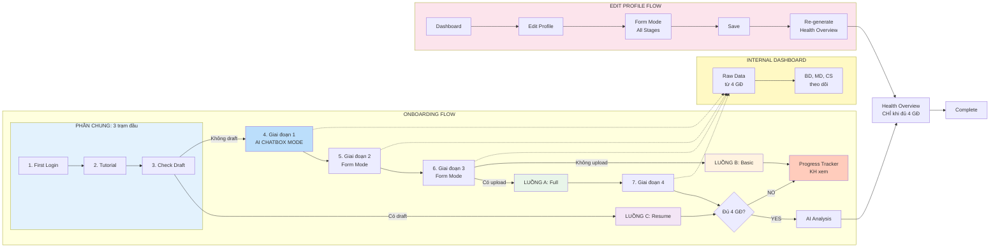

FUNCTION ONBOARDING - MEDICAL PROFILE & HEALTH OVERVIEW

## 2.1 Tổng quan Function

**Mô tả:** Chức năng thu thập thông tin y tế đầy đủ cho bệnh nhân mới đăng ký, tạo Medical Profile và Health Overview qua 4 giai đoạn thu thập dữ liệu (30-45 phút). Giai đoạn 1 sử dụng **AI Chatbox Mode** để tạo trải nghiệm tự nhiên như nói chuyện với bác sĩ.

|            | Nội dung                                                                                                                          |
| ---------- | --------------------------------------------------------------------------------------------------------------------------------- |
| **INPUT**  | Bệnh nhân mới đăng ký, lần đầu login, chưa có hồ sơ y tế (Medical Profile)                                                        |
| **OUTPUT** | Medical Profile hoàn chỉnh (4 giai đoạn, ~100 items + files), Health Overview **CHỈ** tạo khi đủ 4 GĐ, Progress Tracker cho KH chưa hoàn thành |

## 2.2 Các tình huống (Scenarios)

| Tình huống | Mô tả                                                                  | Dẫn đến Luồng              | Câu hỏi |
| ---------- | ---------------------------------------------------------------------- | -------------------------- | ------- |
| A          | Bệnh nhân mới hoàn thành đầy đủ 4 giai đoạn thu thập (AI Chatbox Mode) | Luồng A: Full Onboarding   |         |
| B          | Bệnh nhân chỉ hoàn thành 3 giai đoạn đầu (không upload)                | Luồng B: Basic Onboarding  |         |
| C          | Bệnh nhân có draft lưu sẵn, tiếp tục từ vị trí đã lưu                  | Luồng C: Resume Onboarding |         |
| D          | Bệnh nhân đã onboarding, chỉnh sửa Profile từ Dashboard (Form Mode)    | Luồng D: Edit Profile      |         |

## 2.3 Bảng tổng hợp các Luồng

| Luồng | Tên               | INPUT                                   | OUTPUT                                                      | Số trạm | Trạng thái | Link                                                   |
| ----- | ----------------- | --------------------------------------- | ----------------------------------------------------------- | ------- | ---------- | ------------------------------------------------------ |
| **A** | Full Onboarding   | BN mới + Upload files (AI Chatbox Mode) | Complete Health Overview (8-system score) - CHỈ khi đủ 4 GĐ | 10      | ✅ Done    | [hp-01-full-onboarding.md](./hp-01-full-onboarding.md) |
| **B** | Basic Onboarding  | BN mới (không upload)                   | **Progress Tracker** (chưa đủ 4 GĐ để tạo Health Overview)  | 8       | 📋 Planned | -                                                      |
| **C** | Resume Onboarding | BN có draft (7 ngày)                    | Complete Health Overview / Progress Tracker                 | 7       | 📋 Planned | -                                                      |
| **D** | Edit Profile      | BN đã onboarding (Form Mode)            | Updated Health Overview                                     | 6       | 📋 Planned | -                                                      |

## 2.4 Sơ đồ các Luồng SONG SONG



---

## 2.5 HAI CHẾ ĐỘ THU THẬP THÔNG TIN

| Chế độ              | Bối cảnh                                        | INPUT              | OUTPUT                  | Giao diện              |
| ------------------- | ----------------------------------------------- | ------------------ | ----------------------- | ---------------------- |
| **AI Chatbox Mode** | First Login (Onboarding) - Giai đoạn 1          | Pre-fill data (Họ tên, Giới tính, DOB) + User text messages | Structured medical data | Chatbox conversational |
| **Form Mode**       | Edit Profile (sau onboarding) + Giai đoạn 2,3,4 | Form fields        | Updated medical data    | Form truyền thống      |

> **Lưu ý:** Giai đoạn 2, 3, 4 vẫn sử dụng Form Mode trong cả hai bối cảnh (Onboarding và Edit).

### AI Chatbox Mode - Đặc điểm

- **Pre-fill thông tin cơ bản** (Họ tên, Giới tính, DOB) từ Registration → KH xác nhận hoặc chỉnh sửa
- AI Agent thu thập thông tin thông qua hỏi thoại tự nhiên
- Trải nghiệm như đang nói chuyện với bác sĩ
- Tự động extract structured data từ conversation
- Skip logic thông minh dựa trên câu trả lời
- Validation real-time trong quá trình hỏi đáp

### Form Mode - Đặc điểm

- Hiển thị đầy đủ các field để user chỉnh sửa trực tiếp
- Phù hợp khi cần cập nhật nhanh thông tin cụ thể
- Validation khi submit form
- Pre-fill data từ AI Chatbox (nếu có)

---

## LUỒNG A: Full Onboarding

**Tình huống:** Bệnh nhân mới hoàn thành đầy đủ 4 giai đoạn, bao gồm upload xét nghiệm và hồ sơ y tế

|            | Nội dung                                                                                     |
| ---------- | -------------------------------------------------------------------------------------------- |
| **INPUT**  | Bệnh nhân mới đăng ký, lần đầu login + Có tài liệu để upload                                 |
| **OUTPUT** | Complete Health Overview với 8-system score, 10-year disease predictions, 12-month care plan |

**Số trạm:** 10

> **🆕 v5.0:** Bỏ Output 1, 2, 3 hiển thị cho KH. Chỉ tạo Health Overview khi hoàn thành đủ 4 giai đoạn. Raw data từ các stage được lưu cho Internal Dashboard (BD, MD, CS theo dõi).

### Hành trình đầy đủ:

```
First Login → Tutorial → Check Draft → Giai đoạn 1 → Giai đoạn 2 → Giai đoạn 3 → Giai đoạn 4 → AI Analysis → Health Overview → Complete
```

### Chi tiết từng trạm:

| #   | Trạm            | Mô tả                                                                                                                                                 | Actor       | Input                                                       | Output                     | Câu hỏi |
| --- | --------------- | ----------------------------------------------------------------------------------------------------------------------------------------------------- | ----------- | ----------------------------------------------------------- | -------------------------- | ------- |
| 1   | First Login     | BN lần đầu đăng nhập vào hệ thống sau đăng ký                                                                                                         | KH          | Account credentials                                         | Login session              |         |
| 2   | Tutorial        | Xem video hướng dẫn 2-3 phút (có thể Skip)                                                                                                            | KH          | Login session                                                | Tutorial completed/skipped |         |
| 3   | Check Draft     | Kiểm tra có draft lưu sẵn trong 7 ngày không                                                                                                          | System      | User ID                                                      | Draft status               |         |
| 4   | Giai đoạn 1     | **AI CHATBOX MODE** - Basic Profile & Medical Essentials (5-7 phút, 15-20 items): AI Agent **xác nhận thông tin cơ bản pre-fill từ Registration** (Họ tên, Giới tính, DOB), sau đó hỏi đáp thu thập bệnh sử, thuốc, dị ứng | KH/AI Agent | Thông tin cơ bản (pre-fill từ Registration), bệnh sử, thuốc, dị ứng (KH trả lời qua AI chat) | Stage 1 raw data → Internal |         |
| 5   | Giai đoạn 2     | Extended Medical & Social History (8-10 phút, 30-40 items): Phẫu thuật, gia đình, nhập viện, xã hội                                                   | KH/AI       | Phẫu thuật, gia đình, nhập viện, xã hội (KH điền form)       | Stage 2 raw data → Internal |         |
| 6   | Giai đoạn 3     | Lifestyle Assessment & Vaccination (10-12 phút, 45-55 items): 4 trụ cột Lifestyle + Vaccination                                                       | KH/AI       | 4 trụ cột Lifestyle + Vaccination (KH điền form)             | Stage 3 raw data → Internal |         |
| 7   | Giai đoạn 4     | Objective Data Upload (5-15 phút): Lab tests, Imaging, Wearables, Medical records                                                                     | KH/AI       | Lab tests, Imaging, Wearables, Medical records (KH upload)   | Stage 4 raw data → Internal |         |
| 8   | AI Analysis     | AI phân tích toàn bộ dữ liệu từ 4 giai đoạn (20-30 giây)                                                                                              | AI          | Stage 1-4 raw data (toàn bộ dữ liệu thu thập)               | Health analysis            |         |
| 9   | Health Overview | Tạo COMPLETE HEALTH OVERVIEW - 360° health picture + Full care plan                                                                                   | AI          | Health analysis                                              | Health Overview            |         |
| 10  | Complete        | BN sẵn sàng sử dụng đầy đủ dịch vụ CVH                                                                                                                | System      | Health Overview                                              | Onboarding complete        |         |

**Đặc điểm:**

- Thời gian hoàn thành: 30-45 phút
- **Consolidated Output:** Health Overview CHỈ tạo khi đủ 4 giai đoạn
- Raw data từ mỗi stage lưu vào Internal Dashboard (BD, MD, CS theo dõi)
- AI OCR cho upload files (PDF, JPG, DICOM)
- Complete Health Overview với 8 body systems risk scores
- 10-year disease predictions (CVD, Diabetes, etc.)
- 12-month personalized care plan

---

## LUỒNG B: Basic Onboarding

**Tình huống:** Bệnh nhân mới chỉ hoàn thành 3 giai đoạn đầu, không upload tài liệu (chưa đủ 4 GĐ để tạo Health Overview)

|            | Nội dung                                                                  |
| ---------- | ------------------------------------------------------------------------- |
| **INPUT**  | Bệnh nhân mới đăng ký, lần đầu login, KHÔNG có tài liệu để upload         |
| **OUTPUT** | **Progress Tracker** (chưa đủ 4 GĐ), không tạo Health Overview            |

**Số trạm:** 8

> **🆕 v5.0:** Không tạo Health Overview khi chưa đủ 4 giai đoạn. KH sẽ thấy Progress Tracker và được khuyến khích hoàn thành Giai đoạn 4 để có Health Overview.

### Hành trình đầy đủ:

```
First Login → Tutorial → Check Draft → Giai đoạn 1 → Giai đoạn 2 → Giai đoạn 3 → Progress Tracker → Complete (Partial)
```

### Chi tiết từng trạm:

| #   | Trạm             | Mô tả                                                                                                                 | Actor       | Input                                                       | Output                      | Câu hỏi |
| --- | ---------------- | --------------------------------------------------------------------------------------------------------------------- | ----------- | ----------------------------------------------------------- | --------------------------- | ------- |
| 1   | First Login      | BN lần đầu đăng nhập vào hệ thống sau đăng ký                                                                         | KH          | Account credentials                                         | Login session               |         |
| 2   | Tutorial         | Xem video hướng dẫn 2-3 phút (có thể Skip)                                                                            | KH          | Login session                                                | Tutorial completed/skipped  |         |
| 3   | Check Draft      | Kiểm tra có draft lưu sẵn trong 7 ngày không                                                                          | System      | User ID                                                      | Draft status                |         |
| 4   | Giai đoạn 1      | **AI CHATBOX MODE** - Basic Profile & Medical Essentials (5-7 phút, 15-20 items): AI Agent **xác nhận thông tin cơ bản pre-fill từ Registration** (Họ tên, Giới tính, DOB), sau đó hỏi đáp thu thập bệnh sử, thuốc, dị ứng | KH/AI Agent | Thông tin cơ bản (pre-fill từ Registration), bệnh sử, thuốc, dị ứng (KH trả lời qua AI chat) | Stage 1 raw data → Internal |         |
| 5   | Giai đoạn 2      | Extended Medical & Social History (8-10 phút, 30-40 items)                                                            | KH/AI       | Phẫu thuật, gia đình, nhập viện, xã hội (KH điền form)       | Stage 2 raw data → Internal |         |
| 6   | Giai đoạn 3      | Lifestyle Assessment & Vaccination (10-12 phút, 45-55 items)                                                          | KH/AI       | 4 trụ cột Lifestyle + Vaccination (KH điền form)             | Stage 3 raw data → Internal |         |
| 7   | Progress Tracker | Hiển thị 3/4 stages hoàn thành + CTA "Tiếp tục Bước 4" + Lý do cần hoàn thành                                         | System      | Stage 1+2+3 data                                             | Progress view (75%)         |         |
| 8   | Complete Partial | BN có thể sử dụng dịch vụ cơ bản, được nhắc hoàn thành GĐ4 để có Health Overview                                      | System      | Progress Tracker data (3/4 GĐ)                               | Partial onboarding          |         |

**Đặc điểm:**

- Thời gian hoàn thành: 25-35 phút (ngắn hơn)
- **KHÔNG tạo Health Overview** (chưa đủ 4 giai đoạn theo v5.0)
- Progress Tracker hiển thị tiến độ và khuyến khích hoàn thành GĐ4
- Raw data từ 3 stages lưu vào Internal Dashboard
- Có thể bổ sung Giai đoạn 4 bất kỳ lúc nào để nhận Health Overview đầy đủ

---

## LUỒNG C: Resume Onboarding

**Tình huống:** Bệnh nhân đã bắt đầu onboarding trước đó nhưng chưa hoàn thành, tiếp tục từ draft (lưu 7 ngày)

|            | Nội dung                                                |
| ---------- | ------------------------------------------------------- |
| **INPUT**  | Bệnh nhân có draft lưu sẵn (chưa quá 7 ngày), login lại |
| **OUTPUT** | Complete/Basic Health Overview (tùy hoàn thành đến đâu) |

**Số trạm:** 7 (tối thiểu, tùy thuộc vị trí resume)

### Hành trình đầy đủ:

```
First Login → Check Draft → Resume Session → [Continue from saved stage] → ... → AI Analysis → Health Overview → Complete
```

### Chi tiết từng trạm:

| #   | Trạm            | Mô tả                                          | Actor  | Input               | Output              | Câu hỏi |
| --- | --------------- | ---------------------------------------------- | ------ | ------------------- | ------------------- | ------- |
| 1   | First Login     | BN đăng nhập lại vào hệ thống                  | KH     | Account credentials | Login session       |         |
| 2   | Check Draft     | Kiểm tra và tìm thấy draft trong 7 ngày        | System | User ID             | Draft found         |         |
| 3   | Resume Session  | Hiển thị thông báo resume, KH đồng ý tiếp tục  | KH     | Draft data          | Resume confirmed    |         |
| 4   | Continue Stage  | Tiếp tục từ giai đoạn đã lưu (1, 2, 3, hoặc 4) | KH/AI  | Draft data (giai đoạn đã lưu + câu trả lời KH) | Stage completed     |         |
| 5   | AI Analysis     | AI phân tích dữ liệu                           | AI     | Toàn bộ raw data các giai đoạn đã hoàn thành   | Health analysis     |         |
| 6   | Health Overview | Tạo Health Overview                            | AI     | Health analysis data (kết quả phân tích AI)     | Health Overview     |         |
| 7   | Complete        | BN sẵn sàng sử dụng đầy đủ dịch vụ CVH         | System | Health Overview     | Onboarding complete |         |

**Đặc điểm:**

- Draft tự động lưu mỗi 30 giây
- Draft hết hạn sau 7 ngày
- Hiển thị progress bar cho biết đã hoàn thành đến đâu
- Thông báo nhắc nhở BN hoàn thành nếu có draft chưa xong
- Có thể chọn "Start Fresh" để bắt đầu lại từ đầu

---

## LUỒNG D: Edit Profile

**Tình huống:** Bệnh nhân đã hoàn thành onboarding, cần chỉnh sửa thông tin Profile từ Dashboard

|            | Nội dung                                                     |
| ---------- | ------------------------------------------------------------ |
| **INPUT**  | Bệnh nhân đã có Health Overview, cần cập nhật thông tin y tế |
| **OUTPUT** | Updated Health Overview (re-generated sau khi lưu thay đổi)  |

**Số trạm:** 6

### Hành trình đầy đủ:

```
Dashboard → Edit Profile → Form Mode (All Stages) → Save → Re-generate Health Overview → Complete
```

### Chi tiết từng trạm:

| #   | Trạm           | Mô tả                                                                                | Actor | Input                | Output              | Câu hỏi |
| --- | -------------- | ------------------------------------------------------------------------------------ | ----- | -------------------- | ------------------- | ------- |
| 1   | Dashboard      | BN truy cập Dashboard từ App                                                         | KH    | Login session        | Dashboard view      |         |
| 2   | Edit Profile   | BN chọn "Edit Profile" hoặc "Update Medical Info"                                    | KH    | Profile data hiện tại | Edit mode           |         |
| 3   | Form Mode      | **FORM MODE** - Hiển thị tất cả thông tin theo 4 giai đoạn để BN chỉnh sửa trực tiếp | KH    | Current profile data | Updated form data   |         |
| 4   | Save           | BN bấm Save để lưu thay đổi                                                          | KH    | Updated form data    | Data saved          |         |
| 5   | Re-generate HO | AI tự động re-generate Health Overview với data mới                                  | AI    | Updated profile      | New Health Overview |         |
| 6   | Complete       | BN xem Health Overview đã cập nhật                                                   | KH    | New Health Overview  | View updated HO     |         |

**Đặc điểm:**

- Sử dụng **Form Mode** (không phải AI Chatbox)
- Hiển thị tất cả fields để user chỉnh sửa trực tiếp
- Pre-fill data hiện tại từ profile
- Validation khi submit
- Tự động re-generate Health Overview sau khi lưu
- Không cần làm lại 4 giai đoạn - chỉ update phần cần thay đổi

### So sánh với Onboarding:

| Đặc điểm        | Onboarding (LUỒNG A/B) | Edit Profile (LUỒNG D)  |
| --------------- | ---------------------- | ----------------------- |
| Giai đoạn 1     | AI Chatbox Mode        | Form Mode               |
| Giai đoạn 2-4   | Form Mode              | Form Mode               |
| Thời gian       | 30-45 phút             | 5-15 phút               |
| Pre-fill data   | Không (mới)            | Có (data hiện tại)      |
| Required fields | Tất cả                 | Chỉ thay đổi cần update |

---

## 3. CONSOLIDATED OUTPUT SYSTEM

> **🆕 Version 5.0:** Thay đổi từ Progressive Output sang Consolidated Output. Health Overview **CHỈ** được tạo khi KH hoàn thành đủ 4 giai đoạn. KH chưa hoàn thành sẽ thấy Progress Tracker.

### 3.1 Tổng quan Output System mới

| Thành phần              | Đối tượng xem | Điều kiện                                        | Mô tả                                                  |
| ----------------------- | ------------- | ------------------------------------------------ | ------------------------------------------------------ |
| **Raw Data (Stage 1-4)** | Internal (BD, MD, CS) | Sau mỗi stage                          | Dữ liệu thô từ mỗi giai đoạn - dùng để theo dõi KH     |
| **Progress Tracker**    | KH            | Chưa đủ 4 GĐ                                     | Hiển thị tiến độ (VD: 3/4 - 75%), CTA tiếp tục         |
| **Health Overview**     | KH            | **CHỈ khi đủ 4 GĐ**                              | 360° health picture + 8-system score + Care plan       |

### 3.2 Progress Tracker (cho KH khi chưa đủ 4 GĐ)

| Thành phần           | Mô tả                                                      |
| -------------------- | ---------------------------------------------------------- |
| Progress Bar         | Hiển thị X/4 stages - Y%                                   |
| Checklist            | Danh sách các bước đã hoàn thành / chưa hoàn thành         |
| CTA Button           | "Tiếp tục Bước X" để khuyến khích KH hoàn thành            |
| Explanation          | Giải thích lý do cần hoàn thành đủ 4 bước để có Health Overview |

### 3.3 Internal Dashboard (cho BD, MD, CS)

| Chức năng            | Mô tả                                                      |
| -------------------- | ---------------------------------------------------------- |
| Raw Data View        | Xem dữ liệu thô từ mỗi stage đã thu thập                   |
| Progress Tracking    | Theo dõi tiến độ onboarding của từng KH                    |
| Early Alerts         | Nhận cảnh báo sớm (VD: PHQ-2 cao, Smoker, Allergies)       |
| Actions              | Gọi nhắc nhở, Gửi email, Ghi chú                           |

### 3.4 ~~DEPRECATED~~ Progressive Outputs

> ⚠️ **DEPRECATED (v5.0):** Các output sau KHÔNG còn hiển thị cho KH. Chỉ lưu raw data cho Internal.

| Output (DEPRECATED)                           | Trạng thái          |
| --------------------------------------------- | ------------------- |
| ~~Output 1: Medical Profile Card~~            | ❌ BỎ - Internal only |
| ~~Output 2: Comprehensive Risk Profile~~      | ❌ BỎ - Internal only |
| ~~Output 3: Lifestyle Performance Dashboard~~ | ❌ BỎ - Internal only |

**Lý do thay đổi:**
1. **Chất lượng Health Overview:** Cần đủ dữ liệu từ 4 giai đoạn để đảm bảo độ chính xác
2. **Tránh nhầm lẫn:** Output partial/incomplete có thể gây hiểu nhầm về tình trạng sức khỏe
3. **Internal visibility:** BD, MD, CS cần theo dõi dữ liệu KH đang nhập để hỗ trợ kịp thời

---

## 4. SMART FEATURES

### 4.1 Skip Logic

| Điều kiện         | Hành động                                 |
| ----------------- | ----------------------------------------- |
| Giới tính = Nam   | Bỏ qua câu hỏi OBGYN trong Family History |
| Giới tính = Nữ    | Hiển thị thêm OBGYN section               |
| Không có bệnh nền | Giảm số câu hỏi chi tiết                  |
| Có nhiều bệnh nền | Mở rộng câu hỏi liên quan                 |

### 4.2 Photo Upload (AI OCR)

| Loại file          | Xử lý                           |
| ------------------ | ------------------------------- |
| Lab test PDF/JPG   | AI OCR → Auto-fill lab values   |
| Imaging DICOM      | AI analysis → Extract findings  |
| Medical records    | AI extract → Populate history   |
| Prescription photo | AI OCR → Add to medication list |

### 4.3 Auto-Save Rules

| Rule                | Value                   |
| ------------------- | ----------------------- |
| Auto-save interval  | Mỗi 30 giây             |
| Draft expiration    | 7 ngày                  |
| Resume notification | Khi login, nếu có draft |
| Progress tracking   | Hiển thị % hoàn thành   |

---

## 5. VALIDATION TRIGGERS

### 5.1 Field-Level Validation

| Trường          | Rule                          |
| --------------- | ----------------------------- |
| Date of Birth   | Must be valid date, < today   |
| Medication name | Match against RxNorm database |
| Allergy name    | Match against SNOMED CT       |
| Lab values      | Within physiological range    |

### 5.2 Stage Completion Rules

| Giai đoạn | Required fields                           | Minimum completion |
| --------- | ----------------------------------------- | ------------------ |
| Stage 1   | Basic info + At least 1 condition checked | 100% basic info    |
| Stage 2   | Family history section                    | 80% questions      |
| Stage 3   | All 4 pillars started                     | 70% questions      |
| Stage 4   | Optional                                  | 0% (can skip)      |

---

## 6. KPI & METRICS - THEO 4 GIAI ĐOẠN

### 6.1 Completion Rates

| Metric                     | Target | Mô tả                                |
| -------------------------- | ------ | ------------------------------------ |
| Stage 1 completion         | > 95%  | Basic profile - bắt buộc             |
| Stage 2 completion         | > 85%  | Extended history                     |
| Stage 3 completion         | > 80%  | Lifestyle assessment                 |
| Stage 4 completion         | > 60%  | Upload (optional nhưng khuyến khích) |
| Full completion (4 stages) | > 55%  | Hoàn thành cả 4 giai đoạn            |

### 6.2 Time Metrics

| Giai đoạn | Target time | Max acceptable |
| --------- | ----------- | -------------- |
| Stage 1   | 5-7 phút    | 10 phút        |
| Stage 2   | 8-10 phút   | 15 phút        |
| Stage 3   | 10-12 phút  | 18 phút        |
| Stage 4   | 5-15 phút   | 20 phút        |
| Total     | 30-45 phút  | 60 phút        |

### 6.3 Quality Metrics

| Metric                   | Target                  |
| ------------------------ | ----------------------- |
| Data completeness        | > 85% fields filled     |
| Resume success rate      | > 90%                   |
| Health Overview accuracy | > 90% (validated by MD) |
| User satisfaction        | > 4.5/5                 |

---

## CHANGE LOG

| Version | Date       | Author  | Changes                                                                                                                                                                                                                                        |
| ------- | ---------- | ------- | ---------------------------------------------------------------------------------------------------------------------------------------------------------------------------------------------------------------------------------------------- |
| 1.6     | 2026-03-09 | BA Team | **Stage 1 Pre-fill từ Registration:** Giai đoạn 1 (Luồng A/B) cập nhật: Thông tin cơ bản (Họ tên, Giới tính, DOB) giờ được **pre-fill từ Function Registration - Registration** thay vì thu thập mới. AI Agent xác nhận thông tin đã có, KH chỉ cần confirm hoặc chỉnh sửa. Cập nhật cột Input và Mô tả cho trạm Giai đoạn 1. |
| 1.5     | 2026-01-26 | BA Team | Chuẩn hóa cột Input toàn bộ file: thay thế tất cả condition/status/event bằng dữ liệu cụ thể (Luồng A/B/C/D).                                                                                                                                  |
| 1.4     | 2026-01-26 | BA Team | Sửa cột Input các giai đoạn 1-4: thay điều kiện trạng thái bằng dữ liệu thực tế đầu vào. Thêm dấu tiếng Việt toàn bộ file.                                                                                                                    |
| 1.3     | 2026-01-23 | BA Team | **CR-001:** Consolidated Output System (v5.0). Bỏ Output 1,2,3 cho KH. Health Overview CHỈ tạo khi đủ 4 GĐ. Thêm Progress Tracker, Internal Dashboard. LUỒNG A: 13→10 trạm. LUỒNG B: 11→8 trạm + Progress Tracker. Section 3 rewrite. |
| 1.2     | 2026-01-20 | BA Team | Added AI Chatbox Mode for Giai đoạn 1 (Onboarding). Added Section 2.5 "Hai chế độ thu thập thông tin". Added LUỒNG D: Edit Profile (Form Mode, 6 trạm). Updated mermaid diagram with EDIT PROFILE flow.                                        |
| 1.1     | 2026-01-20 | BA Team | Removed HIPAA Consent (already in Registration flow). Updated station counts: Full (13), Basic (11), Resume (7).                                                                                                                               |
| 1.0     | 2026-01-20 | BA Team | Initial high-level-flow created from Onboarding_Touchpoint_Flow_v1.md. 3 LUỒNGs: Full Onboarding (14 trạm), Basic Onboarding (12 trạm), Resume Onboarding (8 trạm). Progressive output system. Smart features (Skip Logic, AI OCR, Auto-Save). |

---

## TÀI LIỆU THAM CHIẾU

- [Onboarding_Touchpoint_Flow_v1.md](../base/Onboarding_Touchpoint_Flow_v1.md) - Chi tiết đầy đủ 4 giai đoạn
- [data_collection_4_stages.md](../base/demo-log/data_collection_4_stages.md) - Chi tiết câu hỏi mỗi giai đoạn
- [outputs_4_stages.md](../base/demo-log/outputs_4_stages.md) - Chi tiết output mỗi giai đoạn
- [CMO - HEALTH OVERVIEW](../base/CMO%20-%20HEALTH%20OVERVIEW/) - Công thức tính Health Overview

---
