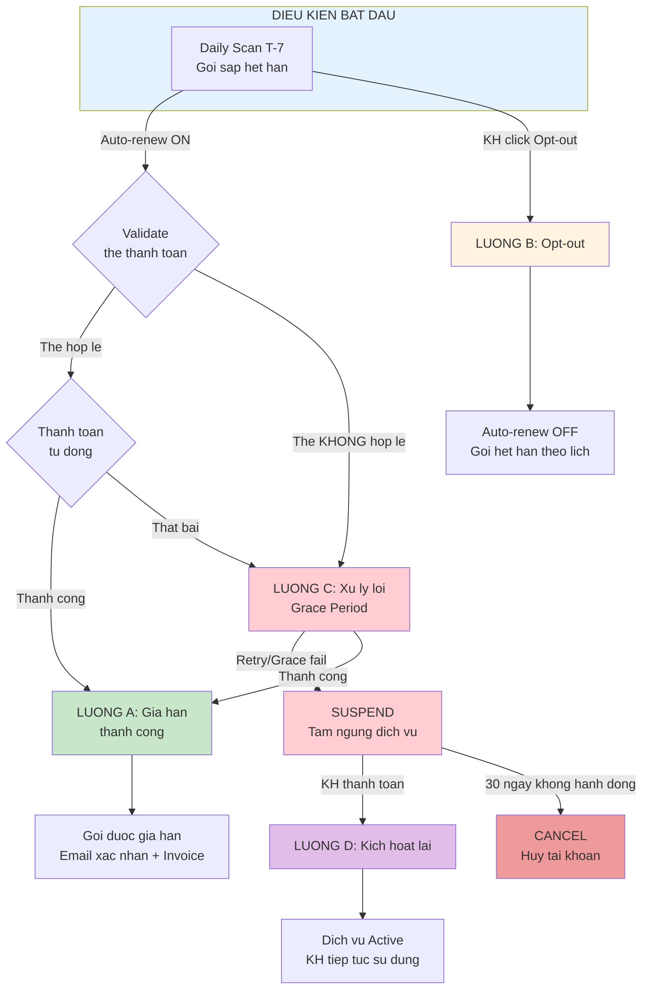
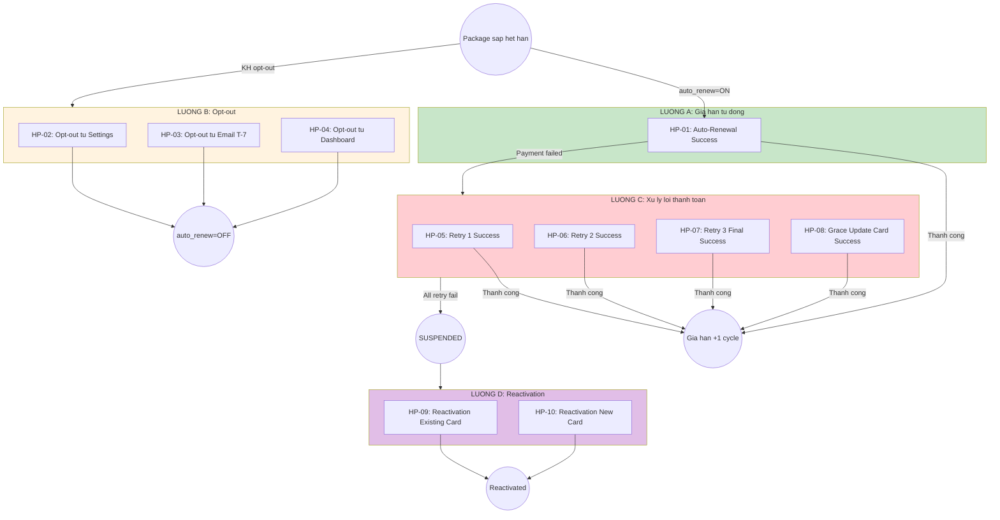

# FUNCTION RENEWAL: AUTO-RENEWAL (TU DONG GIA HAN)

**Version:** 2.1.0
**Last Updated:** 2026-01-07
**Owner:** BA IT (Dung)
**Source:** [Renewal_Touchpoint_Flow_v1.md](../../function-renewal/Renewal_Touchpoint_Flow_v1.md)

---

**## 2.1 Tong quan Function**

**Mo ta:** Chuc nang tu dong gia han goi dich vu cho khach hang da mua goi (Paid User). Ho tro chu ky thanh toan Monthly va Yearly voi co che retry, grace period va reactivation.

|            | Noi dung                                                                                 |
| ---------- | ---------------------------------------------------------------------------------------- |
| **INPUT**  | Khach hang dang su dung goi dich vu (co auto-renew bat), goi sap het han                 |
| **OUTPUT** | Goi dich vu duoc gia han thanh cong, khach hang tiep tuc su dung dich vu khong gian doan |

---

**## 2.2 Cac tinh huong (Scenarios)**

| Tinh huong | Mo ta                                                           | Dan den Luong                       | Cau hoi |
| ---------- | --------------------------------------------------------------- | ----------------------------------- | ------- |
| A          | Goi sap het han (T-7), auto-renew = TRUE, thanh toan thanh cong | Luong A: Gia han tu dong thanh cong |         |
| B          | KH muon huy tu dong gia han (click opt-out truoc ngay gia han)  | Luong B: Khach hang Opt-out         |         |
| C          | Thanh toan khong thanh cong (bi tu choi hoac the khong hop le)  | Luong C: Xu ly loi thanh toan       |         |
| D          | Dich vu dang bi tam ngung, KH muon kich hoat lai                | Luong D: Kich hoat lai dich vu      |         |

---

**## 2.3 Bang tong hop cac Luong**

| Luong | Ten                        | INPUT                                       | OUTPUT                                       | So tram | Cau hoi |
| ----- | -------------------------- | ------------------------------------------- | -------------------------------------------- | ------- | ------- |
| **A** | Gia han tu dong thanh cong | Goi sap het han, auto-renew = TRUE          | Goi duoc gia han, hoa don duoc gui           | 6       |         |
| **B** | Khach hang Opt-out         | KH click "Turn off auto-renewal"            | Auto-renew tat, goi het han theo lich        | 6       |         |
| **C** | Xu ly loi thanh toan       | Thanh toan bi tu choi hoac the khong hop le | Thanh toan thanh cong hoac dich vu tam ngung | 9       |         |
| **D** | Kich hoat lai dich vu      | Dich vu dang bi tam ngung                   | Dich vu duoc kich hoat, KH tiep tuc su dung  | 6       |         |

---

**## 2.4 So do cac Luong SONG SANG**



---

**## LUONG A: Gia han tu dong thanh cong**

**Tinh huong:** Goi dich vu sap het han (T-7), auto-renew = TRUE, thanh toan tu dong thanh cong ngay lan dau

|            | Noi dung                                                        |
| ---------- | --------------------------------------------------------------- |
| **INPUT**  | Goi sap het han (T-7), auto-renew = TRUE, the thanh toan hop le |
| **OUTPUT** | Goi duoc gia han +1 cycle, email xac nhan + invoice duoc gui    |

**So tram:** 6

**### Hanh trinh day du:**

```
Daily Scan → Gui Email T-7 → Validate The → Thanh Toan → Cap Nhat He Thong → Gui Email Xac Nhan → END
```

**### Chi tiet tung tram:**

**| # | Tram | Mo ta | Actor | Input | Output | Cau hoi |**
**|---|------|-------|-------|-------|--------|---------|**
**| 1 | Daily Scan | He thong chay scheduled job 00:00 UTC, query goi het han trong 7 ngay, auto_renew = TRUE | System | Expiry date + Auto-renew flag | Danh sach goi can gia han | |**
**| 2 | Gui Email T-7 | Gui email thong bao gia han sap dien ra voi link opt-out va doi goi | System | Customer info + Package info | Email sent | |**
**| 3 | Validate The | T=0: Kiem tra the chua het han, status != Blocked, token con valid | System | Payment method token | Validation result | |**
**| 4 | Thanh Toan | Tao payment request gui den Payment Gateway, nhan ket qua | Payment Gateway | Payment request | Transaction result | |**
**| 5 | Cap Nhat He Thong | Package Status = Active, Next Billing Date +1 cycle, generate Invoice PDF | System | Transaction success | Updated subscription | |**
**| 6 | Gui Email Xac Nhan | Gui email "Your CVH Package has been renewed" voi Invoice dinh kem | System | Invoice PDF | Email sent + Case closed | |**

**Dac diem:**
**- Tu dong 100%, khong can hanh dong tu KH**
**- Thoi gian xu ly: < 1 phut**
**- Email thong bao 7 ngay truoc**

---

**## LUONG B: Khach hang Opt-out**

**Tinh huong:** Khach hang chu dong huy auto-renewal trong 7 ngay truoc khi gia han

|            | Noi dung                                                  |
| ---------- | --------------------------------------------------------- |
| **INPUT**  | KH nhan email T-7, click "Turn off auto-renewal"          |
| **OUTPUT** | Auto-renew = FALSE, goi het han theo lich, email xac nhan |

**So tram:** 6

**### Hanh trinh day du:**

```
Nhan Email T-7 → Click Opt-out → Hien Thi Modal → Xac Nhan → Xu Ly He Thong → Gui Email Xac Nhan → END
```

**### Chi tiet tung tram:**

**| # | Tram | Mo ta | Actor | Input | Output | Cau hoi |**
**|---|------|-------|-------|-------|--------|---------|**
**| 1 | Nhan Email T-7 | KH nhan email thong bao gia han voi link "Turn off auto-renewal" | KH | Email | Click action | |**
**| 2 | Click Opt-out | KH click link, redirect den trang cai dat subscription | KH | Click | Subscription page | |**
**| 3 | Hien Thi Modal | Modal xac nhan voi canh bao: het han, mat quyen truy cap, dropdown ly do huy | System | User action | Modal displayed | |**
**| 4 | Xac Nhan | KH click "Confirm" de xac nhan huy auto-renewal | KH | Confirmation + Reason (optional) | Confirm signal | |**
**| 5 | Xu Ly He Thong | Set auto_renew = FALSE, log cancellation_reason, log analytics | System | Confirm signal | Updated subscription | |**
**| 6 | Gui Email Xac Nhan | Email "Auto-renewal turned off for [Package]", thong tin het han, link bat lai | System | Updated subscription | Email sent | |**

**Dac diem:**
**- KH co quyen opt-out bat ky luc nao truoc ngay gia han**
**- Dich vu van hoat dong den het ky hien tai**
**- Co the bat lai auto-renewal bat ky luc nao**
**- Thu thap ly do huy (optional) de phan tich**

---

**## LUONG C: Xu ly loi thanh toan**

**Tinh huong:** Thanh toan khong thanh cong do the bi tu choi hoac the khong hop le. He thong xu ly theo 2 nhanh: Retry Mechanism (the hop le bi tu choi) hoac Grace Period (the khong hop le)

|            | Noi dung                                                              |
| ---------- | --------------------------------------------------------------------- |
| **INPUT**  | Thanh toan that bai (card_declined, insufficient_funds, invalid card) |
| **OUTPUT** | Thanh toan thanh cong (sau retry/grace) hoac dich vu bi tam ngung     |

**So tram:** 9

**### Hanh trinh day du:**

```
Payment Failed → Phan Loai Loi → [Retry 1 T+1] → [Retry 2 T+3] → [Retry 3 T+7] → Xu Ly Ket Qua → [Grace Period] → [KH Update The] → Ket Thuc → END
```

**### Chi tiet tung tram:**

**| # | Tram | Mo ta | Actor | Input | Output | Cau hoi |**
**|---|------|-------|-------|-------|--------|---------|**
**| 1 | Payment Failed | Payment Gateway tra ve loi: card_declined, insufficient_funds, invalid_card | Payment Gateway | Payment request | Error code + message | |**
**| 2 | Phan Loai Loi | Phan loai: The hop le bi tu choi (Retry) vs The khong hop le (Grace Period) | System | Error code | Branch decision | |**
**| 3 | Gui Email Thong Bao | "Payment Failed - We'll try again", CTA update payment method | System | Error info | Email sent | |**
**| 4 | Retry 1 (T+1) | Tu dong thu lai thanh toan sau 24h voi cung the | System | Payment method | Retry result | |**
**| 5 | Retry 2 (T+3) | Thu lai lan 2 sau 72h, gui email URGENT neu that bai | System | Payment method | Retry result | |**
**| 6 | Retry 3 FINAL (T+7) | Lan thu cuoi cung, neu that bai → SUSPEND dich vu | System | Payment method | Final result | |**
**| 7 | Kich Hoat Grace Period | The khong hop le: 7 ngay de KH update the, hien warning banner | System | Invalid card | Grace period active | |**
**| 8 | KH Update The | KH click Update Card, nhap the moi, gateway tokenize, save | KH | New card info | New payment method | |**
**| 9 | Xu Ly Ket Qua | Thanh cong → Gia han (LUONG A), That bai → SUSPEND → LUONG D | System | Final status | Next action | |**

**Dac diem:**
**- Retry Mechanism: 4 lan trong 7 ngay (T=0, T+1, T+3, T+7)**
**- Grace Period: 7 ngay cho KH update the**
**- Dich vu VAN HOAT DONG trong suot thoi gian xu ly**
**- Warning banner hien tren moi page khi trong grace period**
**- Sau 7 ngay that bai → SUSPEND → chuyen LUONG D**

---

**## LUONG D: Kich hoat lai dich vu**

**Tinh huong:** Dich vu dang bi tam ngung (SUSPENDED), KH muon thanh toan thu cong va kich hoat lai

|            | Noi dung                                                     |
| ---------- | ------------------------------------------------------------ |
| **INPUT**  | Package Status = Suspended, KH click "Reactivate Now"        |
| **OUTPUT** | Package Status = Active, Access Level = Full, email xac nhan |

**So tram:** 6

**### Hanh trinh day du:**

```
Quyet Dinh Reactivate → Hien Thi Payment Form → Submit Payment → Xu Ly Payment → Cap Nhat He Thong → Gui Email Xac Nhan → END
```

**### Chi tiet tung tram:**

**| # | Tram | Mo ta | Actor | Input | Output | Cau hoi |**
**|---|------|-------|-------|-------|--------|---------|**
**| 1 | Quyet Dinh Reactivate | KH click "Reactivate Now" tu email, modal login, hoac Settings > Billing | KH | Click action | Reactivation intent | |**
**| 2 | Hien Thi Payment Form | Hien form: Amount (current cycle), chon the cu hoac them the moi, checkbox auto-renew | System | Subscription info | Payment form | |**
**| 3 | Submit Payment | KH nhap thong tin (neu the moi), click "Pay & Reactivate" | KH | Payment details | Payment request | |**
**| 4 | Xu Ly Payment | Gateway xu ly thanh toan, tra ve ket qua | Payment Gateway | Payment request | Transaction result | |**
**| 5 | Cap Nhat He Thong | Thanh cong: Package Status = Active, Access Level = Full, Next Billing Date +1 cycle | System | Transaction success | Updated subscription | |**
**| 6 | Gui Email Xac Nhan | Email "Welcome back! Your package is reactivated" voi Invoice dinh kem | System | Updated subscription | Email sent | |**

**Dac diem:**
**- KH co 30 ngay de kich hoat lai sau khi SUSPEND**
**- Khi SUSPENDED: Co the login, xem history, billing; KHONG the dat lich, chat, su dung dich vu**
**- Khong gioi han so lan thu thanh toan**
**- Sau 30 ngay khong reactivate → Account Status = Cancelled**
**- Reminder emails: Day 15, Day 25, Day 30**

---

## 2.5 DANH SACH HAPPY PATHS

### 2.5.1 Tong hop Happy Paths

| HP ID     | Ten Happy Path                                                          | Luong | Entry Point        | Dieu kien                                          | Duration | Trang thai  |
| --------- | ----------------------------------------------------------------------- | ----- | ------------------ | -------------------------------------------------- | -------- | ----------- |
| **HP-01** | [Auto-Renewal Success](hp-01-auto-renewal-success.md)                   | A     | Daily Scan T-7     | auto_renew=TRUE, the hop le, thanh toan thanh cong | < 1 min  | ✅ Complete |
| **HP-02** | [Opt-out tu Settings](hp-02-opt-out-settings.md)                        | B     | Settings > Billing | KH click "Turn off" tu menu Settings               | 1-2 min  | ✅ Complete |
| **HP-03** | [Opt-out tu Email T-7](hp-03-opt-out-email.md)                          | B     | Email T-7          | KH click link opt-out trong email thong bao        | 1-2 min  | ✅ Complete |
| **HP-04** | [Opt-out tu Dashboard Banner](hp-04-opt-out-dashboard.md)               | B     | Dashboard          | KH click opt-out tu warning banner                 | 1-2 min  | ✅ Complete |
| **HP-05** | [Retry 1 Success (T+1)](hp-05-retry-1-success.md)                       | C     | Payment Failed T=0 | Retry 1 thanh cong sau 24h                         | 24h      | ✅ Complete |
| **HP-06** | [Retry 2 Success (T+3)](hp-06-retry-2-success.md)                       | C     | Retry 1 Failed     | Retry 2 thanh cong sau 72h                         | 72h      | ✅ Complete |
| **HP-07** | [Retry 3 Final Success (T+7)](hp-07-retry-3-final-success.md)           | C     | Retry 2 Failed     | Retry 3 (final) thanh cong sau 168h                | 168h     | ✅ Complete |
| **HP-08** | [Grace Period - Update Card Success](hp-08-grace-period-update-card.md) | C     | Invalid Card       | KH update the moi trong 7 ngay grace               | 1-7 days | ✅ Complete |
| **HP-09** | [Reactivation - Existing Card](hp-09-reactivation-existing-card.md)     | D     | Suspended State    | KH thanh toan bang the cu de kich hoat lai         | 2-5 min  | ✅ Complete |
| **HP-10** | [Reactivation - New Card](hp-10-reactivation-new-card.md)               | D     | Suspended State    | KH them the moi de kich hoat lai                   | 3-7 min  | ✅ Complete |

**Tong so:** 10 Happy Paths (tu 4 Luong A-D)

---

### 2.5.2 So do Happy Paths theo Luong



---

### 2.5.3 Phan bo Happy Paths theo Luong

| Luong | So HP | Danh sach HP               | Dac diem                                           |
| ----- | ----- | -------------------------- | -------------------------------------------------- |
| **A** | 1     | HP-01                      | Tu dong 100%, khong can hanh dong tu KH            |
| **B** | 3     | HP-02, HP-03, HP-04        | 3 entry points khac nhau, cung ket qua opt-out     |
| **C** | 4     | HP-05, HP-06, HP-07, HP-08 | Retry mechanism + Grace period, dich vu van active |
| **D** | 2     | HP-09, HP-10               | KH chu dong thanh toan de kich hoat lai            |

---

### 2.5.4 Lien ket den Function Specs

| HP ID | Function Spec                       | Trang thai |
| ----- | ----------------------------------- | ---------- |
| HP-01 | `FS-11-01-auto-renewal.md`          | Pending    |
| HP-02 | `FS-11-02-opt-out-settings.md`      | Pending    |
| HP-03 | `FS-11-03-opt-out-email.md`         | Pending    |
| HP-04 | `FS-11-04-opt-out-dashboard.md`     | Pending    |
| HP-05 | `FS-11-05-retry-1.md`               | Pending    |
| HP-06 | `FS-11-06-retry-2.md`               | Pending    |
| HP-07 | `FS-11-07-retry-3.md`               | Pending    |
| HP-08 | `FS-11-08-grace-update-card.md`     | Pending    |
| HP-09 | `FS-11-09-reactivation-existing.md` | Pending    |
| HP-10 | `FS-11-10-reactivation-new.md`      | Pending    |

---

## 2.6 Timeline Tong Quan

```
        T-7              T=0              T+1         T+3              T+7            T+37
         │                │                │           │                │               │
─────────┼────────────────┼────────────────┼───────────┼────────────────┼───────────────┼─────
         │                │                │           │                │               │
   Gui email         Validate &     Retry 1 (24h)  Retry 2      Retry 3 FINAL    Suspend end
   thong bao         Payment           (neu fail)   (48h)        (72h) → Suspend   → Cancel
   gia han           attempt                         (neu fail)   (neu fail)      (neu khong
                                                                                  reactivate)
                                      ◄──── RETRY MECHANISM (7 ngay) ────►
                                                                  │
                                                                  ▼
                                                      ◄─── 30 NGAY GRACE PERIOD ───►
                                                           (sau khi Suspend)
```

---

## 2.7 Dieu Kien Dau Vao (Pre-conditions)

| STT | Dieu kien                 | Mo ta                                                                 |
| --- | ------------------------- | --------------------------------------------------------------------- |
| 1   | **Da thanh toan goi**     | KH da mua va thanh toan thanh cong goi dich vu (Connect/Plus/Premium) |
| 2   | **Billing cycle**         | Monthly hoac Yearly                                                   |
| 3   | **Auto-renew enabled**    | Auto-renew = TRUE (mac dinh khi mua)                                  |
| 4   | **The thanh toan hop le** | The da duoc luu (tokenized), chua het han, khong bi block             |
| 5   | **Goi dang active**       | Package Status = "Active", dang trong thoi gian su dung               |

---

## 2.8 Email Templates

| STT | Template                   | Trigger                           | Subject                                                 |
| --- | -------------------------- | --------------------------------- | ------------------------------------------------------- |
| 1   | Email T-7                  | Daily scan tim goi het han 7 ngay | Your CVH [Package] will renew on [Date] for $[Amount]   |
| 2   | Email Opt-out Confirmation | KH xac nhan huy auto-renewal      | Auto-renewal turned off for your CVH [Package]          |
| 3   | Email Payment Failed       | Thanh toan lan dau that bai       | Payment Failed for CVH Renewal - We'll try again        |
| 4   | Email URGENT               | Retry 2 that bai, truoc Retry 3   | URGENT: Update Payment Card - Final Retry in 72 Hours   |
| 5   | Email Suspended            | Tat ca retry/grace that bai       | Your CVH [Package] has been suspended - Action required |
| 6   | Email Renewal Success      | Thanh toan thanh cong             | Your CVH [Package] has been renewed - Receipt inside    |
| 7   | Email Reactivation Success | KH thanh toan va kich hoat lai    | Welcome back! Your CVH [Package] is reactivated         |

---

## 2.9 Business Rules

| Rule ID | Rule Name              | Description                                       |
| ------- | ---------------------- | ------------------------------------------------- |
| BR-001  | T-7 Notification       | Email 7 ngay truoc khi gia han                    |
| BR-002  | Auto-renew Default     | Auto-renew = TRUE khi mua goi                     |
| BR-003  | Retry Attempts         | Toi da 4 lan (T=0, T+1, T+3, T+7)                 |
| BR-004  | Retry Timing           | 24h → 48h → 72h sau moi lan fail                  |
| BR-005  | Grace Period (Card)    | 7 ngay de cap nhat the invalid                    |
| BR-006  | Grace Period (Suspend) | 30 ngay de reactivate sau khi suspend             |
| BR-007  | Service During Retry   | Dich vu van ACTIVE trong 7 ngay retry             |
| BR-008  | Service During Grace   | Dich vu van ACTIVE trong 7 ngay grace (co banner) |
| BR-009  | Limited Access         | Suspended: chi xem history, billing, pay          |
| BR-010  | Opt-out Any Time       | KH co the huy auto-renewal bat ky luc nao         |

---

## Change Log

| Version | Date       | Author       | Changes                                                       |
| ------- | ---------- | ------------ | ------------------------------------------------------------- |
| 2.1.0   | 2026-01-07 | BA IT (Dung) | Added section 2.5 DANH SACH HAPPY PATHS (10 HPs from 4 Luong) |
| 2.0.0   | 2026-01-02 | BA IT (Dung) | Converted to LUONG template pattern (Menu 1 generation)       |
| 1.1.0   | 2024-12-29 | BA Team      | Merged FLOW-03 & FLOW-04 into single Payment Error flow       |
| 1.0.0   | 2024-12-29 | BA Team      | Initial creation from Renewal source documents                |

---
