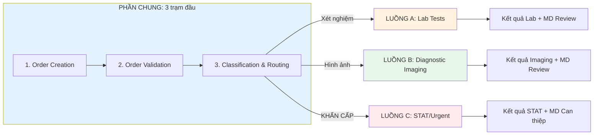

# High-Level Flow: Service 10 (Lab_Imaging_Management) - Lab/Imaging Management

**Service:** Lab/Imaging Management (Quản lý Xét nghiệm & Chẩn đoán Hình ảnh)
**Version:** 1.0.0
**Last Updated:** 2026-02-01

---

## 2.1 Tổng quan Service

**Mô tả:** Dịch vụ quản lý toàn bộ quy trình xét nghiệm và chẩn đoán hình ảnh, từ khi MD tạo order đến khi có kết quả và cập nhật vào EMR.

|            | Nội dung                                                                                    |
| ---------- | ------------------------------------------------------------------------------------------- |
| **INPUT**  | MD tạo order xét nghiệm/chẩn đoán hình ảnh trong EMR (dựa trên triệu chứng/chẩn đoán lâm sàng) |
| **OUTPUT** | Kết quả xét nghiệm/hình ảnh được cập nhật vào EMR, MD review và tích hợp vào kế hoạch điều trị |

## 2.2 Các tình huống (Scenarios)

| Tình huống | Mô tả                                                              | Dẫn đến Luồng                   | Câu hỏi |
| ---------- | ------------------------------------------------------------------ | ------------------------------- | ------- |
| A          | KH cần xét nghiệm máu, nước tiểu, hoặc các xét nghiệm thường quy   | Luồng A: Lab Tests              |         |
| B          | KH cần chụp X-ray, MRI, CT, siêu âm hoặc chẩn đoán hình ảnh khác   | Luồng B: Diagnostic Imaging     |         |
| C          | KH cần xét nghiệm/hình ảnh KHẨN CẤP (STAT) - kết quả trong 24 giờ  | Luồng C: STAT/Urgent            |         |

## 2.3 Bảng tổng hợp các Luồng

| Luồng | Tên                 | INPUT                                      | OUTPUT                                          | Số trạm | Câu hỏi |
| ----- | ------------------- | ------------------------------------------ | ----------------------------------------------- | ------- | ------- |
| **A** | Lab Tests           | KH cần xét nghiệm thường quy               | Kết quả xét nghiệm đã cập nhật EMR, MD đã review | 12      |         |
| **B** | Diagnostic Imaging  | KH cần chẩn đoán hình ảnh                  | Kết quả hình ảnh đã cập nhật EMR, MD đã review   | 15      |         |
| **C** | STAT/Urgent         | KH cần xét nghiệm/hình ảnh khẩn cấp        | Kết quả khẩn cấp đã xử lý, MD đã can thiệp       | 8       |         |

## 2.4 Sơ đồ các Luồng SONG SONG



---

## LUỒNG A: Lab Tests

**Tình huống:** Khách hàng cần xét nghiệm máu, nước tiểu, hoặc các xét nghiệm thường quy

|            | Nội dung                                                                           |
| ---------- | ---------------------------------------------------------------------------------- |
| **INPUT**  | MD tạo order xét nghiệm (CBC, metabolic panel, lipid, thyroid, etc.)               |
| **OUTPUT** | Kết quả xét nghiệm đã cập nhật vào EMR, MD đã review và điều chỉnh kế hoạch điều trị |

**Số trạm:** 12

### Hành trình đầy đủ:

```
MD Order → Validation → Routing → Tìm Lab → Gửi danh sách → KH chọn Lab → Đặt lịch → Nhắc nhở → Thực hiện xét nghiệm → Nhận kết quả → Cập nhật EMR → MD Review → END
```

### Chi tiết từng trạm:

| # | Trạm | Mô tả | Actor | Input | Output | Câu hỏi |
|---|------|-------|-------|-------|--------|---------|
| 1 | Order Creation | MD tạo order xét nghiệm trong EMR với mã test cụ thể | MD | Chẩn đoán lâm sàng | Lab Order ID |  |
| 2 | Order Validation | Hệ thống kiểm tra tính hợp lệ của order (mã test, bảo hiểm) | System | Lab Order | Validated Order |  |
| 3 | Lab Routing | Hệ thống xác định loại order là Lab Tests | System | Order Type | Lab Queue |  |
| 4 | Search Labs | Tìm phòng xét nghiệm phù hợp (bảo hiểm, khoảng cách, dịch vụ) | System | Insurance + Location | Lab Candidates |  |
| 5 | Send Lab List | Gửi danh sách phòng xét nghiệm qua App/Email/SMS | System | Lab List | List Delivered |  |
| 6 | KH Select Lab | KH chọn phòng xét nghiệm từ danh sách | KH | Lab Options | Selected Lab |  |
| 7 | Schedule Appointment | KH đặt lịch hẹn tại phòng xét nghiệm đã chọn | KH | Lab + Availability | Appointment |  |
| 8 | Appointment Reminder | Gửi nhắc nhở 24h trước lịch hẹn qua SMS/App | System | Appointment | Reminder Sent |  |
| 9 | Lab Execution | KH đến phòng xét nghiệm, thực hiện lấy mẫu | Lab Partner | KH + Order | Sample Collected |  |
| 10 | Results Received | Hệ thống nhận kết quả từ phòng xét nghiệm (HL7/API/Fax) | System | Lab Results | Results in System |  |
| 11 | Update EMR | Cập nhật kết quả xét nghiệm vào EMR, đánh dấu abnormal values | System | Lab Results | EMR Updated |  |
| 12 | MD Review | MD review kết quả, cập nhật kế hoạch điều trị, thông báo KH | MD | Lab Results | Case Closed |  |

**Đặc điểm:**
- Thời gian xử lý: 3-7 ngày (từ order đến kết quả)
- Tích hợp: Quest Diagnostics, LabCorp, local labs
- Auto-flag: Giá trị bất thường được highlight cho MD
- Fasting reminder: Nhắc nhịn ăn nếu order yêu cầu

---

## LUỒNG B: Diagnostic Imaging

**Tình huống:** Khách hàng cần chụp X-ray, MRI, CT, siêu âm hoặc chẩn đoán hình ảnh khác

|            | Nội dung                                                                           |
| ---------- | ---------------------------------------------------------------------------------- |
| **INPUT**  | MD tạo order chẩn đoán hình ảnh (X-ray, MRI, CT, Ultrasound, etc.)                 |
| **OUTPUT** | Kết quả hình ảnh + báo cáo radiologist đã cập nhật EMR, MD đã review               |

**Số trạm:** 15

### Hành trình đầy đủ:

```
MD Order → Validation → Routing → Prior Auth Check → Tìm Imaging Center → Gửi danh sách → KH chọn Center → Đặt lịch → Gửi prep instructions → Nhắc nhở → Thực hiện chụp → Radiologist đọc → Nhận kết quả → Cập nhật EMR → MD Review → END
```

### Chi tiết từng trạm:

| # | Trạm | Mô tả | Actor | Input | Output | Câu hỏi |
|---|------|-------|-------|-------|--------|---------|
| 1 | Order Creation | MD tạo order imaging trong EMR với CPT code và clinical indication | MD | Chẩn đoán lâm sàng | Imaging Order ID |  |
| 2 | Order Validation | Hệ thống kiểm tra tính hợp lệ (CPT code, contraindications) | System | Imaging Order | Validated Order |  |
| 3 | Imaging Routing | Hệ thống xác định loại order là Diagnostic Imaging | System | Order Type | Imaging Queue |  |
| 4 | Prior Auth Check | Kiểm tra yêu cầu Prior Authorization từ bảo hiểm | System | Order + Insurance | Auth Status |  |
| 5 | Search Centers | Tìm imaging center phù hợp (bảo hiểm, thiết bị, khoảng cách) | System | Insurance + Modality | Center Candidates |  |
| 6 | Send Center List | Gửi danh sách imaging center qua App/Email/SMS | System | Center List | List Delivered |  |
| 7 | KH Select Center | KH chọn imaging center từ danh sách | KH | Center Options | Selected Center |  |
| 8 | Schedule Appointment | KH đặt lịch hẹn tại imaging center đã chọn | KH | Center + Availability | Appointment |  |
| 9 | Send Prep Instructions | Gửi hướng dẫn chuẩn bị (nhịn ăn, thuốc contrast, etc.) | System | Modality | Prep Instructions Sent |  |
| 10 | Appointment Reminder | Gửi nhắc nhở 24h trước với prep checklist | System | Appointment | Reminder Sent |  |
| 11 | Imaging Execution | KH đến center, thực hiện chụp hình ảnh | Imaging Partner | KH + Order | Images Captured |  |
| 12 | Radiologist Read | Radiologist đọc và viết báo cáo kết quả | Radiologist | Images | Radiology Report |  |
| 13 | Results Received | Hệ thống nhận báo cáo và hình ảnh từ center (DICOM/HL7) | System | Report + Images | Results in System |  |
| 14 | Update EMR | Cập nhật báo cáo và link hình ảnh vào EMR | System | Results | EMR Updated |  |
| 15 | MD Review | MD review báo cáo, so sánh với prior studies, thông báo KH | MD | Radiology Report | Case Closed |  |

**Đặc điểm:**
- Thời gian xử lý: 5-14 ngày (từ order đến kết quả)
- Prior Authorization: Tự động submit nếu bảo hiểm yêu cầu
- Tích hợp: RadNet, SimonMed, local imaging centers
- DICOM viewer: Link xem hình ảnh trực tiếp trong EMR
- Contrast alert: Kiểm tra eGFR trước khi dùng thuốc cản quang

---

## LUỒNG C: STAT/Urgent

**Tình huống:** Khách hàng cần xét nghiệm hoặc hình ảnh KHẨN CẤP - kết quả trong 24 giờ

|            | Nội dung                                                                           |
| ---------- | ---------------------------------------------------------------------------------- |
| **INPUT**  | MD tạo order STAT với priority cao (nghi ngờ tình trạng cấp tính)                  |
| **OUTPUT** | Kết quả khẩn cấp được xử lý ngay, MD can thiệp kịp thời                            |

**Số trạm:** 8

### Hành trình đầy đủ:

```
MD STAT Order → Validation → Priority Routing → MA Pickup → Đặt lịch khẩn → Thực hiện → Kết quả STAT → MD Review ngay → Can thiệp → END
```

### Chi tiết từng trạm:

| # | Trạm | Mô tả | Actor | Input | Output | Câu hỏi |
|---|------|-------|-------|-------|--------|---------|
| 1 | STAT Order Creation | MD tạo order với flag STAT/Urgent và lý do khẩn cấp | MD | Clinical Urgency | STAT Order ID |  |
| 2 | Priority Validation | Hệ thống xác nhận STAT và đẩy vào queue ưu tiên | System | STAT Order | Priority Queue |  |
| 3 | MA Pickup | MA nhận order STAT và liên hệ KH ngay lập tức | MA | STAT Notification | Contact Initiated |  |
| 4 | Urgent Scheduling | MA đặt lịch same-day hoặc next-day tại partner ưu tiên | MA | Partner Network | Urgent Appointment |  |
| 5 | STAT Execution | KH đến thực hiện xét nghiệm/imaging với ưu tiên cao | Partner | KH + STAT Order | STAT Sample/Images |  |
| 6 | STAT Results | Partner xử lý ưu tiên và gửi kết quả trong 24h | Partner | STAT Request | STAT Results |  |
| 7 | Immediate MD Review | MD nhận alert và review kết quả ngay lập tức | MD | STAT Results | Clinical Decision |  |
| 8 | Intervention | MD liên hệ KH và thực hiện can thiệp cần thiết | MD | Clinical Decision | Case Resolved |  |

**Đặc điểm:**
- Thời gian xử lý: < 24 giờ (từ order đến MD review)
- MA hỗ trợ toàn bộ quy trình
- Alert system: Push notification cho MD khi có kết quả
- Escalation: Tự động escalate nếu quá 24h chưa có kết quả
- Critical value: Gọi điện trực tiếp cho MD nếu kết quả critical

---

## 2.5 So sánh các Luồng

| Tiêu chí              | Lab Tests           | Diagnostic Imaging   | STAT/Urgent         |
| --------------------- | ------------------- | -------------------- | ------------------- |
| Thời gian             | 3-7 ngày            | 5-14 ngày            | < 24 giờ            |
| Prior Auth            | Hiếm khi            | Thường yêu cầu       | Bypass nếu cần      |
| MA hỗ trợ             | Không               | Không                | Có                  |
| Đặt lịch              | KH tự đặt           | KH tự đặt            | MA đặt hộ           |
| Kết quả delivery      | Auto qua hệ thống   | Auto qua hệ thống    | Alert ngay cho MD   |
| Partner network       | Quest, LabCorp      | RadNet, SimonMed     | Priority partners   |

---

## 2.6 Các tình huống ngoại lệ

### Ngoại lệ 1: Prior Authorization bị từ chối

| Luồng      | Xử lý                                                                              |
| ---------- | ---------------------------------------------------------------------------------- |
| **Lab**    | Hiếm - thông báo KH về chi phí out-of-pocket                                       |
| **Imaging**| MA hỗ trợ appeal process, hoặc thông báo KH về chi phí self-pay                    |
| **STAT**   | Bypass Prior Auth, xử lý billing sau                                               |

### Ngoại lệ 2: KH không đến lịch hẹn (No-Show)

| Luồng      | Xử lý                                                                              |
| ---------- | ---------------------------------------------------------------------------------- |
| **Lab**    | Auto-remind sau 3 ngày, escalate sau 7 ngày                                        |
| **Imaging**| Auto-remind sau 3 ngày, escalate sau 7 ngày                                        |
| **STAT**   | MA gọi ngay nếu KH không đến, đặt lại lịch khẩn cấp                                |

### Ngoại lệ 3: Kết quả Critical Value

| Luồng      | Xử lý                                                                              |
| ---------- | ---------------------------------------------------------------------------------- |
| **Tất cả** | Hệ thống flag critical value, gọi điện trực tiếp cho MD trong 1 giờ                |

---

## 2.7 Tích hợp hệ thống

| Hệ thống          | Mô tả                                       | Sử dụng cho              |
| ----------------- | ------------------------------------------- | ------------------------ |
| **HL7/FHIR**      | Giao thức truyền order và nhận kết quả      | Lab & Imaging            |
| **DICOM**         | Chuẩn hình ảnh y tế                         | Imaging only             |
| **Quest Connect** | API tích hợp Quest Diagnostics              | Lab Tests                |
| **LabCorp Link**  | API tích hợp LabCorp                        | Lab Tests                |
| **RadNet Portal** | Hệ thống đặt lịch và nhận kết quả RadNet    | Diagnostic Imaging       |

---

## 2.8 Success Metrics

| Metric                      | Lab Tests   | Imaging     | STAT        |
| --------------------------- | ----------- | ----------- | ----------- |
| Order to Results Time       | ≤ 7 ngày    | ≤ 14 ngày   | ≤ 24 giờ    |
| Completion Rate             | ≥ 90%       | ≥ 85%       | ≥ 98%       |
| Results Documented in EMR   | 100%        | 100%        | 100%        |
| Critical Value Alert Time   | ≤ 1 giờ     | ≤ 1 giờ     | ≤ 30 phút   |
| Customer Satisfaction       | ≥ 4.3/5.0   | ≥ 4.3/5.0   | ≥ 4.5/5.0   |

---
