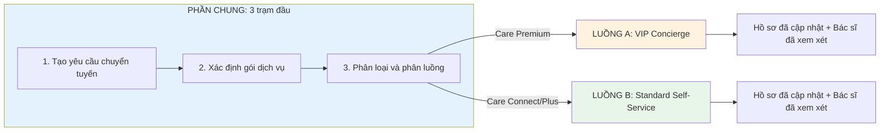

# High-Level Flow: Service 2 (Specialist_Referral) - Specialist Referral

**Service:** Specialist Referral (Giới thiệu Chuyên khoa)
**Version:** 1.1.0
**Last Updated:** 2026-02-01

---

## Happy Paths

| HP        | Tên                   | Đối tượng         | Số bước | Thời gian | Link                                                               |
| --------- | --------------------- | ----------------- | ------- | --------- | ------------------------------------------------------------------ |
| **HP-01** | VIP Concierge         | Care Premium      | 17      | ≤ 5 ngày  | [hp-01-vip-concierge.md](./hp-01-vip-concierge.md)                 |
| **HP-02** | Standard Self-Service | Care Connect/Plus | 11      | 7-14 ngày | [hp-02-standard-self-service.md](./hp-02-standard-self-service.md) |

---

## 2.1 Tổng quan Service

**Mô tả:** Dịch vụ quản lý chuyển tuyến khám chuyên khoa, từ nhận chỉ định đến nhận kết quả và cập nhật hồ sơ bệnh án.

|            | Nội dung                                                                                                              |
| ---------- | --------------------------------------------------------------------------------------------------------------------- |
| **INPUT**  | Bác sĩ điều trị tạo yêu cầu chuyển tuyến chuyên khoa (xác định khách hàng cần khám bác sĩ chuyên khoa)                |
| **OUTPUT** | Kết quả khám từ bác sĩ chuyên khoa được cập nhật vào hồ sơ bệnh án, bác sĩ điều trị xem xét và cập nhật phác đồ điều trị |

## 2.2 Các tình huống (Scenarios)

| Tình huống | Mô tả                                                    | Dẫn đến Luồng                  |
| ---------- | -------------------------------------------------------- | ------------------------------ |
| A          | Khách hàng gói VIP (Care Premium) - cần hỗ trợ toàn diện | Luồng A: VIP Concierge         |
| B          | Khách hàng gói Standard (Care Connect/Plus) - tự phục vụ | Luồng B: Standard Self-Service |

## 2.3 Bảng tổng hợp các Luồng

| Luồng | Tên                   | INPUT                                                                           | OUTPUT                                                                                           | Số trạm |
| ----- | --------------------- | ------------------------------------------------------------------------------- | ------------------------------------------------------------------------------------------------ | ------- |
| **A** | VIP Concierge         | Khách hàng gói VIP (Care Premium) có chỉ định khám chuyên khoa từ bác sĩ        | Kết quả khám đã được lưu vào hồ sơ bệnh án, bác sĩ điều trị đã xem xét và cập nhật phác đồ       | 17      |
| **B** | Standard Self-Service | Khách hàng gói Standard (Care Connect/Plus) có chỉ định khám chuyên khoa từ bác sĩ | Kết quả khám đã được lưu vào hồ sơ bệnh án, bác sĩ điều trị đã xem xét và cập nhật phác đồ       | 10      |

## 2.4 Sơ đồ các Luồng SONG SONG



---

## LUỒNG A: VIP Concierge

**Tình huống:** Khách hàng VIP (Care Premium) cần chuyên khoa - Chuyên viên chăm sóc khách hàng (CS) hỗ trợ toàn bộ quy trình

|            | Nội dung                                                                                                                      |
| ---------- | ----------------------------------------------------------------------------------------------------------------------------- |
| **INPUT**  | Khách hàng gói VIP có chỉ định khám chuyên khoa từ bác sĩ điều trị                                                            |
| **OUTPUT** | Kết quả khám từ bác sĩ chuyên khoa đã được lưu vào hồ sơ bệnh án, bác sĩ điều trị đã xem xét và cập nhật kế hoạch điều trị    |

**Số trạm:** 17

### Hành trình đầy đủ:

```
Bác sĩ tạo yêu cầu → Nhận chỉ định → Phân loại → CS nhập hồ sơ → Hệ thống tổng hợp → CS kiểm tra → Dịch (nếu cần) → Chọn bác sĩ chuyên khoa → Gửi hồ sơ → Xác nhận → Đặt lịch → Gửi thông tin KH → Nhắc nhở 24h → Theo dõi sau khám → Thu thập kết quả → Cập nhật hồ sơ → Bác sĩ xem xét → KẾT THÚC
```

### Chi tiết từng trạm:

| #   | Trạm                      | Mô tả                                                              | Actor      | Input                                            | Output                                                 |
| --- | ------------------------- | ------------------------------------------------------------------ | ---------- | ------------------------------------------------ | ------------------------------------------------------ |
| 1   | Tạo yêu cầu chuyển tuyến  | Bác sĩ điều trị tạo yêu cầu khám chuyên khoa trong hồ sơ bệnh án   | Bác sĩ     | Triệu chứng và chẩn đoán sơ bộ của khách hàng    | Yêu cầu chuyển tuyến đã được tạo                       |
| 2   | Xác định gói dịch vụ      | Hệ thống kiểm tra gói dịch vụ hiện tại của khách hàng              | Hệ thống   | Thông tin khách hàng                             | Loại gói dịch vụ (VIP/Standard)                        |
| 3   | Phân luồng VIP            | Hệ thống chuyển yêu cầu vào danh sách công việc của CS             | Hệ thống   | Gói dịch vụ = Care Premium                       | Công việc đã được giao cho CS                          |
| 4   | CS tiếp nhận              | CS nhận thông báo và xem chi tiết yêu cầu chuyển tuyến             | CS         | Thông báo có yêu cầu mới                         | CS đang xử lý yêu cầu                                  |
| 5   | Tổng hợp hồ sơ tự động    | Hệ thống tự động tổng hợp thư giới thiệu (13 phần)                 | Hệ thống   | Thông tin từ hồ sơ bệnh án                       | Bản nháp thư giới thiệu                                |
| 6   | CS kiểm tra hồ sơ         | CS kiểm tra tính đầy đủ và chính xác của hồ sơ                     | CS         | Bản nháp thư giới thiệu                          | Hồ sơ đã được xác nhận đầy đủ                          |
| 7   | Dịch thuật                | CS dịch tài liệu nếu bác sĩ chuyên khoa không nói tiếng Việt       | CS         | Các tài liệu cần dịch                            | Tài liệu đã được dịch                                  |
| 8   | Chọn bác sĩ chuyên khoa   | CS chọn phòng khám chuyên khoa phù hợp từ danh sách                | CS         | Chuyên khoa cần khám + Bảo hiểm của KH           | Phòng khám đã được chọn                                |
| 9   | Gửi hồ sơ                 | Hệ thống gửi hồ sơ qua fax bảo mật                                 | Hệ thống   | Hồ sơ + Số fax phòng khám                        | Xác nhận đã gửi hồ sơ                                  |
| 10  | Xác nhận đã nhận          | CS gọi điện xác nhận phòng khám đã nhận được hồ sơ                 | CS         | Thông tin lần gửi hồ sơ                          | Phòng khám xác nhận đã nhận hồ sơ                      |
| 11  | Đặt lịch hẹn              | CS liên hệ đặt lịch hẹn khám cho khách hàng                        | CS         | Thời gian trống của phòng khám                   | Thông tin lịch hẹn (ngày, giờ, địa điểm)               |
| 12  | Gửi thông tin cho KH      | Hệ thống gửi thông tin lịch hẹn qua Email/SMS/Ứng dụng             | Hệ thống   | Thông tin lịch hẹn                               | Khách hàng đã nhận được thông báo                      |
| 13  | Nhắc nhở trước 24h        | CS gọi điện nhắc khách hàng trước buổi hẹn 24 giờ                  | CS         | Thông tin lịch hẹn                               | Đã nhắc nhở khách hàng                                 |
| 14  | Theo dõi sau khám         | CS gọi hỏi thăm khách hàng sau buổi khám 24 giờ                    | CS         | Ngày khám                                        | Phản hồi của khách hàng đã được ghi nhận               |
| 15  | Thu thập kết quả          | CS liên hệ phòng khám và thu thập phiếu tư vấn                     | CS         | Thông tin liên hệ phòng khám                     | Phiếu tư vấn từ bác sĩ chuyên khoa                     |
| 16  | Cập nhật hồ sơ            | Hệ thống cập nhật kết quả khám vào hồ sơ bệnh án                   | Hệ thống   | Phiếu tư vấn                                     | Hồ sơ bệnh án đã được cập nhật                         |
| 17  | Bác sĩ xem xét            | Bác sĩ điều trị xem xét kết quả và cập nhật kế hoạch điều trị      | Bác sĩ     | Phiếu tư vấn từ bác sĩ chuyên khoa               | Hoàn tất - Kế hoạch điều trị đã được cập nhật          |

**Đặc điểm:**

- CS hỗ trợ toàn bộ quy trình (Concierge)
- Thời gian xử lý: <= 5 ngày đến lịch hẹn đầu tiên
- Gửi hồ sơ qua fax bảo mật tuân thủ quy định bảo mật y tế
- Tỷ lệ vắng mặt mục tiêu: <= 5%
- Mức độ hài lòng mục tiêu: >= 4.7/5.0

---

## LUỒNG B: Standard Self-Service

**Tình huống:** Khách hàng Standard (Care Connect/Plus) cần chuyên khoa - Khách hàng tự chọn và đặt lịch

|            | Nội dung                                                                                                                   |
| ---------- | -------------------------------------------------------------------------------------------------------------------------- |
| **INPUT**  | Khách hàng gói Standard có chỉ định khám chuyên khoa từ bác sĩ điều trị                                                    |
| **OUTPUT** | Kết quả khám từ bác sĩ chuyên khoa đã được lưu vào hồ sơ bệnh án, bác sĩ điều trị đã xem xét và cập nhật kế hoạch điều trị |

**Số trạm:** 10

### Hành trình đầy đủ:

```
Bác sĩ tạo yêu cầu → Nhận chỉ định → Phân loại → Tìm bác sĩ chuyên khoa → Xếp hạng → Gửi danh sách → KH tự đặt lịch → Email theo dõi → KH báo cáo → Cập nhật hồ sơ → Bác sĩ xem xét → KẾT THÚC
```

### Chi tiết từng trạm:

| #   | Trạm                       | Mô tả                                                                                            | Actor      | Input                                              | Output                                                      |
| --- | -------------------------- | ------------------------------------------------------------------------------------------------ | ---------- | -------------------------------------------------- | ----------------------------------------------------------- |
| 1   | Tạo yêu cầu chuyển tuyến   | Bác sĩ điều trị tạo yêu cầu khám chuyên khoa trong hồ sơ bệnh án                                 | Bác sĩ     | Triệu chứng và chẩn đoán sơ bộ của khách hàng      | Yêu cầu chuyển tuyến đã được tạo                            |
| 2   | Xác định gói dịch vụ       | Hệ thống kiểm tra gói dịch vụ hiện tại của khách hàng                                            | Hệ thống   | Thông tin khách hàng                               | Loại gói dịch vụ (VIP/Standard)                             |
| 3   | Phân luồng Standard        | Hệ thống kích hoạt quy trình tự động cho gói Standard                                            | Hệ thống   | Gói dịch vụ = Care Connect/Plus                    | Quy trình tự động đã được kích hoạt                         |
| 4   | Tìm bác sĩ chuyên khoa     | Hệ thống tìm kiếm bác sĩ phù hợp (chuyên khoa, bảo hiểm, khoảng cách, đang nhận bệnh nhân mới)   | Hệ thống   | Tiêu chí tìm kiếm (chuyên khoa, bảo hiểm, vị trí)  | Danh sách bác sĩ phù hợp                                    |
| 5   | Xếp hạng và lọc            | Hệ thống xếp hạng ưu tiên (nói tiếng Việt, đánh giá >= 4.0, lịch trống, khoảng cách)             | Hệ thống   | Danh sách bác sĩ phù hợp                           | Danh sách 5-10 bác sĩ đã xếp hạng                           |
| 6   | Gửi danh sách              | Hệ thống gửi danh sách bác sĩ qua Email + SMS + Ứng dụng                                         | Hệ thống   | Danh sách bác sĩ đã xếp hạng                       | Khách hàng đã nhận được danh sách                           |
| 7   | Khách hàng tự đặt lịch     | Khách hàng tự chọn bác sĩ chuyên khoa và đặt lịch hẹn                                            | Khách hàng | Danh sách bác sĩ chuyên khoa                       | Thông tin lịch hẹn do khách hàng tự báo cáo                 |
| 8   | Email theo dõi sau khám    | Hệ thống gửi email theo dõi 24-48 giờ sau ngày hẹn                                               | Hệ thống   | Ngày hẹn khám                                      | Yêu cầu phản hồi đã được gửi                                |
| 9   | Khách hàng báo cáo         | Khách hàng báo cáo kết quả khám và tải lên tài liệu                                              | Khách hàng | Tình trạng sau khám                                | Kết quả khám đã được gửi                                    |
| 10  | Cập nhật hồ sơ             | Hệ thống cập nhật kết quả vào hồ sơ bệnh án và thông báo cho bác sĩ                              | Hệ thống   | Kết quả khám do khách hàng gửi                     | Hồ sơ đã cập nhật, bác sĩ đã nhận thông báo                 |
| 11  | Bác sĩ xem xét             | Bác sĩ điều trị xem xét kết quả và cập nhật kế hoạch điều trị                                    | Bác sĩ     | Kết quả khám từ bác sĩ chuyên khoa                 | Hoàn tất - Kế hoạch điều trị đã được cập nhật               |

**Đặc điểm:**

- Khách hàng tự phục vụ (Self-Service)
- Thời gian xử lý: 7-14 ngày đến lịch hẹn đầu tiên
- Nhắc nhở tự động: Ngày 3, 7, 10 nếu khách hàng chưa đặt lịch
- Chuyển cho CS xử lý: Sau 10 ngày không có phản hồi
- Mức độ hài lòng mục tiêu: >= 4.3/5.0

---

## 2.5 So sánh VIP vs Standard

| Tiêu chí          | VIP (Care Premium)                              | Standard (Care Connect/Plus)               |
| ----------------- | ----------------------------------------------- | ------------------------------------------ |
| Chuẩn bị hồ sơ    | CS tổng hợp thư giới thiệu (13 phần)            | Không có                                   |
| Truyền hồ sơ      | CS gửi qua fax bảo mật                          | Không có                                   |
| Đặt lịch          | CS đặt hộ, phối hợp với khách hàng              | Khách hàng tự đặt từ danh sách             |
| Nhắc nhở          | CS gọi điện trước 24 giờ                        | Tin nhắn tự động                           |
| Theo dõi sau khám | CS gọi khách hàng + liên hệ bác sĩ chuyên khoa  | Email tự động, khách hàng tự báo cáo       |
| Thời gian         | <= 5 ngày đến lịch hẹn đầu tiên                 | 7-14 ngày                                  |
| Mức độ hỗ trợ     | Cao (Concierge)                                 | Thấp (Self-Service)                        |

---

## 2.6 Các tình huống ngoại lệ

### Ngoại lệ 1: Khách hàng bỏ lỡ cuộc hẹn (No-Show)

| Gói          | Xử lý                                                                                            |
| ------------ | ------------------------------------------------------------------------------------------------ |
| **VIP**      | CS gọi ngay để hỏi thăm. Đặt lại lịch ngay nếu có lý do chính đáng                               |
| **Standard** | Gửi email nhắc nhở + hướng dẫn đặt lại lịch. Chuyển cho CS xử lý sau 3 lần nhắc không phản hồi   |

### Ngoại lệ 2: Bác sĩ chuyên khoa yêu cầu thêm xét nghiệm

| Gói          | Xử lý                                                                                            |
| ------------ | ------------------------------------------------------------------------------------------------ |
| **VIP**      | CS phối hợp xét nghiệm với bác sĩ/phòng xét nghiệm. Đặt lại lịch sau khi có kết quả              |
| **Standard** | Hệ thống thông báo khách hàng về yêu cầu xét nghiệm. Khách hàng tự phối hợp xét nghiệm           |

### Ngoại lệ 3: Kết quả cần can thiệp khẩn cấp

| Gói        | Xử lý                                                                                                     |
| ---------- | --------------------------------------------------------------------------------------------------------- |
| **Cả hai** | Phát hiện từ khóa khẩn cấp trong kết quả. Báo ngay cho bác sĩ điều trị. Bác sĩ liên hệ khách hàng trong 2 giờ |

---

## 2.7 Kênh truyền hồ sơ chuyển tuyến (Luồng VIP)

| Kênh                        | Mô tả                                                  | Sử dụng khi                                           |
| --------------------------- | ------------------------------------------------------ | ----------------------------------------------------- |
| **Fax bảo mật**             | Fax điện tử tuân thủ quy định bảo mật y tế             | Mặc định, phổ biến nhất (88% phòng khám)              |
| **Email mã hóa**            | Email được mã hóa đảm bảo bảo mật thông tin            | Bác sĩ chuyên khoa yêu cầu nhận qua email             |
| **Cổng hồ sơ điện tử**      | Truyền trực tiếp qua hệ thống hồ sơ bệnh án điện tử    | Phòng khám dùng cùng hệ thống hồ sơ điện tử           |
| **Nền tảng chuyển tuyến**   | Nền tảng chuyên dụng cho việc chuyển tuyến             | Bác sĩ chuyên khoa sử dụng nền tảng chuyên dụng       |

---

## 2.8 Chỉ số đánh giá thành công

| Chỉ số                                      | Mục tiêu VIP | Mục tiêu Standard |
| ------------------------------------------- | ------------ | ----------------- |
| Thời gian đến lịch hẹn đầu tiên             | <= 5 ngày    | <= 14 ngày        |
| Tỷ lệ hoàn thành chuyển tuyến               | >= 95%       | >= 85%            |
| Mức độ hài lòng của khách hàng              | >= 4.7/5.0   | >= 4.3/5.0        |
| Tỷ lệ vắng mặt                              | <= 5%        | <= 10%            |
| Tỷ lệ kết quả được cập nhật vào hồ sơ       | 100%         | 100%              |

---
