SERVICE SCHEDULE VIDEO VISIT

## 3.1 Tổng quan Service

**Mô tả:** Dịch vụ đặt lịch khám bệnh qua video call với bác sĩ Mỹ

| | Nội dung |
|------|----------|
| **INPUT** | Khách hàng cần khám bệnh (đặt lịch trước 24h) |
| **OUTPUT** | Kết quả khám + hướng điều trị (Thuốc/Xét nghiệm/Theo dõi/Cấp cứu) |

## 3.2 Các tình huống (Scenarios)

| Tình huống | Mô tả | Dẫn đến Luồng | Câu hỏi |
|------------|-------|---------------|---------|
| A | KH hủy lịch hẹn | Luồng A: Cancel | |
| B | BS phát hiện tình huống khẩn cấp trong video | Luồng B: Emergency | |
| C | BS kê đơn thuốc sau khám | Luồng C: Prescription | |
| D | BS chỉ định xét nghiệm | Luồng D: Lab/Imaging | |
| E | BS chỉ định theo dõi (từ V4, hoặc sau Luồng C/D) | Luồng E: Monitoring | |

## 3.3 Bảng tổng hợp các Luồng

| Luồng | Tên | INPUT | OUTPUT | Số trạm | Câu hỏi |
|-------|-----|-------|--------|---------|---------|
| **A** | Cancel | KH muốn hủy lịch | Lịch đã hủy, quota/refund xử lý xong | 4 | |
| **B** | Emergency | BS phát hiện tình huống khẩn cấp | Handoff thành công đến ER/911 | 11 | |
| **C** | Prescription | BS kê đơn thuốc sau khám | Đơn thuốc đã được tạo trong hệ thống CVH (có thể → Luồng E) | 13 | |
| **D** | Lab/Imaging | BS chỉ định xét nghiệm | Đơn xét nghiệm đã được tạo trong hệ thống CVH (có thể → Luồng E) | 13 | |
| **E** | Monitoring | BS chỉ định theo dõi (từ V4 / sau C / sau D) | Tình trạng đã ổn định | 17 | |

## 3.4 Sơ đồ các Luồng SONG HÀNG

```mermaid
flowchart LR
    subgraph BOOKING [PHẦN BOOKING: 5 trạm]
        B1[1. Booking] --> B2[2. Confirm]
        B2 --> B3[3. Reminder 3h]
        B3 --> B4[4. Deadline 2h]
        B4 --> B5[5. Reminder 30min]
    end

    B2 -->|HỦY| LA[LUỒNG A: Cancel]

    subgraph PREP [PHẦN PREP: 3 trạm]
        P1[6. Collect Docs] --> P2[7. AI Analysis]
        P2 --> P3[8. VN MD Review]
    end

    B5 --> P1

    subgraph VIDEO [PHẦN VIDEO: 4 trạm]
        V1[9. Join Call] --> V2[10. Clinical Interview]
        V2 --> V3[11. Diagnosis]
        V3 --> V4[12. Treatment Decision]
    end

    P3 --> V1

    V4 -->|KHẨN CẤP| LB[LUỒNG B: Emergency]
    V4 -->|Thuốc| LC[LUỒNG C: Prescription]
    V4 -->|XN| LD[LUỒNG D: Lab/Imaging]
    V4 -->|Theo dõi| LE[LUỒNG E: Monitoring]

    LA --> EA[Lịch đã hủy]
    LB --> EB[ER Handoff]
    LC --> EC[Đơn thuốc đã tạo]
    LD --> ED[Đơn XN đã tạo]

    EC -.->|Cần theo dõi| LE
    ED -.->|Cần theo dõi| LE

    LE --> EE[Tình trạng ổn định]

    style BOOKING fill:#e3f2fd
    style PREP fill:#fff3e0
    style VIDEO fill:#e8f5e9
    style LA fill:#fce4ec
    style LB fill:#ffebee
    style LC fill:#e8f5e9
    style LD fill:#f3e5f5
    style LE fill:#e0f7fa
```



---

## 3.5 Chi tiết Booking (Trạm 1)

**Thời gian:** 5-10 phút

### Các bước đặt lịch:

| Bước | Hành động | Mô tả |
|------|-----------|-------|
| 1 | **Đăng nhập** | App/website CVH (email/password hoặc biometric) |
| 2 | **Chọn dịch vụ** | Click "Đặt lịch khám video" / "Schedule Video Visit" |
| 3 | **Xem lịch bác sĩ** | Calendar view, filter theo chuyên khoa/ngôn ngữ |
| 4 | **Chọn ngày giờ** | Slot ≥ 24h từ thời điểm hiện tại |
| 5 | **Nhập thông tin khám** | Điền form bên dưới |
| 6 | **Kiểm tra quota** | Care Plus: X/5 lượt (Care Premium: unlimited) |
| 7 | **Xác nhận** | Review và click "Xác nhận đặt lịch" |

### Form thông tin khám:

| Field | Bắt buộc | Kiểu | Giới hạn |
|-------|----------|------|----------|
| Lý do khám chính | ✅ Required | Text area | Max 500 ký tự |
| Triệu chứng | ✅ Required | Text area | Max 1000 ký tự |
| Khi nào bắt đầu | Optional | Text | - |
| Mức độ đau | Optional | Scale | 1-10 |

**Lưu ý:** Tất cả thông tin này là PHI (Protected Health Information) - được mã hóa theo chuẩn HIPAA.

---

## LUỒNG A: Cancel

**Tình huống:** Khách hàng muốn hủy lịch hẹn

| | Nội dung |
|------|----------|
| **INPUT** | KH muốn hủy lịch video visit |
| **OUTPUT** | Lịch đã hủy, quota/refund xử lý xong |

**Số trạm:** 4

### Hành trình đầy đủ:
```
Booking → Confirm → Cancel Request → Process Cancellation → END
```

### Chi tiết từng trạm:

| # | Trạm | Mô tả | Actor | Input | Output | Câu hỏi |
|---|------|-------|-------|-------|--------|---------|
| 1 | Booking | KH đặt lịch video visit (xem 3.5) | KH | Lý do khám, Triệu chứng, Thời điểm, Mức độ đau | Appointment ID | |
| 2 | Confirm | KH nhận email/SMS xác nhận | System | Appointment ID | Confirmation | |
| 3 | Cancel Request | KH yêu cầu hủy (trước hoặc sau 2h) | KH | Confirmation | Cancel Request | |
| 4 | Process Cancellation | Xử lý hủy: trước 2h (miễn phí) hoặc sau 2h (tính quota/hotline) | System | Cancel Request | Cancellation Complete | |

**Đặc điểm:**
- Trước 2h: Hủy miễn phí, không tính quota
- Sau 2h: Phải gọi hotline, có thể tính quota (Care Plus)
- Thời gian: Ngay lập tức

---

## LUỒNG B: Emergency

**Tình huống:** BS phát hiện tình huống khẩn cấp trong video call

| | Nội dung |
|------|----------|
| **INPUT** | BS phát hiện tình huống khẩn cấp khi đang khám video |
| **OUTPUT** | Kích hoạt quy trình ER (gọi 911, liên hệ ER gần nhất) |

**Số trạm:** 11

### Hành trình đầy đủ:
```
Booking → Confirm → Reminders → Prep → VN MD Review → Join Call → Clinical Interview → Emergency Detected → Emergency Order → ER Protocol → END
```

### Chi tiết từng trạm:

| # | Trạm | Mô tả | Actor | Input | Output | Câu hỏi |
|---|------|-------|-------|-------|--------|---------|
| 1 | Booking | KH đặt lịch video visit (xem 3.5) | KH | Lý do khám, Triệu chứng, Thời điểm, Mức độ đau | Appointment ID | |
| 2 | Confirm | KH nhận xác nhận | System | Appointment ID | Confirmation | |
| 3 | Reminders | Chuỗi reminder (3h, 30min) | System | Confirmation | Ready for Visit | |
| 4 | Collect Docs | Thu thập hồ sơ KH | System | Ready | Documents | |
| 5 | AI Analysis | AI phân tích hồ sơ | AI | Documents | Analysis | |
| 6 | VN MD Review | VN MD review trước khám | VN MD | Analysis | Prep Complete | |
| 7 | Join Call | KH và US MD vào video call | KH/US MD | Prep Complete | Call Started | |
| 8 | Clinical Interview | US MD phỏng vấn lâm sàng | US MD | Call Started | Clinical Data | |
| 9 | Emergency Detected | US MD phát hiện KHẨN CẤP | US MD | Clinical Data | Emergency Alert | |
| 10 | Emergency Order | Tạo lệnh chuyển cấp cứu | US MD | Emergency Alert | Emergency Order | |
| 11 | ER Protocol | Kích hoạt quy trình ER | Care Coordinator | Emergency Order | ER Contacted | |


**Đặc điểm:**
- Hiếm khi xảy ra nhưng rất quan trọng
- Không tính quota (Care Plus)
- Thời gian: < 15 phút sau phát hiện

---

## LUỒNG C: Prescription

**Tình huống:** BS kê đơn thuốc sau khám video

| | Nội dung |
|------|----------|
| **INPUT** | BS kê đơn thuốc sau khi khám video |
| **OUTPUT** | Đơn thuốc đã được tạo trong hệ thống CVH |

**Số trạm:** 13

### Hành trình đầy đủ:
```
Booking → Confirm → Reminders → Collect Docs → AI Analysis → VN MD Review → Join Call → Clinical Interview → Diagnosis → Treatment Decision (Rx) → Rx Order Creation → EMR Update → Completion
```

### Chi tiết từng trạm:

| # | Trạm | Mô tả | Actor | Input | Output | Câu hỏi |
|---|------|-------|-------|-------|--------|---------|
| 1 | Booking | KH đặt lịch video visit (xem 3.5) | KH | Lý do khám, Triệu chứng, Thời điểm, Mức độ đau | Appointment ID | |
| 2 | Confirm | KH nhận xác nhận | System | Appointment ID | Confirmation | |
| 3 | Reminders | Chuỗi reminder (3h, 30min) | System | Confirmation | Ready for Visit | |
| 4 | Collect Docs | Thu thập hồ sơ KH trước khám | System | Ready | Documents | |
| 5 | AI Analysis | AI phân tích hồ sơ trước khám | AI | Documents | Analysis | |
| 6 | VN MD Review | VN MD review trước khám | VN MD | Analysis | Prep Complete | |
| 7 | Join Call | KH và US MD vào video call | KH/US MD | Prep Complete | Call Started | |
| 8 | Clinical Interview | US MD phỏng vấn lâm sàng qua video | US MD | Call Started | Clinical Data | |
| 9 | Diagnosis | US MD chẩn đoán | US MD | Clinical Data | Diagnosis | |
| 10 | Treatment Decision | US MD quyết định kê đơn thuốc | US MD | Diagnosis | Rx Decision | |
| 11 | Rx Order Creation | US MD tạo đơn thuốc trong hệ thống CVH (lưu vào EMR) | US MD/System | Rx Decision | Prescription Order Created | |
| 12 | EMR Update | Cập nhật trạng thái đơn thuốc vào EMR | System | Prescription Order | EMR Updated | |
| 13 | Completion | Đóng case (hoặc chuyển Luồng E nếu cần theo dõi) | System | EMR Updated | Case Closed HOẶC Monitor Order | |

**Đặc điểm:**
- Thời gian: Ngay lập tức sau khám (chỉ tạo order trong hệ thống)
- Tính quota (Care Plus): 1 quota cho video visit
- **THAY ĐỔI KIẾN TRÚC:** Không tích hợp bên thứ 3 (Surescripts, pharmacy), chỉ tạo đơn thuốc trong hệ thống CVH
- Đơn thuốc được lưu vào EMR và có thể xuất cho KH
- **Escalation:** Nếu cần theo dõi tác dụng phụ/hiệu quả thuốc, chuyển sang LUỒNG E (bỏ qua Trạm 1-11)

---

## LUỒNG D: Lab/Imaging

**Tình huống:** BS chỉ định xét nghiệm sau khám video

| | Nội dung |
|------|----------|
| **INPUT** | BS chỉ định xét nghiệm sau khi khám video |
| **OUTPUT** | Đơn xét nghiệm đã được tạo trong hệ thống CVH |

**Số trạm:** 13

### Hành trình đầy đủ:
```
Booking → Confirm → Reminders → Collect Docs → AI Analysis → VN MD Review → Join Call → Clinical Interview → Diagnosis → Treatment Decision (Lab) → Lab Order Creation → EMR Update → Completion
```

### Chi tiết từng trạm:

| # | Trạm | Mô tả | Actor | Input | Output | Câu hỏi |
|---|------|-------|-------|-------|--------|---------|
| 1 | Booking | KH đặt lịch video visit (xem 3.5) | KH | Lý do khám, Triệu chứng, Thời điểm, Mức độ đau | Appointment ID | |
| 2 | Confirm | KH nhận xác nhận | System | Appointment ID | Confirmation | |
| 3 | Reminders | Chuỗi reminder (3h, 30min) | System | Confirmation | Ready for Visit | |
| 4 | Collect Docs | Thu thập hồ sơ KH trước khám | System | Ready | Documents | |
| 5 | AI Analysis | AI phân tích hồ sơ trước khám | AI | Documents | Analysis | |
| 6 | VN MD Review | VN MD review trước khám | VN MD | Analysis | Prep Complete | |
| 7 | Join Call | KH và US MD vào video call | KH/US MD | Prep Complete | Call Started | |
| 8 | Clinical Interview | US MD phỏng vấn lâm sàng qua video | US MD | Call Started | Clinical Data | |
| 9 | Diagnosis | US MD chẩn đoán | US MD | Clinical Data | Diagnosis | |
| 10 | Treatment Decision | US MD quyết định chỉ định xét nghiệm/chụp hình | US MD | Diagnosis | Lab Decision | |
| 11 | Lab Order Creation | US MD tạo chỉ định xét nghiệm/chụp hình trong hệ thống CVH (lưu vào EMR) | US MD/System | Lab Decision | Lab Order Created | |
| 12 | EMR Update | Cập nhật trạng thái chỉ định vào EMR | System | Lab Order | EMR Updated | |
| 13 | Completion | Đóng case (hoặc chuyển Luồng E nếu cần theo dõi) | System | EMR Updated | Case Closed HOẶC Monitor Order | |

**Đặc điểm:**
- Thời gian: Ngay lập tức sau khám (chỉ tạo order trong hệ thống)
- Tính quota (Care Plus): 1 quota cho video visit
- **THAY ĐỔI KIẾN TRÚC:** Không tích hợp bên thứ 3 (LabCorp, Quest, HL7 FHIR), chỉ tạo chỉ định trong hệ thống CVH
- Chỉ định xét nghiệm/chụp hình được lưu vào EMR và có thể xuất cho KH
- **Escalation:** Nếu cần theo dõi kết quả xét nghiệm, chuyển sang LUỒNG E (bỏ qua Trạm 1-11)

---

## LUỒNG E: Monitoring

**Tình huống:** Khách hàng cần được theo dõi tại nhà

| | Nội dung |
|------|----------|
| **INPUT** | **CẤU HÌNH 1:** KH cần theo dõi sau khám video (từ V4) <br> **CẤU HÌNH 2:** Đã tạo đơn thuốc, cần theo dõi tác dụng phụ/hiệu quả (từ Luồng C) <br> **CẤU HÌNH 3:** Đã tạo chỉ định XN, cần theo dõi diễn biến (từ Luồng D) |
| **OUTPUT** | Tình trạng KH ổn định, không cần can thiệp thêm |

**Số trạm:** 17

### Hành trình đầy đủ:

**CẤU HÌNH 1 (Từ V4 - Đầy đủ):**
```
Booking → Confirm → Reminders → Collect Docs → AI Analysis → VN MD Review → Join Call → Clinical Interview → Diagnosis → Treatment Decision (Monitor) → Monitor Order → Setup Protocol → Check-in 1 → Check-in 2/3 → Final Review → Survey → Completion
```

**CẤU HÌNH 2/3 (Từ Luồng C/D - Rút gọn):**
```
[Skip Trạm 1-11] → Setup Protocol → Check-in 1 → Check-in 2/3 → Final Review → Survey → Completion
```

### Điểm nhập Luồng:

**LUỒNG E có 3 điểm nhập khác nhau:**

| Điểm nhập | Từ | Trạm bắt đầu | Mô tả |
|-----------|-----|--------------|-------|
| **#1** | V4 (Treatment Decision) | Trạm 1 | BS quyết định theo dõi từ đầu (triệu chứng cần theo dõi) |
| **#2** | Luồng C (Completion) | Trạm 12 | Sau tạo đơn thuốc, cần theo dõi hiệu quả/tác dụng phụ |
| **#3** | Luồng D (Completion) | Trạm 12 | Sau tạo chỉ định XN, cần theo dõi diễn biến |

**Lưu ý:**
- Điểm nhập #1 (từ V4): Thực hiện ĐẦY ĐỦ 17 trạm (bao gồm BOOKING + PREP + VIDEO + MONITORING)
- Điểm nhập #2/#3 (từ C/D): BỎ QUA Trạm 1-11 (đã có dữ liệu từ Luồng trước), BẮT ĐẦU từ Trạm 12

### Chi tiết từng trạm:

| # | Trạm | Mô tả | Actor | Input | Output | Điểm nhập | Câu hỏi |
|---|------|-------|-------|-------|-------|-----------|---------|
| 1 | Booking | KH đặt lịch video visit (xem 3.5) | KH | Lý do khám, Triệu chứng, Thời điểm, Mức độ đau | Appointment ID | #1 only | |
| 2 | Confirm | KH nhận xác nhận | System | Appointment ID | Confirmation | #1 only | |
| 3 | Reminders | Chuỗi reminder (3h, 30min) | System | Confirmation | Ready for Visit | #1 only | |
| 4 | Collect Docs | Thu thập hồ sơ KH trước khám | System | Ready | Documents | #1 only | |
| 5 | AI Analysis | AI phân tích hồ sơ trước khám | AI | Documents | Analysis | #1 only | |
| 6 | VN MD Review | VN MD review trước khám | VN MD | Analysis | Prep Complete | #1 only | |
| 7 | Join Call | KH và US MD vào video call | KH/US MD | Prep Complete | Call Started | #1 only | |
| 8 | Clinical Interview | US MD phỏng vấn lâm sàng qua video | US MD | Call Started | Clinical Data | #1 only | |
| 9 | Diagnosis | US MD chẩn đoán | US MD | Clinical Data | Diagnosis | #1 only | |
| 10 | Treatment Decision | US MD quyết định cần theo dõi | US MD | Diagnosis | Monitor Decision | #1 only | |
| 11 | Monitor Order | US MD tạo + phê duyệt chỉ định theo dõi (đồng thời) | US MD | Monitor Decision | Approved Monitor Order ⭐ | #1 only | |
| 12 | Setup Protocol | Thiết lập protocol theo dõi (24h/48h/72h) | System | Approved (hoặc từ C/D) | Protocol Active | ALL | |
| 13 | Check-in 1 | Check-in lần đầu qua App (AI hỏi, KH trả lời) | AI/KH | Protocol | Status Update 1 | ALL | |
| 14 | Check-in 2/3 | Check-in tiếp theo (1-2 lần tùy protocol) | AI/KH | Status Update 1 | Status Updates | ALL | |
| 15 | Final Review | VN/US MD review toàn bộ status updates | VN MD/US MD | All Status Updates | Final Assessment | ALL | |
| 16 | Survey | Gửi khảo sát đánh giá dịch vụ | System | Final Assessment | Survey Sent | ALL | |
| 17 | Completion | Cập nhật EMR, đóng case | System | Survey Sent | Case Closed | ALL | |

**Đặc điểm:**
- **Điểm nhập #1 (Từ V4):** CẦN US MD approval, thực hiện đầy đủ 17 trạm
- **Điểm nhập #2 (Từ Luồng C):** Đã có US MD approval từ Luồng C, chỉ thực hiện Trạm 12-17 (6 trạm)
- **Điểm nhập #3 (Từ Luồng D):** Đã có US MD approval từ Luồng D, chỉ thực hiện Trạm 12-17 (6 trạm)
- Thời gian xử lý: 24-72h (tùy protocol: 24h/48h/72h intervals)
- Check-in định kỳ qua App (AI tự động hỏi, KH trả lời)
- Escalation nếu tình trạng xấu đi (quay lại Service 3 (Schedule_Video_Visit) hoặc chuyển cấp cứu)
- Tính quota (Care Plus):
  - Điểm nhập #1: Tính 1 quota (video visit mới)
  - Điểm nhập #2/#3: Không tính quota thêm (đã tính ở Luồng C/D)
- **Integration:** Luồng E phục vụ cả Standalone monitoring VÀ Follow-up monitoring sau điều trị

---
