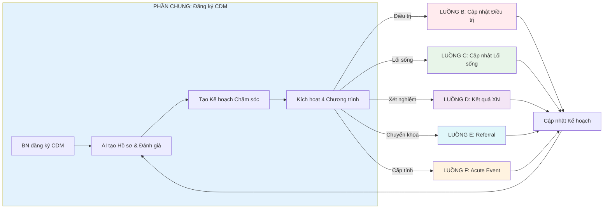

# SERVICE CHRONIC DISEASE MANAGEMENT

---

## 2.1 Tổng quan Service

**Mô tả:** Dịch vụ Quản lý Bệnh Mạn tính cung cấp hệ thống chăm sóc AI-first với 4 chương trình song song và vòng lặp đánh giá liên tục cho bệnh nhân tiểu đường, tăng huyết áp, tim mạch.

|            | Nội dung                                                            |
| ---------- | ------------------------------------------------------------------- |
| **INPUT**  | BN đang điều trị bệnh mạn tính đăng ký dịch vụ CDM                  |
| **OUTPUT** | Kế hoạch Chăm sóc cá nhân hóa + Quản lý liên tục qua 4 Chương trình |

---

## 2.2 Các tình huống (Scenarios)

| Tình huống | Mô tả                                             | Dẫn đến Luồng                        | Câu hỏi |
| ---------- | ------------------------------------------------- | ------------------------------------ | ------- |
| A          | BN đăng ký dịch vụ CDM lần đầu                    | Luồng A: Đăng ký & Đánh giá Ban đầu  |         |
| B          | BN đang trong chương trình, cần giám sát điều trị | Luồng B: Chu trình Cập nhật Điều trị |         |
| C          | BN cần theo dõi lối sống hàng ngày                | Luồng C: Chu trình Cập nhật Lối sống |         |
| D          | Đến hạn xét nghiệm định kỳ                        | Luồng D: Xử lý Kết quả Xét nghiệm    |         |
| E          | AI/BS xác định cần chuyển khoa chuyên gia         | Luồng E: Chuyển khoa Chuyên gia      |         |
| F          | Sự kiện cấp tính xảy ra                           | Luồng F: Sự kiện Cấp tính            |         |

---

## 2.3 Bảng tổng hợp các Luồng

| Luồng | Tên                         | INPUT                                                        | OUTPUT                                       | Số trạm | MD US Approval | Câu hỏi |
| ----- | --------------------------- | ------------------------------------------------------------ | -------------------------------------------- | ------- | -------------- | ------- |
| **A** | Đăng ký & Đánh giá Ban đầu  | BN đăng ký dịch vụ CDM                                       | Kế hoạch Chăm sóc + Kích hoạt 4 Chương trình | 5       | KHÔNG          |         |
| **B** | Chu trình Cập nhật Điều trị | Dữ liệu tuân thủ thuốc và sinh hiệu                          | Kế hoạch Chăm sóc được điều chỉnh (nếu cần)  | 10      | CÓ (đơn thuốc) |         |
| **C** | Chu trình Cập nhật Lối sống | Dữ liệu lối sống (dinh dưỡng, vận động, giấc ngủ, tâm trạng) | Điểm lối sống (0-100) + Coaching cá nhân hóa | 13      | KHÔNG          |         |
| **D** | Xử lý Kết quả Xét nghiệm    | Lịch XN trong Kế hoạch Chăm sóc                              | Kế hoạch Chăm sóc được điều chỉnh (nếu cần)  | 14      | CÓ (chỉ định)  |         |
| **E** | Chuyển khoa Chuyên gia      | AI/BS xác định cần chuyển khoa                               | Kế hoạch Chăm sóc được cập nhật              | 4       | -              |         |
| **F** | Sự kiện Cấp tính            | Sự kiện cấp tính xảy ra                                      | Kế hoạch Chăm sóc được điều chỉnh            | 4       | -              |         |

---

## 2.4 Sơ đồ các Luồng SONG SONG



---

## LUỒNG A: Đăng ký & Đánh giá Ban đầu

**Tình huống:** BN đang điều trị bệnh mạn tính đăng ký dịch vụ Quản lý Bệnh Mạn tính (CDM)

|            | Nội dung                                                 |
| ---------- | -------------------------------------------------------- |
| **INPUT**  | BN đăng ký dịch vụ CDM                                   |
| **OUTPUT** | Kế hoạch Chăm sóc cá nhân hóa + Kích hoạt 4 Chương trình |

**Số trạm:** 5

### Hành trình đầy đủ:

```
Khởi tạo Hồ sơ → Đánh giá Y khoa → Tạo Kế hoạch Chăm sóc → Lưu EHR → Kích hoạt Chương trình → END
```

### Chi tiết từng trạm:

| #   | Trạm                   | Mô tả                                                                              | Actor  | Input           | Output                 | Câu hỏi |
| --- | ---------------------- | ---------------------------------------------------------------------------------- | ------ | --------------- | ---------------------- | ------- |
| 1   | Khởi tạo Hồ sơ         | AI khởi tạo Hồ sơ Bệnh mạn tính & Thu thập dữ liệu từ EHR                          | AI     | BN đăng ký CDM  | Hồ sơ + Dữ liệu        |         |
| 2   | Đánh giá Y khoa        | AI đánh giá tình trạng y khoa (mức độ, nguy cơ, khoảng trống, ưu tiên, đề xuất)    | AI     | Hồ sơ + Dữ liệu | Đánh giá hoàn tất      |         |
| 3   | Tạo Kế hoạch           | AI tạo Kế hoạch Chăm sóc cá nhân hóa                                               | AI     | Đánh giá        | Kế hoạch được tạo      |         |
| 4   | Lưu EHR                | Lưu Kế hoạch Chăm sóc vào EHR                                                      | System | Kế hoạch        | Đã lưu                 |         |
| 5   | Kích hoạt Chương trình | Kích hoạt 4 Chương trình quản lý                                                   | System | Kế hoạch đã lưu | 4 Chương trình active  |         |

**Đặc điểm:**

- Tự động hoàn toàn bởi AI
- Không cần MD US approval
- Thời gian xử lý: < 5 phút

---

## LUỒNG B: Chu trình Cập nhật Điều trị

**Tình huống:** BN đang trong chương trình CDM, hệ thống giám sát tuân thủ thuốc và hiệu quả điều trị hàng ngày

|            | Nội dung                                    |
| ---------- | ------------------------------------------- |
| **INPUT**  | Dữ liệu tuân thủ thuốc và sinh hiệu         |
| **OUTPUT** | Kế hoạch Chăm sóc được điều chỉnh (nếu cần) |

**Số trạm:** 10

### Hành trình đầy đủ:

```
Nhắc thuốc → Xác nhận BN → Phân tích Tuân thủ → Escalate CS → Đánh giá Hiệu quả → Phát hiện Tác dụng phụ → Tạo Đề xuất → MD VN Review → MD US Phê duyệt → Cập nhật Kế hoạch → END
```

### Chi tiết từng trạm:

| #   | Trạm                   | Mô tả                                                         | Actor  | Input                  | Output                 | Câu hỏi |
| --- | ---------------------- | ------------------------------------------------------------- | ------ | ---------------------- | ---------------------- | ------- |
| 1   | Nhắc thuốc             | Gửi nhắc thuốc qua app/SMS                                    | System | Lịch thuốc             | Đã gửi nhắc            |         |
| 2   | Xác nhận BN            | BN xác nhận đã uống thuốc                                     | KH     | Nhắc thuốc             | Ghi nhận tuân thủ      |         |
| 3   | Phân tích Tuân thủ     | AI phân tích tuân thủ, phát hiện liều bỏ lỡ                   | AI     | Dữ liệu tuân thủ       | Báo cáo tuân thủ       |         |
| 4   | Escalate CS            | Chuyển lên Care Specialist nếu >2 liều bỏ liên tiếp           | AI     | Báo cáo                | CS được thông báo      |         |
| 5   | Đánh giá Hiệu quả      | AI đánh giá hiệu quả điều trị                                 | AI     | Dữ liệu lâm sàng       | Báo cáo hiệu quả       |         |
| 6   | Phát hiện Tác dụng phụ | AI phát hiện tác dụng phụ và tương tác thuốc                  | AI     | Dữ liệu BN             | Ghi nhận tác dụng phụ  |         |
| 7   | Tạo Đề xuất            | AI tạo đề xuất điều chỉnh nếu cần                             | AI     | Báo cáo + Tác dụng phụ | Đề xuất được tạo       |         |
| 8   | MD VN Review           | MD VN xem xét và phê duyệt/điều chỉnh                         | MD VN  | Đề xuất AI             | Đã phê duyệt           |         |
| 9   | MD US Phê duyệt        | MD US phê duyệt cuối cùng cho đơn thuốc                       | MD US  | Đề xuất đã duyệt       | Đơn thuốc được duyệt   |         |
| 10  | Cập nhật Kế hoạch      | Cập nhật Kế hoạch Chăm sóc và thông báo BN                    | System | Đơn thuốc duyệt        | Kế hoạch cập nhật      |         |

**Đặc điểm:**

- Chu trình liên tục hàng ngày
- CẦN MD US approval cho thay đổi đơn thuốc
- Escalate nếu >2 liều bỏ liên tiếp
- Thời gian xử lý đề xuất: 24-48 giờ

---

## LUỒNG C: Chu trình Cập nhật Lối sống

**Tình huống:** BN ghi nhật ký lối sống hàng ngày (dinh dưỡng, vận động, giấc ngủ, tâm trạng), AI phân tích và đưa ra coaching cá nhân hóa

|            | Nội dung                                                         |
| ---------- | ---------------------------------------------------------------- |
| **INPUT**  | Dữ liệu lối sống (dinh dưỡng, vận động, giấc ngủ, tâm trạng)     |
| **OUTPUT** | Điểm lối sống (0-100) + Coaching + Điều chỉnh mục tiêu (nếu cần) |

**Số trạm:** 13

### Hành trình đầy đủ:

```
Ghi Bữa ăn → AI Phân tích Dinh dưỡng → Ghi Vận động → AI Phân tích Vận động → Ghi Giấc ngủ → AI Phân tích Giấc ngủ → Check-in Tâm trạng → AI Tổng hợp → Tính Điểm → Kiểm tra Ngưỡng → Can thiệp CS → Tạo Coaching → Cập nhật EHR → END
```

### Chi tiết từng trạm:

| #   | Trạm                     | Mô tả                                                    | Actor     | Input                      | Output                                               | Câu hỏi |
| --- | ------------------------ | -------------------------------------------------------- | --------- | -------------------------- | ---------------------------------------------------- | ------- |
| 1   | Ghi Bữa ăn               | BN ghi nhật ký bữa ăn (món ăn, khẩu phần)                | KH        | Bữa ăn (text/ảnh)          | Ghi nhận bữa ăn                                      |         |
| 2   | AI Phân tích Dinh dưỡng  | AI phân tích thành phần dinh dưỡng từ bữa ăn             | AI        | Ghi nhận bữa ăn            | Dữ liệu dinh dưỡng (calo, carbs, protein, fat, vitamins) |         |
| 3   | Ghi Vận động             | BN ghi hoạt động hoặc sync từ wearable                   | KH/Device | Hoạt động (loại, thời gian)| Ghi nhận hoạt động                                   |         |
| 4   | AI Phân tích Vận động    | AI tính toán metrics vận động                            | AI        | Ghi nhận hoạt động         | Dữ liệu vận động (calo đốt, quãng đường, nhịp tim TB)|         |
| 5   | Ghi Giấc ngủ             | BN ghi giấc ngủ hoặc sync từ wearable                    | KH/Device | Giấc ngủ (giờ đi ngủ, thức dậy) | Ghi nhận giấc ngủ                               |         |
| 6   | AI Phân tích Giấc ngủ    | AI phân tích chất lượng giấc ngủ                         | AI        | Ghi nhận giấc ngủ          | Dữ liệu giấc ngủ (thời lượng, % deep sleep, sleep score) |         |
| 7   | Check-in Tâm trạng       | BN check-in tâm trạng hàng ngày                          | KH        | Tâm trạng                  | Dữ liệu tâm trạng                                    |         |
| 8   | AI Tổng hợp              | AI tổng hợp và phân tích dữ liệu lối sống                | AI        | 4 loại dữ liệu             | Dữ liệu tổng hợp                                     |         |
| 9   | Tính Điểm                | Tính Điểm Lối sống từng lĩnh vực + tổng thể (0-100)      | AI        | Dữ liệu tổng hợp           | Điểm 0-100                                           |         |
| 10  | Kiểm tra Ngưỡng          | Kiểm tra điểm có đạt ngưỡng >=60%                        | AI        | Điểm                       | Phân loại                                            |         |
| 11  | Can thiệp CS             | Kích hoạt can thiệp CS nếu điểm <60%                     | System    | Phân loại                  | Cảnh báo CS                                          |         |
| 12  | Tạo Coaching             | AI tạo coaching cá nhân hóa                              | AI        | Điểm + Phân tích           | Coaching được gửi                                    |         |
| 13  | Cập nhật EHR             | Cập nhật dữ liệu lối sống vào EHR                        | System    | Tất cả dữ liệu             | EHR cập nhật                                         |         |

**Đặc điểm:**

- Chu trình hàng ngày + Review hàng tháng
- KHÔNG cần MD US approval
- Coaching sử dụng: Motivational interviewing, SMART goals, Barrier identification
- Can thiệp CS khi điểm <60%

---

## LUỒNG D: Xử lý Kết quả Xét nghiệm

**Tình huống:** AI quản lý toàn bộ chu trình xét nghiệm từ chỉ định, theo dõi thực hiện, phân tích kết quả, đến điều chỉnh điều trị

|            | Nội dung                                    |
| ---------- | ------------------------------------------- |
| **INPUT**  | Lịch XN trong Kế hoạch Chăm sóc             |
| **OUTPUT** | Kế hoạch Chăm sóc được điều chỉnh (nếu cần) |

**Số trạm:** 14

### Hành trình đầy đủ:

```
Kiểm tra Lịch → Tạo Phiếu XN → MD US Phê duyệt → Gửi Nhắc → BN đi XN → Reminder → Escalate CS → Reschedule → Lab gửi KQ → Nhập EHR → So sánh → Đánh giá → Phân tích Xu hướng → Phân loại → END
```

### Chi tiết từng trạm:

| #   | Trạm               | Mô tả                                                              | Actor  | Input            | Output                | Câu hỏi |
| --- | ------------------ | ------------------------------------------------------------------ | ------ | ---------------- | --------------------- | ------- |
| 1   | Kiểm tra Lịch      | AI kiểm tra lịch XN theo Kế hoạch Chăm sóc                         | AI     | Kế hoạch         | XN đến hạn            |         |
| 2   | Tạo Phiếu XN       | AI tạo Phiếu chỉ định XN                                           | AI     | XN đến hạn       | Phiếu XN (bản nháp)   |         |
| 3   | MD US Phê duyệt    | MD US phê duyệt chỉ định xét nghiệm                                | MD US  | Phiếu XN         | Phiếu XN (đã duyệt)   |         |
| 4   | Gửi Nhắc           | Gửi nhắc cho BN (3-5 ngày trước)                                   | System | Phiếu XN duyệt   | Đã gửi nhắc           |         |
| 5   | BN đi XN           | BN đến lab thực hiện XN                                            | KH     | Nhắc             | Ghi nhận tham gia     |         |
| 6   | Reminder           | Nếu BN bỏ lỡ: Gửi reminder tự động                                 | AI     | Bỏ lỡ            | Reminder được gửi     |         |
| 7   | Escalate CS        | Nếu >7 ngày: Escalate lên CS                                       | AI     | >7 ngày          | CS được thông báo     |         |
| 8   | Reschedule         | Reschedule appointment                                             | System | Escalate         | Lịch mới được tạo     |         |
| 9   | Lab gửi KQ         | Lab thực hiện XN & gửi kết quả                                     | Lab    | BN đi XN         | Kết quả được gửi      |         |
| 10  | Nhập EHR           | AI nhập kết quả vào EHR                                            | AI     | Kết quả          | EHR cập nhật          |         |
| 11  | So sánh            | So sánh với reference ranges                                       | AI     | Kết quả          | So sánh hoàn tất      |         |
| 12  | Đánh giá           | Đánh giá mức độ kiểm soát bệnh                                     | AI     | So sánh          | Đánh giá hoàn tất     |         |
| 13  | Phân tích Xu hướng | Phân tích xu hướng theo thời gian                                  | AI     | Dữ liệu lịch sử  | Báo cáo xu hướng      |         |
| 14  | Phân loại          | Phân loại: Bình thường/Cận biên/Bất thường/Nguy hiểm               | AI     | Tất cả phân tích | Phân loại + Hành động |         |

> **Lưu ý:** Mọi chỉ định xét nghiệm (Phiếu XN) đều PHẢI có MD US phê duyệt trước khi gửi cho BN.

**Đặc điểm:**

- Chu trình định kỳ theo Kế hoạch Chăm sóc
- **CẦN MD US approval cho mọi chỉ định xét nghiệm** (trạm 3)
- CẦN MD VN/US review nếu kết quả Bất thường/Nguy hiểm
- Auto-reschedule nếu BN bỏ lỡ >7 ngày
- 4 mức phân loại: Bình thường, Cận biên, Bất thường, Nguy hiểm

---

## LUỒNG E: Chuyển khoa Chuyên gia

**Tình huống:** AI/BS xác định BN cần chuyển khoa chuyên gia, toàn bộ quy trình được chuyển sang Service 2 (Specialist_Referral)

|            | Nội dung                                                |
| ---------- | ------------------------------------------------------- |
| **INPUT**  | AI/BS xác định cần chuyển khoa                          |
| **OUTPUT** | Kế hoạch Chăm sóc được cập nhật với kết quả chuyển khoa |

**Số trạm:** 4

### Hành trình đầy đủ:

```
Điều kiện kích hoạt → Chuyển Service 2 (Specialist_Referral) → Kết quả phản hồi → Cập nhật Kế hoạch → END
```

### Chi tiết từng trạm:

| #   | Trạm                | Mô tả                                                                              | Actor    | Input     | Output               | Câu hỏi |
| --- | ------------------- | ---------------------------------------------------------------------------------- | -------- | --------- | -------------------- | ------- |
| 1   | Điều kiện kích hoạt | AI/BS xác định cần chuyển khoa (biến chứng, XN bất thường, không đáp ứng)          | AI/MD VN | Đánh giá  | Xác định chuyển khoa |         |
| 2   | Chuyển Service 2 (Specialist_Referral)    | Chuyển toàn bộ quy trình sang Service 2 (Specialist_Referral)                       | System   | Xác định  | Referral created     |         |
| 3   | Kết quả phản hồi    | Nhận kết quả từ chuyên gia qua Service 2 (Specialist_Referral)                                           | System   | Referral  | Kết quả chuyển khoa  |         |
| 4   | Cập nhật Kế hoạch   | Cập nhật Kế hoạch Chăm sóc với kết quả chuyển khoa                                 | System   | Kết quả   | Kế hoạch cập nhật    |         |

**Đặc điểm:**

- TRIGGER POINT cho Service 2 (Specialist_Referral)
- Điều kiện: Biến chứng, XN bất thường, Không đáp ứng, Khuyến nghị theo hướng dẫn
- Thời gian: 1-4 tuần (tùy loại chuyển khoa)

---

## LUỒNG F: Sự kiện Cấp tính

**Tình huống:** Sự kiện cấp tính xảy ra (hạ đường huyết, tăng HA cấp, đau ngực...), quy trình được chuyển sang Service 1 (Access_to_Care_247)

|            | Nội dung                                      |
| ---------- | --------------------------------------------- |
| **INPUT**  | Sự kiện cấp tính xảy ra                       |
| **OUTPUT** | Kế hoạch Chăm sóc được điều chỉnh sau sự kiện |

**Số trạm:** 4

### Hành trình đầy đủ:

```
Sự kiện cấp tính → Chuyển Service 1 (Access_to_Care_247) → Kết quả xử lý → Điều chỉnh Kế hoạch → END
```

### Chi tiết từng trạm:

| #   | Trạm                | Mô tả                                                                                         | Actor    | Input       | Output                 | Câu hỏi |
| --- | ------------------- | --------------------------------------------------------------------------------------------- | -------- | ----------- | ---------------------- | ------- |
| 1   | Sự kiện cấp tính    | Phát hiện sự kiện cấp tính (hạ đường huyết, tăng HA, đau ngực, tác dụng phụ nghiêm trọng)     | KH/AI    | Triệu chứng | Sự kiện được ghi nhận  |         |
| 2   | Chuyển Service 1 (Access_to_Care_247)    | Chuyển sang Service 1 (Access_to_Care_247)                                                    | System   | Sự kiện     | Case cấp tính created  |         |
| 3   | Kết quả xử lý       | Nhận kết quả xử lý từ Service 1 (Access_to_Care_247)                                                               | System   | Case        | Kết quả xử lý          |         |
| 4   | Điều chỉnh Kế hoạch | Điều chỉnh Kế hoạch Chăm sóc dựa trên sự kiện cấp tính                                        | AI/MD VN | Kết quả     | Kế hoạch điều chỉnh    |         |

**Đặc điểm:**

- SAFETY NET - hoạt động 24/7
- Điều kiện: Hạ đường huyết nặng (<54 mg/dL), Tăng HA cấp (>180/120), Đau ngực/Khó thở, Tác dụng phụ nghiêm trọng, Biến chứng cấp tính (DKA, HHS)
- Mọi sự kiện ảnh hưởng đến Kế hoạch Chăm sóc

---

## 3. Tham chiếu Ngoài

| Program      | Service                        | Integration                   |
| ------------ | ------------------------------ | ----------------------------- |
| P3 (LUỒNG E) | Service 2 (Specialist_Referral) | Referral initiation & results |
| P4 (LUỒNG F) | Service 1 (Access_to_Care_247) | Emergency care & outcomes     |

→ [Function Specs](../function-specs/) | [Master Index](../../index.md) | [Glossary](../../glossary.md)
