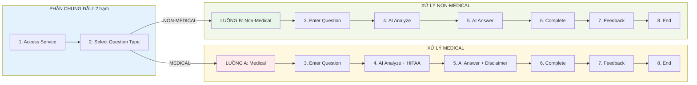

SERVICE ASYNC MESSAGING

## 6.1 Tổng quan Service

**Mô tả:** Dịch vụ hỏi đáp qua AI về các câu hỏi y tế và phi y tế

| | Nội dung |
|------|----------|
| **INPUT** | Khách hàng có câu hỏi cần giải đáp (y tế hoặc phi y tế) |
| **OUTPUT** | Câu trả lời + tài liệu tham khảo + lưu lịch sử |

**ĐẶC BIỆT:** Đây là mô hình **LINEAR** (tuyến tính) với 2 nhánh xử lý song song dựa trên LOẠI CÂU HỎI, không phải outcome.

## 6.2 Các tình huống (Scenarios)

| Tình huống | Mô tả | Dẫn đến Luồng | Câu hỏi |
|------------|-------|---------------|---------|
| A | KH có câu hỏi về sức khỏe CÁ NHÂN (triệu chứng, thuốc, điều trị) | Luồng A: Medical Question | |
| B | KH có câu hỏi về DỊCH VỤ/THÔNG TIN CHUNG (hướng dẫn app, dinh dưỡng, kỹ thuật) | Luồng B: Non-Medical Question | |

## 6.3 Bảng tổng hợp các Luồng

| Luồng | Tên | INPUT | OUTPUT | Số trạm | Câu hỏi |
|-------|-----|-------|--------|---------|---------|
| **A** | Medical Question | KH có câu hỏi về sức khỏe cá nhân | Câu trả lời + disclaimer + references (HIPAA) | 8 | |
| **B** | Non-Medical Question | KH có câu hỏi về dịch vụ/thông tin chung | Câu trả lời + references | 8 | |

## 6.4 Sơ đồ các Luồng SONG SONG



## 6.5 So sánh 2 Luồng

| Aspect | LUỒNG A: Medical | LUỒNG B: Non-Medical |
|--------|------------------|----------------------|
| **HIPAA Compliance** | Có - Mã hóa PHI | Không |
| **AI Filters** | Medical safety filters | General content filters |
| **Disclaimer** | Có - "Không thay thế tư vấn chuyên gia" | Không |
| **Knowledge Base** | CVH Medical Library | General knowledge |
| **Storage** | Encrypted, access-controlled, audit trail | Standard security |
| **Escalation** | Có thể chuyển Service 1 (Access_to_Care_247)/5 | Không |
| **Ví dụ câu hỏi** | "Thuốc X có tác dụng phụ gì?" | "Làm sao đổi mật khẩu?" |

---

## LUỒNG A: Medical Question

**Tình huống:** Khách hàng có câu hỏi về sức khỏe cá nhân

| | Nội dung |
|------|----------|
| **INPUT** | KH có câu hỏi về sức khỏe cá nhân (triệu chứng, thuốc, điều trị...) |
| **OUTPUT** | Câu trả lời + disclaimer + references + lưu lịch sử (HIPAA compliant) |

**Số trạm:** 8

### Hành trình đầy đủ:
```
Access → Select Medical → Enter Question → AI Analyze (HIPAA) → AI Answer (+ Disclaimer) → Complete → Feedback (optional) → End
```

### Chi tiết từng trạm:

| # | Trạm | Mô tả | Actor | Input | Output | Câu hỏi |
|---|------|-------|-------|-------|--------|---------|
| 1 | Access Service | KH truy cập Async Messaging qua App/Web | KH | Active Account | Service Interface | |
| 2 | Select Question Type | KH chọn loại câu hỏi = MEDICAL | KH | Interface | Question Type = MEDICAL | |
| 3 | Enter Question | KH nhập câu hỏi về sức khỏe | KH | Question Type | Question Text (PHI) | |
| 4 | AI Analyze | AI phân tích + áp dụng HIPAA filters + medical safety | AI | Question Text | Analysis + Safety Check | |
| 5 | AI Answer | AI tạo câu trả lời + disclaimer + references | AI | Analysis | Answer + Disclaimer + Docs | |
| 6 | Complete | Hiển thị form feedback (optional), cảm ơn | System | Answer | Session Summary | |
| 7 | Feedback | KH đánh giá (Helpful/Not Helpful, stars) | KH | Session Summary | Feedback Data | |
| 8 | End | Đóng session, lưu lịch sử (encrypted) | System | Feedback | Session Closed | |

**Đặc điểm:**
- HIPAA compliance: Mã hóa dữ liệu, audit trail
- Medical safety filters: Phát hiện tình huống khẩn cấp, từ chối nội dung nguy hiểm
- Disclaimer: "Thông tin chỉ mang tính tham khảo, không thay thế tư vấn y tế chuyên nghiệp"
- Escalation: Nếu câu hỏi quá phức tạp → đề nghị dùng Service 1 (Access_to_Care_247) (24/7 Access) hoặc Service 3 (Schedule_Video_Visit) (Video Visit)

---

## LUỒNG B: Non-Medical Question

**Tình huống:** Khách hàng có câu hỏi về dịch vụ hoặc thông tin chung

| | Nội dung |
|------|----------|
| **INPUT** | KH có câu hỏi về dịch vụ/thông tin chung (hướng dẫn app, dinh dưỡng, kỹ thuật...) |
| **OUTPUT** | Câu trả lời + references + lưu lịch sử |

**Số trạm:** 8

### Hành trình đầy đủ:
```
Access → Select Non-Medical → Enter Question → AI Analyze → AI Answer → Complete → Feedback (optional) → End
```

### Chi tiết từng trạm:

| # | Trạm | Mô tả | Actor | Input | Output | Câu hỏi |
|---|------|-------|-------|-------|--------|---------|
| 1 | Access Service | KH truy cập Async Messaging qua App/Web | KH | Active Account | Service Interface | |
| 2 | Select Question Type | KH chọn loại câu hỏi = NON-MEDICAL | KH | Interface | Question Type = NON-MEDICAL | |
| 3 | Enter Question | KH nhập câu hỏi về dịch vụ/thông tin | KH | Question Type | Question Text | |
| 4 | AI Analyze | AI phân tích câu hỏi (general filters) | AI | Question Text | Analysis | |
| 5 | AI Answer | AI tạo câu trả lời + references | AI | Analysis | Answer + Docs | |
| 6 | Complete | Hiển thị form feedback (optional), cảm ơn | System | Answer | Session Summary | |
| 7 | Feedback | KH đánh giá (Helpful/Not Helpful, stars) | KH | Session Summary | Feedback Data | |
| 8 | End | Đóng session, lưu lịch sử | System | Feedback | Session Closed | |

**Đặc điểm:**
- KHÔNG cần HIPAA compliance (không có PHI)
- General content filters: Từ chối spam, nội dung không phù hợp
- KHÔNG có disclaimer y tế
- Knowledge base: Hướng dẫn app, thông tin dịch vụ CVH, thông tin sức khỏe tổng quát

---

## 6.6 Ví dụ thực tế

### Ví dụ 1: Medical Question (LUỒNG A)
```
KH: "Tôi đang uống thuốc huyết áp Amlodipine, có thể uống cùng với bưởi được không?"

AI Analysis: Phát hiện câu hỏi về Drug-Food Interaction → Medical → HIPAA enabled

AI Answer:
"Bưởi (grapefruit) có thể tương tác với Amlodipine, làm tăng nồng độ thuốc trong máu và
gây tác dụng phụ như chóng mặt, nhịp tim nhanh. Để an toàn, nên tránh ăn bưởi hoặc
uống nước bưởi khi đang dùng thuốc này.

📚 Tài liệu tham khảo:
- Drug Interactions: Amlodipine (CVH Medical Library)
- Grapefruit Juice and Medications (FDA)

⚠️ Lưu ý: Thông tin này chỉ mang tính tham khảo. Vui lòng tham khảo ý kiến bác sĩ
để được tư vấn cụ thể cho trường hợp của bạn."
```

### Ví dụ 2: Non-Medical Question (LUỒNG B)
```
KH: "Làm sao để đổi mật khẩu ứng dụng CVH?"

AI Analysis: Phát hiện câu hỏi về Technical Support → Non-Medical

AI Answer:
"Để đổi mật khẩu ứng dụng CVH, bạn thực hiện các bước sau:

1. Mở ứng dụng CVH → Vào 'Settings' (Cài đặt)
2. Chọn 'Account' (Tài khoản) → 'Change Password' (Đổi mật khẩu)
3. Nhập mật khẩu cũ, sau đó nhập mật khẩu mới 2 lần
4. Nhấn 'Save' (Lưu)

📚 Tài liệu tham khảo:
- Hướng dẫn sử dụng ứng dụng CVH (CVH Help Center)"
```

---

## 6.7 Exception Scenarios

| Scenario | AI xử lý | Hướng dẫn KH |
|----------|----------|--------------|
| Câu hỏi quá phức tạp | Thông báo không thể trả lời | Đề nghị dùng Service 1 (Access_to_Care_247)/5 |
| Phát hiện tình huống khẩn cấp | Alert + từ chối xử lý | Đề nghị gọi 911 hoặc dùng Service 1 (Access_to_Care_247) |
| Nội dung vi phạm điều khoản | Từ chối lịch sự | Giải thích lý do, đề nghị hỏi câu khác |
| Spam/nội dung không phù hợp | Từ chối | Thông báo và đề nghị hỏi lại |

---
