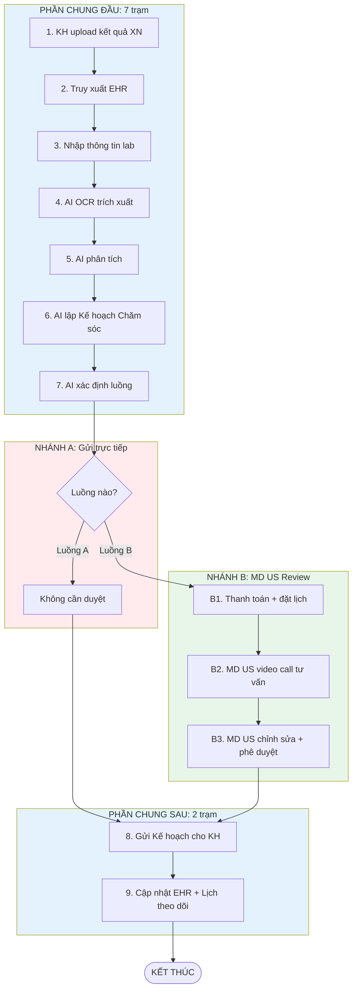

# SERVICE TƯ VẤN KẾT QUẢ XÉT NGHIỆM (LAB RESULTS CONSULTATION)

---

## 2.1 Tổng quan Service

**Mô tả:** Dịch vụ lẻ cung cấp phân tích và tư vấn chuyên sâu về kết quả xét nghiệm từ các phòng lab bên ngoài (LabCorp, Quest Diagnostics, bệnh viện, phòng khám). KH thanh toán theo lần sử dụng, không thuộc gói Care Connect/Plus/Premium.

|            | Nội dung                                  |
| ---------- | ----------------------------------------- |
| **INPUT**  | Kết quả XN từ lab bên ngoài (PDF/JPG/PNG) |
| **OUTPUT** | Kế hoạch Chăm sóc + Lịch theo dõi         |

**Trigger:** KH chọn dịch vụ "Tư vấn Kết quả Xét nghiệm"

**Điều kiện tiên quyết:**

- Tài khoản CVH đang hoạt động
- Có kết quả XN từ lab bên ngoài (PDF/JPG/PNG)

---

## 2.2 Các tình huống (Scenarios)

| Tình huống | Mô tả                                 | Dẫn đến Luồng              | Câu hỏi |
| ---------- | -------------------------------------- | --------------------------- | ------- |
| A          | KH có kết quả XN cần phân tích tư vấn | Luồng A: Tư vấn Kết quả XN |         |

> **Lưu ý:** Luồng này có 2 nhánh xử lý tùy theo mức độ phức tạp của kết quả XN. AI phân tích, lập Kế hoạch Chăm sóc **cho cả 2 luồng**, sau đó tự động xác định luồng phù hợp. KH KHÔNG cần chọn.

---

## 2.3 Bảng tổng hợp các Luồng

| Luồng | Tên                       | INPUT                   | OUTPUT                      | Số trạm | BS Review | Câu hỏi |
| ----- | -------------------------- | ----------------------- | --------------------------- | ------- | --------- | ------- |
| **A** | AI gửi trực tiếp           | Kết quả XN từ lab ngoài | Kế hoạch Chăm sóc + Lịch TĐ | 9       | KHÔNG     |         |
| **B** | MD US Review + Phê duyệt  | Kết quả XN từ lab ngoài | Kế hoạch Chăm sóc + Lịch TĐ | 12      | CÓ        |         |

---

## 2.4 Sơ đồ các Luồng SONG SONG



---

## LUỒNG A: Tư vấn Kết quả Xét nghiệm

**Tình huống:** KH upload kết quả XN từ lab bên ngoài. AI phân tích, **lập Kế hoạch Chăm sóc cho cả 2 luồng**, sau đó tự động xác định luồng phù hợp (KH KHÔNG cần chọn).

- **Luồng A:** Kế hoạch AI được gửi **trực tiếp** cho KH, không cần BS review/phê duyệt.
- **Luồng B:** Kế hoạch AI đã lập sẵn → MD US dùng Kế hoạch này để video call tư vấn KH → MD chỉnh sửa (nếu cần) → MD phê duyệt → Gửi KH.

|            | Nội dung                                  |
| ---------- | ----------------------------------------- |
| **INPUT**  | Kết quả XN từ lab bên ngoài (PDF/JPG/PNG) |
| **OUTPUT** | Kế hoạch Chăm sóc + Lịch theo dõi         |

**Số trạm:** Luồng A: 9 trạm (7 chung đầu + 0 riêng + 2 chung sau) | Luồng B: 12 trạm (7 chung đầu + 3 riêng + 2 chung sau)

### Hành trình đầy đủ:

```
Luồng A: [CHUNG ĐẦU] Upload XN → Truy xuất EHR → Nhập thông tin → AI OCR → AI phân tích → AI lập Kế hoạch → AI xác định luồng → [NHÁNH A] Gửi thẳng → [CHUNG SAU] Gửi KH → Cập nhật EHR → END

Luồng B: [CHUNG ĐẦU] Upload XN → Truy xuất EHR → Nhập thông tin → AI OCR → AI phân tích → AI lập Kế hoạch → AI xác định luồng → [NHÁNH B] Thanh toán → Video Call → MD chỉnh sửa + phê duyệt → [CHUNG SAU] Gửi KH → Cập nhật EHR → END
```

### Chi tiết từng trạm:

#### Bước chung đầu (cả 2 luồng)

| #   | Trạm                        | Mô tả                                                               | Actor  | Input                 | Output                | Câu hỏi |
| --- | ---------------------------- | -------------------------------------------------------------------- | ------ | --------------------- | --------------------- | ------- |
| 1   | Upload XN                    | KH upload file kết quả XN                                           | KH     | File XN (PDF/JPG/PNG) | File được lưu         |         |
| 2   | Truy xuất EHR                | Hệ thống truy xuất và hiển thị dữ liệu EHR                          | System | KH ID                 | EHR hiển thị          |         |
| 3   | Nhập thông tin               | KH nhập thông tin lab (tên lab, ngày XN, lý do)                      | KH     | -                     | Thông tin hoàn tất    |         |
| 4   | AI OCR                       | AI OCR & trích xuất dữ liệu từ file                                 | AI     | File XN               | Dữ liệu XN            |         |
| 5   | AI phân tích                 | AI phân tích kết quả (so sánh reference range, xác định bất thường) | AI     | Dữ liệu XN + EHR      | Báo cáo phân tích     |         |
| 6   | AI lập Kế hoạch Chăm sóc     | AI tự động lập Kế hoạch Chăm sóc dựa trên báo cáo phân tích        | AI     | Báo cáo phân tích     | Kế hoạch Chăm sóc     |         |
| 7   | AI xác định luồng            | AI tự động xác định luồng phù hợp (A hoặc B) và chuyển KH vào luồng | AI     | Báo cáo phân tích     | Chuyển sang luồng A/B |         |

> **Lưu ý:** AI lập Kế hoạch Chăm sóc **trước khi** xác định luồng. Cả 2 luồng đều có Kế hoạch sẵn. Sự khác biệt là luồng A gửi thẳng, luồng B qua MD review.

#### Nhánh A: Gửi trực tiếp (Không cần duyệt)

| #   | Trạm | Mô tả | Actor | Input | Output | Câu hỏi |
| --- | ---- | ----- | ----- | ----- | ------ | ------- |
| -   | -    | Không có bước riêng. Kế hoạch AI đã lập ở bước 6 được chuyển thẳng sang bước chung "Gửi Kế hoạch" (bước 8) | - | - | - | |

> **Lưu ý Luồng A:** Không có bước tư vấn, không có MD review, không có phê duyệt. Kế hoạch AI được gửi **tự động** cho KH ngay sau khi xác định luồng A.

#### Nhánh B: MD US Video Call + Phê duyệt

| #   | Trạm                        | Mô tả                                                                                            | Actor      | Input                            | Output                          | Câu hỏi |
| --- | ---------------------------- | ------------------------------------------------------------------------------------------------- | ---------- | -------------------------------- | ------------------------------- | ------- |
| B1  | Thanh toán + đặt lịch        | KH thanh toán phí bổ sung ($50-100) + đặt lịch video call                                        | KH         | -                                | Lịch được xác nhận              |         |
| B2  | MD US video call tư vấn      | MD US video call tư vấn KH (20-30 phút). MD **dùng Kế hoạch AI đã lập sẵn** làm cơ sở tư vấn    | MD US + KH | Kế hoạch AI + Báo cáo phân tích | Hoàn tất tư vấn                 |         |
| B3  | MD US chỉnh sửa + phê duyệt | MD US xem lại Kế hoạch AI, **chỉnh sửa nếu cần**, sau đó phê duyệt (ký số) trước khi gửi cho KH | MD US      | Kế hoạch AI                      | Kế hoạch đã duyệt (đã ký số)   |         |

> **Lưu ý Luồng B:** Kế hoạch AI đã được lập sẵn ở bước 6 (phần chung). MD US dùng Kế hoạch này để tư vấn KH trong video call, có thể chỉnh sửa trước khi phê duyệt. Sau khi phê duyệt → chuyển sang bước chung "Gửi Kế hoạch" (bước 8).

#### Bước chung sau (sau phân nhánh)

| #   | Trạm         | Mô tả                                                                                                             | Actor  | Input              | Output       | Câu hỏi |
| --- | ------------ | ------------------------------------------------------------------------------------------------------------------ | ------ | ------------------ | ------------ | ------- |
| 8   | Gửi Kế hoạch | Hệ thống gửi Kế hoạch Chăm sóc (PDF mã hóa + app). Luồng A: bản AI gốc. Luồng B: bản MD đã chỉnh sửa/phê duyệt | System | Kế hoạch (A hoặc B) | KH nhận được |         |
| 9   | Cập nhật EHR | Cập nhật EHR + thiết lập lịch theo dõi                                                                            | System | Kế hoạch            | Case Closed  |         |

### Phân biệt 2 nhánh:

| Tiêu chí              | Luồng A: Gửi trực tiếp                                | Luồng B: MD US Review + Phê duyệt                        |
| ---------------------- | ------------------------------------------------------ | --------------------------------------------------------- |
| Khi nào AI chọn        | Bất thường mức Bình thường/Cần chú ý, không cần thuốc | Chỉ số nguy hiểm, cần kê đơn, mẫu phức tạp               |
| AI lập Kế hoạch        | **CÓ** (bước 6 - phần chung)                          | **CÓ** (bước 6 - phần chung)                              |
| MD review Kế hoạch     | **KHÔNG**                                              | CÓ - MD dùng Kế hoạch AI để tư vấn, chỉnh sửa + phê duyệt |
| Kế hoạch gửi cho KH    | Bản AI gốc (tự động)                                  | Bản MD đã chỉnh sửa/phê duyệt                             |
| Chi phí                | Phí cơ bản (rẻ hơn)                                   | Phí cơ bản + $50-100                                      |
| Quy trình riêng        | Không có bước riêng → Gửi thẳng                        | Thanh toán → Video Call → MD chỉnh sửa + phê duyệt        |
| Thời gian              | 5-10 phút (tự động)                                   | 30-50 phút + chờ lịch                                     |
| Số bước riêng          | 0 bước                                                | 3 bước (B1-B3)                                            |
| KH chọn luồng          | **KHÔNG** - AI tự động xác định                        | **KHÔNG** - AI tự động xác định                            |

**Đặc điểm:**

- Dịch vụ lẻ, thanh toán theo lần sử dụng
- **AI LUÔN lập Kế hoạch Chăm sóc** cho cả 2 luồng (bước 6 - phần chung đầu)
- **AI TỰ ĐỘNG xác định luồng** phù hợp dựa trên mức độ bất thường (KH KHÔNG cần chọn)
- **Luồng A:** Kế hoạch AI gửi **trực tiếp** cho KH, KHÔNG có tư vấn, KHÔNG có BS review/phê duyệt
- **Luồng B:** Kế hoạch AI đã lập sẵn → MD US dùng để video call tư vấn → MD **chỉnh sửa nếu cần** → MD phê duyệt → Gửi KH

---

## 3. Tham chiếu Ngoài

| Tích hợp           | Dịch vụ         | Mô tả                                      |
| ------------------- | --------------- | ------------------------------------------- |
| Đơn thuốc điện tử   | Nhà thuốc       | Luồng B: MD US có thể kê đơn               |
| EHR                 | Hệ thống nội bộ | Truy xuất lịch sử y khoa, cập nhật kết quả |

→ [Function Specs](../function-specs/) | [Master Index](../../index.md) | [Glossary](../../glossary.md)
