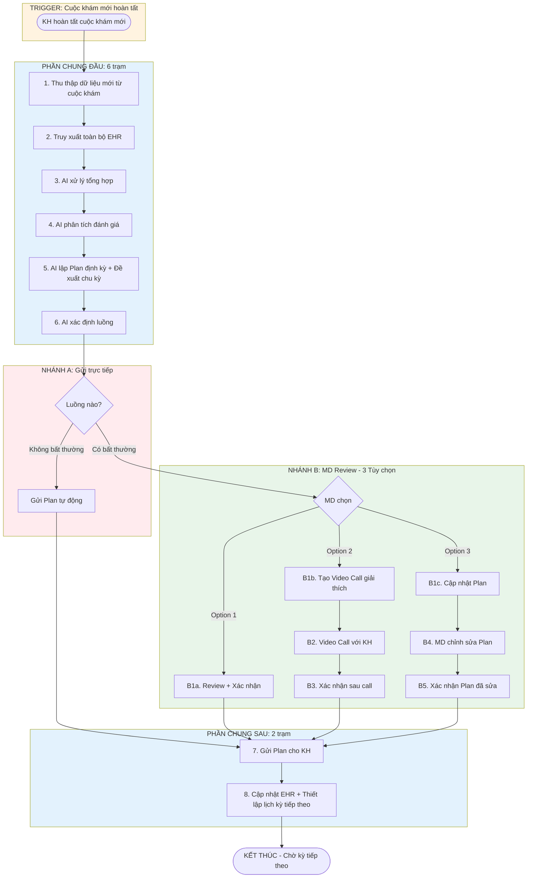

# SERVICE QUẢN LÝ SỨC KHỎE ĐỊNH KỲ (ROUTINE CHECKUP)

---

## 2.1 Tổng quan Service

**Mô tả:** Dịch vụ Quản lý Sức khỏe Định kỳ tạo Kế hoạch chăm sóc sức khỏe (Plan định kỳ) cho khách hàng dựa trên toàn bộ dữ liệu sức khỏe. AI phân tích và đề xuất chu kỳ theo dõi phù hợp (6 tháng hoặc 12 tháng). Service được kích hoạt khi KH có cuộc khám mới và đã mua gói dịch vụ có bao gồm service này.

|            | Nội dung                                                              |
| ---------- | --------------------------------------------------------------------- |
| **INPUT**  | Toàn bộ dữ liệu EHR + Kết quả khám mới                                |
| **OUTPUT** | Plan định kỳ (PDF) + Cập nhật EHR + Lịch hẹn kỳ tiếp theo             |

**Trigger:** KH hoàn tất cuộc khám mới với CVH (có dữ liệu sức khỏe mới)

**Điều kiện tiên quyết:**

- Tài khoản CVH đang hoạt động
- **Đã mua gói dịch vụ có bao gồm Service Quản lý Sức khỏe Định kỳ**
- Có dữ liệu EHR từ các dịch vụ trước
- KH vừa hoàn tất cuộc khám mới (dữ liệu mới được cập nhật vào EHR)

---

## 2.2 Các tình huống (Scenarios)

| Tình huống | Mô tả                                                    | Dẫn đến Luồng                       | Câu hỏi |
| ---------- | -------------------------------------------------------- | ----------------------------------- | ------- |
| A          | KH hoàn tất cuộc khám mới → Hệ thống tạo Plan định kỳ   | Luồng A: Quản lý Sức khỏe Định kỳ   |         |

> **Lưu ý:** Luồng này có 2 nhánh xử lý tùy theo tình trạng sức khỏe của KH. AI phân tích, lập Plan định kỳ **cho cả 2 luồng**, sau đó tự động xác định luồng phù hợp. KH KHÔNG cần chọn.

---

## 2.3 Bảng tổng hợp các Luồng

| Luồng | Tên                        | INPUT                           | OUTPUT                              | Số trạm | MD Review | Câu hỏi |
| ----- | -------------------------- | ------------------------------- | ----------------------------------- | ------- | --------- | ------- |
| **A** | AI gửi trực tiếp           | Toàn bộ EHR + Kết quả khám mới  | Plan định kỳ + EHR + Lịch kỳ tiếp   | 9       | KHÔNG     |         |
| **B** | MD Review (3 tùy chọn)     | Toàn bộ EHR + Kết quả khám mới  | Plan định kỳ + EHR + Lịch kỳ tiếp   | 10-12   | CÓ        |         |

---

## 2.4 Sơ đồ các Luồng SONG SONG



---

## LUỒNG A: Quản lý Sức khỏe Định kỳ

**Tình huống:** KH hoàn tất cuộc khám mới với CVH (đã mua gói dịch vụ có service này). AI tự động thu thập toàn bộ dữ liệu sức khỏe, phân tích, **lập Plan định kỳ cho cả 2 luồng**, sau đó tự động xác định luồng phù hợp (KH KHÔNG cần chọn).

- **Luồng A:** Plan AI được gửi **trực tiếp** cho KH, không cần MD review (khi không có bất thường).
- **Luồng B:** Plan AI đã lập sẵn → MD có 3 tùy chọn: (1) Review + Xác nhận, (2) Tạo Video Call giải thích, (3) Cập nhật Plan → Gửi KH.

|            | Nội dung                                                  |
| ---------- | --------------------------------------------------------- |
| **INPUT**  | Toàn bộ dữ liệu EHR + Kết quả khám mới                    |
| **OUTPUT** | Plan định kỳ (PDF) + Cập nhật EHR + Lịch hẹn kỳ tiếp theo |

**Số trạm:** Luồng A: 9 trạm (6 chung đầu + 0 riêng + 2 chung sau + 1 trigger) | Luồng B: 10-12 trạm (6 chung đầu + 1-3 riêng tùy option + 2 chung sau + 1 trigger)

### Hành trình đầy đủ:

```
Luồng A: [TRIGGER] Cuộc khám mới hoàn tất → [CHUNG ĐẦU] Thu thập → Truy xuất EHR → AI xử lý → AI phân tích → AI lập Plan + Đề xuất chu kỳ → AI xác định luồng → [NHÁNH A] Gửi thẳng → [CHUNG SAU] Gửi KH → Cập nhật EHR + Lịch kỳ tiếp → END

Luồng B (Option 1): [TRIGGER] Cuộc khám mới → [CHUNG ĐẦU] ... → [NHÁNH B] MD Review + Xác nhận → [CHUNG SAU] Gửi KH → Cập nhật EHR → END
Luồng B (Option 2): [TRIGGER] Cuộc khám mới → [CHUNG ĐẦU] ... → [NHÁNH B] MD tạo Video Call → Video Call giải thích → Xác nhận → [CHUNG SAU] Gửi KH → END
Luồng B (Option 3): [TRIGGER] Cuộc khám mới → [CHUNG ĐẦU] ... → [NHÁNH B] MD Cập nhật Plan → Xác nhận → [CHUNG SAU] Gửi KH → END
```

### Chi tiết từng trạm:

#### Trigger (Khởi động khi hoàn tất cuộc khám)

| #   | Trạm                      | Mô tả                                                                                           | Actor  | Input                          | Output              | Câu hỏi |
| --- | ------------------------- | ----------------------------------------------------------------------------------------------- | ------ | ------------------------------ | ------------------- | ------- |
| 0   | Cuộc khám mới hoàn tất    | Hệ thống kích hoạt khi KH hoàn tất cuộc khám mới và dữ liệu được cập nhật vào EHR               | System | Kết quả khám mới               | Trigger activated   |         |

> **Lưu ý:** Hệ thống tự động kích hoạt khi KH hoàn tất cuộc khám mới với CVH. **Điều kiện:** KH phải đã mua gói dịch vụ có bao gồm Service Quản lý Sức khỏe Định kỳ.

#### Bước chung đầu (cả 2 luồng)

| #   | Trạm                         | Mô tả                                                                                      | Actor  | Input                       | Output                     | Câu hỏi |
| --- | ---------------------------- | ------------------------------------------------------------------------------------------ | ------ | --------------------------- | -------------------------- | ------- |
| 1   | Thu thập dữ liệu mới         | Hệ thống thu thập kết quả từ cuộc khám mới                                                 | System | Trigger                     | Dữ liệu khám mới           |         |
| 2   | Truy xuất toàn bộ EHR        | Hệ thống truy xuất và tổng hợp toàn bộ lịch sử sức khỏe của KH                             | System | KH ID                       | EHR đầy đủ                 |         |
| 3   | AI xử lý tổng hợp            | AI xử lý, chuẩn hóa, tổng hợp dữ liệu mới với toàn bộ EHR                                  | AI     | Dữ liệu khám mới + EHR      | Dữ liệu đã xử lý           |         |
| 4   | AI phân tích đánh giá        | AI phân tích tình trạng sức khỏe (so sánh với lịch sử, xác định xu hướng, phát hiện bất thường) | AI     | Dữ liệu đã xử lý            | Báo cáo phân tích          |         |
| 5   | AI lập Plan định kỳ          | AI tự động lập Plan định kỳ + Đề xuất chu kỳ phù hợp (6 hoặc 12 tháng)                     | AI     | Báo cáo phân tích           | Plan định kỳ + Chu kỳ      |         |
| 6   | AI xác định luồng            | AI tự động xác định luồng phù hợp (A nếu không bất thường, B nếu có bất thường)            | AI     | Báo cáo phân tích           | Chuyển sang luồng A/B      |         |

> **Lưu ý:** AI lập Plan định kỳ **trước khi** xác định luồng. Cả 2 luồng đều có Plan sẵn. Sự khác biệt là luồng A gửi thẳng, luồng B qua MD review với 3 tùy chọn.

#### Nhánh A: Gửi trực tiếp (Không cần duyệt)

| #   | Trạm | Mô tả | Actor | Input | Output | Câu hỏi |
| --- | ---- | ----- | ----- | ----- | ------ | ------- |
| -   | -    | Không có bước riêng. Plan AI đã lập ở bước 5 được chuyển thẳng sang bước chung "Gửi Plan" (bước 7) | - | - | - | |

> **Lưu ý Luồng A:** Không có bước tư vấn, không có MD review, không có phê duyệt. Plan AI được gửi **tự động** cho KH ngay sau khi xác định luồng A (khi không có bất thường).

#### Nhánh B: MD Review (3 Tùy chọn)

Khi AI xác định Plan có bất thường, MD sẽ nhận được thông báo và có **3 tùy chọn** xử lý:

##### Option 1: Review + Xác nhận (Nhanh nhất)

| #    | Trạm              | Mô tả                                                         | Actor | Input    | Output            | Câu hỏi |
| ---- | ----------------- | ------------------------------------------------------------- | ----- | -------- | ----------------- | ------- |
| B1a  | Review + Xác nhận | MD xem xét Plan AI, nếu đồng ý thì xác nhận để gửi cho KH     | MD    | Plan AI  | Plan đã xác nhận  |         |

##### Option 2: Tạo Video Call để giải thích

| #    | Trạm                    | Mô tả                                                                       | Actor      | Input                        | Output                | Câu hỏi |
| ---- | ----------------------- | --------------------------------------------------------------------------- | ---------- | ---------------------------- | --------------------- | ------- |
| B1b  | Tạo Video Call          | MD quyết định cần giải thích trực tiếp cho KH, tạo lịch video call          | MD         | Plan AI                      | Lịch call được tạo    |         |
| B2   | Video Call với KH       | MD video call giải thích Plan cho KH (20-30 phút), giải đáp thắc mắc        | MD + KH    | Plan AI + Báo cáo phân tích  | Hoàn tất giải thích   |         |
| B3   | Xác nhận sau call       | MD xác nhận Plan sau khi đã giải thích cho KH                               | MD         | Plan AI                      | Plan đã xác nhận      |         |

##### Option 3: Cập nhật Plan

| #    | Trạm                    | Mô tả                                                                       | Actor | Input    | Output                 | Câu hỏi |
| ---- | ----------------------- | --------------------------------------------------------------------------- | ----- | -------- | ---------------------- | ------- |
| B1c  | Cập nhật Plan           | MD quyết định cần chỉnh sửa/bổ sung Plan AI                                 | MD    | Plan AI  | Chế độ chỉnh sửa       |         |
| B4   | MD chỉnh sửa Plan       | MD chỉnh sửa nội dung Plan (khuyến nghị, chu kỳ, lịch theo dõi, v.v.)       | MD    | Plan AI  | Plan đã chỉnh sửa      |         |
| B5   | Xác nhận Plan đã sửa    | MD xác nhận Plan đã chỉnh sửa để gửi cho KH                                 | MD    | Plan đã sửa | Plan đã xác nhận    |         |

> **Lưu ý Luồng B:** Plan AI đã được lập sẵn ở bước 5 (phần chung). MD có quyền chọn 1 trong 3 cách xử lý tùy theo mức độ bất thường và nhu cầu tư vấn. Sau khi xác nhận → chuyển sang bước chung "Gửi Plan" (bước 7).

#### Bước chung sau (sau phân nhánh)

| #   | Trạm                          | Mô tả                                                                                                          | Actor  | Input                    | Output       | Câu hỏi |
| --- | ----------------------------- | -------------------------------------------------------------------------------------------------------------- | ------ | ------------------------ | ------------ | ------- |
| 7   | Gửi Plan cho KH               | Hệ thống gửi Plan định kỳ (PDF mã hóa + app). Luồng A: bản AI gốc. Luồng B: bản MD đã xác nhận/chỉnh sửa       | System | Plan (A hoặc B)          | KH nhận được |         |
| 8   | Cập nhật EHR + Lịch kỳ tiếp   | Cập nhật EHR + thiết lập lịch hẹn kỳ tiếp theo theo chu kỳ AI đề xuất (6 hoặc 12 tháng)                        | System | Plan định kỳ             | Case Closed  |         |

### Phân biệt 2 nhánh:

| Tiêu chí              | Luồng A: Gửi trực tiếp                                  | Luồng B: MD Review (3 Tùy chọn)                            |
| --------------------- | ------------------------------------------------------- | ---------------------------------------------------------- |
| Khi nào AI chọn       | Chỉ số bình thường, xu hướng ổn định, không cần can thiệp | Chỉ số bất thường, xu hướng xấu, cần MD xem xét            |
| AI lập Plan           | **CÓ** (bước 5 - phần chung)                            | **CÓ** (bước 5 - phần chung)                               |
| MD review Plan        | **KHÔNG**                                               | CÓ - MD có 3 tùy chọn xử lý                                |
| Plan gửi cho KH       | Bản AI gốc (tự động)                                    | Bản AI gốc hoặc bản MD đã chỉnh sửa (tùy option)           |
| Chi phí               | Miễn phí (thuộc gói)                                    | Phí bổ sung nếu cần video call (Option 2)                  |
| Quy trình riêng       | Không có bước riêng → Gửi thẳng                         | Option 1: Review + Xác nhận (1 bước)<br>Option 2: Video Call (3 bước)<br>Option 3: Cập nhật Plan (3 bước) |
| Số bước riêng         | 0 bước                                                  | 1-3 bước (tùy option)                                      |
| KH chọn luồng         | **KHÔNG** - AI tự động xác định                         | **KHÔNG** - AI tự động xác định                            |

### Chi tiết 3 Options của Luồng B:

| Option | Tên                  | Khi nào dùng                                      | Số bước | Chi phí      |
| ------ | -------------------- | ------------------------------------------------- | ------- | ------------ |
| 1      | Review + Xác nhận    | Bất thường nhẹ, MD đồng ý với Plan AI             | 1       | Thuộc gói    |
| 2      | Tạo Video Call       | Cần giải thích trực tiếp cho KH                   | 3       | Phí bổ sung  |
| 3      | Cập nhật Plan        | MD cần chỉnh sửa/bổ sung Plan                     | 3       | Thuộc gói    |

**Đặc điểm:**

- **Kích hoạt khi KH hoàn tất cuộc khám mới** (phải đã mua gói dịch vụ có service này)
- **AI LUÔN lập Plan định kỳ** cho cả 2 luồng (bước 5 - phần chung đầu)
- **AI đề xuất chu kỳ** phù hợp (6 hoặc 12 tháng) dựa trên tình trạng sức khỏe
- **AI TỰ ĐỘNG xác định luồng** phù hợp dựa trên mức độ bất thường (KH KHÔNG cần chọn)
- **Luồng A:** Plan AI gửi **trực tiếp** cho KH, KHÔNG có tư vấn, KHÔNG có MD review
- **Luồng B:** Plan AI đã lập sẵn → MD chọn 1 trong 3 options → Gửi KH
- **Kỳ tiếp theo:** Khi đến thời điểm theo chu kỳ (6/12 tháng), KH có cuộc khám mới → Service tạo Plan mới

---

## 3. Tham chiếu Ngoài

| Tích hợp                | Dịch vụ                   | Mô tả                                                      |
| ----------------------- | ------------------------- | ---------------------------------------------------------- |
| Subscription            | Gói dịch vụ               | KH phải mua gói có bao gồm Service này mới được kích hoạt  |
| EHR Source              | Service 4 (Chronic_Management) | Dữ liệu sức khỏe từ các dịch vụ này được tổng hợp vào Plan |
| Lab Integration         | Lab bên ngoài             | Kết quả lab được tích hợp vào EHR                          |
| Kết quả bất thường      | Service 2 (Specialist_Referral)   | Nếu Plan đề xuất cần khám chuyên khoa                      |
| EHR                     | Hệ thống nội bộ           | Truy xuất toàn bộ lịch sử y khoa, cập nhật Plan            |
| Scheduling              | Hệ thống lịch hẹn         | Thiết lập lịch hẹn kỳ tiếp theo theo chu kỳ AI đề xuất     |

→ [Function Specs](../function-specs/) | [Master Index](../../index.md)
