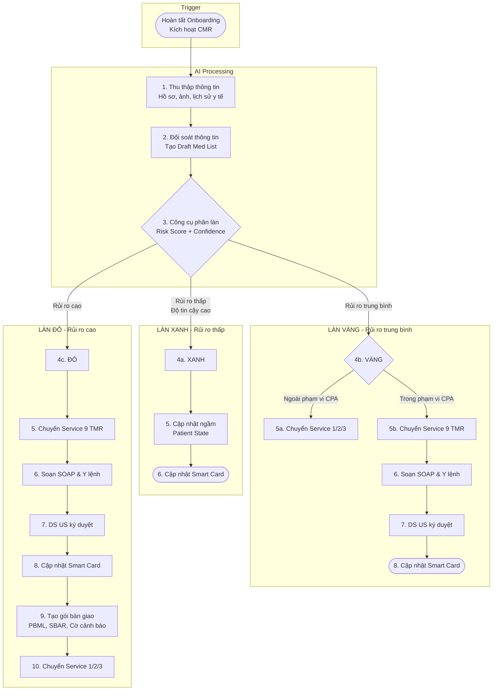
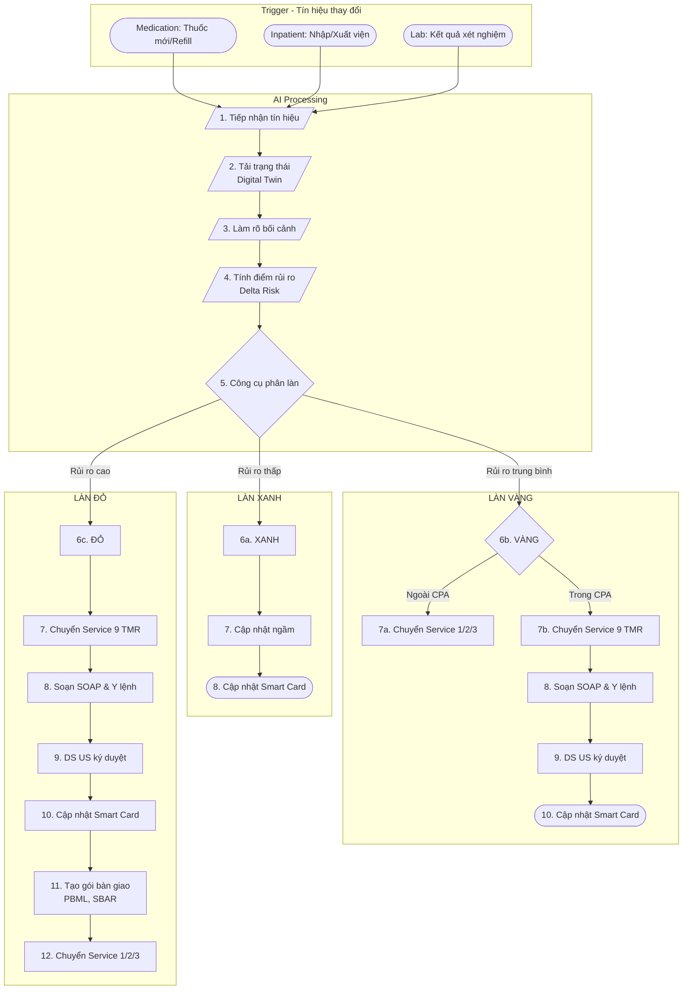

# High Level Flow - SERVICE 8 (CMR): Comprehensive Medication Review

---

## 1. Overview

Quy trình Đánh Giá Thuốc Toàn Diện (CMR) giúp xem xét hệ thống và toàn diện tất cả các vấn đề liên quan đến thuốc của bệnh nhân, bao gồm cả thuốc truyền thống và thảo dược. Đặc biệt phù hợp với cộng đồng người US gốc Việt.

Service này bao gồm 2 quy trình con:

1. **CMR**: Đánh giá thuốc toàn diện khi bệnh nhân hoàn tất onboarding
2. **Micro-CMR**: Xử lý nhanh các biến động nhỏ phát sinh liên tục trong quá trình điều trị

> **Lưu ý:** Khi phát hiện rủi ro cần đánh giá chi tiết (Làn Vàng/Đỏ), CMR sẽ chuyển sang **Service 9 (TMR)** để thực hiện Targeted Medication Review.

| Target Users                           | Platforms                               | Happy Paths | Type              |
| -------------------------------------- | --------------------------------------- | ----------- | ----------------- |
| Bệnh nhân, Dược sĩ VN, Dược sĩ US, PCP | Mobile App, Web Portal, Provider Portal | 8           | Clinical Workflow |

---

## 2. Flow Diagram

### 2.1 CMR Flow (Quy trình đánh giá thuốc toàn diện)

### 2.2 Micro-CMR Flow (Xử lý biến động)

---

## 3. Happy Paths

### 3.1 CMR (Đánh giá thuốc toàn diện)

| HP    | Tên                           | Điều kiện                                | Input                       | Output                              | Duration   | Link                                       |
| ----- | ----------------------------- | ---------------------------------------- | --------------------------- | ----------------------------------- | ---------- | ------------------------------------------ |
| HP-01 | CMR Làn Xanh - Auto Update    | Rủi ro thấp, độ tin cậy cao              | Onboarding data, Med photos | Updated Patient State, Smart Card   | 1-2 phút   | [Chi tiết](./hp-01-cmr-green-auto.md)      |
| HP-02 | CMR Làn Vàng - CPA Processing | Rủi ro TB, trong phạm vi CPA             | Draft Med List, CPA scope   | SOAP Note, Y lệnh đã ký, Smart Card | 15-30 phút | [Chi tiết](./hp-02-cmr-yellow-cpa.md)      |
| HP-03 | CMR Làn Vàng - Escalation     | Rủi ro TB, ngoài phạm vi CPA             | Draft Med List, Risk flags  | Gói chuyển tuyến đến Service 1 (Access_to_Care_247)/2/3  | 5-10 phút  | [Chi tiết](./hp-03-cmr-yellow-escalate.md) |
| HP-04 | CMR Làn Đỏ - Chuyển Service 9 (TMR) | Rủi ro cao, tương tác thuốc nghiêm trọng | Draft Med List, Risk alerts | PBML, SBAR, Gói chuyển tuyến        | 30-60 phút | [Chi tiết](./hp-04-cmr-red-full-tmr.md)    |

### 3.2 Micro-CMR (Xử lý biến động)

| HP    | Tên                                 | Điều kiện                  | Input                          | Output                            | Duration   | Link                                         |
| ----- | ----------------------------------- | -------------------------- | ------------------------------ | --------------------------------- | ---------- | -------------------------------------------- |
| HP-05 | Micro-CMR Làn Xanh - Silent Update  | Biến động nhỏ, rủi ro thấp | Change signal, Digital Twin    | Updated Patient State, Smart Card | 30 giây    | [Chi tiết](./hp-05-micro-green-auto.md)      |
| HP-06 | Micro-CMR Làn Vàng - CPA Processing | Biến động TB, trong CPA    | Change signal, CPA scope       | SOAP Note, Y lệnh đã ký           | 15-25 phút | [Chi tiết](./hp-06-micro-yellow-cpa.md)      |
| HP-07 | Micro-CMR Làn Vàng - Escalation     | Biến động TB, ngoài CPA    | Change signal, Risk flags      | Gói chuyển tuyến                  | 5-10 phút  | [Chi tiết](./hp-07-micro-yellow-escalate.md) |
| HP-08 | Micro-CMR Làn Đỏ - Urgent Review    | Biến động nghiêm trọng     | Change signal, Critical alerts | PBML, SBAR, Gói chuyển tuyến      | 20-40 phút | [Chi tiết](./hp-08-micro-red-urgent.md)      |

---

## 4. Điều kiện phân làn (Triage Criteria)

### 4.1 Tiêu chí chấm điểm

| Yếu tố                 | Xanh (0-2 điểm) | Vàng (3-5 điểm)  | Đỏ (6+ điểm)         |
| ---------------------- | --------------- | ---------------- | -------------------- |
| **Độ tin cậy dữ liệu** | ≥95% match      | 70-94% match     | <70% match           |
| **Số thuốc tương tác** | 0               | 1-2 minor        | 3+ hoặc major        |
| **Chống chỉ định**     | Không có        | Relative         | Absolute (Hard Stop) |
| **Dị ứng**             | Không có        | Không rõ ràng    | Đã xác nhận          |
| **Thuốc thảo dược**    | Không có        | Có, đã nhận dạng | Có, chưa nhận dạng   |
| **Lịch sử nhập viện**  | >6 tháng        | 1-6 tháng        | <1 tháng             |

### 4.2 Quy tắc Hard Stop (Dừng ngay)

Hệ thống **BẮT BUỘC** chuyển sang Làn Đỏ khi phát hiện:

- Tương tác thuốc mức độ **Major** hoặc **Contraindicated**
- Dị ứng đã xác nhận với thuốc đang dùng
- Liều thuốc vượt quá ngưỡng an toàn (>150% max dose)
- Thuốc kiểm soát đặc biệt (Controlled Substance) có bất thường

---

## 5. Actors & Responsibilities

| Actor          | Vai trò         | Trách nhiệm chính                                                      |
| -------------- | --------------- | ---------------------------------------------------------------------- |
| **AI System**  | Xử lý tự động   | Thu thập, đối soát, tính điểm rủi ro, phân làn                         |
| **Dược sĩ VN** | Xử lý nghiệp vụ | Xem xét ngoại lệ, soạn SOAP, tạo gói bàn giao, chuyển Service 9 (TMR) khi cần |
| **Dược sĩ US** | Ký duyệt        | Ký duyệt y lệnh, xác nhận CPA scope                                    |
| **PCP/Bác sĩ** | Tiếp nhận       | Nhận gói bàn giao từ Service 1 (Access_to_Care_247)/2/3                |

---

## 6. Forms & Documents

| Mã  | Tên biểu mẫu                  | Sử dụng trong bước | Mục đích                            |
| --- | ----------------------------- | ------------------ | ----------------------------------- |
| F1  | Bộ câu hỏi thu thập thông tin | Bước 1 (Thu thập)  | Thu thập dữ liệu từ bệnh nhân       |
| F2  | Draft Med List                | Bước 2 (Đối soát)  | Danh sách thuốc sơ bộ cần xác minh  |
| F3  | PBML (Personal Best Med List) | Bước 9/11 (Bàn giao) | Danh sách thuốc đã xác minh       |
| F5  | SOAP Form                     | Bước 6/8           | Ghi nhận đánh giá lâm sàng          |
| F6  | CPA Form                      | Bước 6/8           | Xác nhận phạm vi thỏa thuận hợp tác |
| F7  | SBAR Form                     | Bước 9/11          | Gói bàn giao khi chuyển tuyến       |

> **Lưu ý:** F4 (TMR Workbench) thuộc Service 9 (TMR)

---

## 7. Integration Points

### 7.1 Internal Services

| Service                 | Hướng    | Mục đích                            |
| ----------------------- | -------- | ----------------------------------- |
| Function Onboarding (Onboarding)  | Inbound  | Trigger CMR khi hoàn tất onboarding |
| Service 1 (Access_to_Care_247)  | Outbound | Chuyển tuyến ca cấp tính            |
| Service 2 (Specialist_Referral)    | Outbound | Chuyển tuyến đến chuyên khoa        |
| Service 4 (Chronic_Management) | Outbound | Chuyển tuyến ca phức tạp/mãn tính   |
| Service 9 (TMR)        | Outbound | Chuyển sang đánh giá thuốc mục tiêu khi Làn Vàng/Đỏ |
| Care Plan  | Outbound | Cập nhật kế hoạch chăm sóc          |

### 7.2 External Systems

| System           | Hướng   | Mục đích                   |
| ---------------- | ------- | -------------------------- |
| Insurance Claims | Inbound | Xác minh thuốc từ bảo hiểm |
| Hospital ADT     | Inbound | Tín hiệu nhập/xuất viện    |
| Lab Systems      | Inbound | Kết quả xét nghiệm         |
| Pharmacy         | Inbound | Medication refill signals  |

---

## 8. HIPAA Compliance Notes

| Yêu cầu                | Cách thực hiện                                  |
| ---------------------- | ----------------------------------------------- |
| **PHI Access Control** | Chỉ Dược sĩ VN/US được phép xem chi tiết thuốc  |
| **Audit Logging**      | Mọi thao tác CRUD trên Med List được ghi log    |
| **Encryption**         | Ảnh thuốc và PBML được mã hóa AES-256           |
| **Minimum Necessary**  | AI chỉ truy cập dữ liệu cần thiết cho đánh giá  |
| **Authorization**      | Y lệnh phải có chữ ký của Dược sĩ US (licensed) |

---

## 9. Version History

| Version | Date       | Author       | Changes                          |
| ------- | ---------- | ------------ | -------------------------------- |
| 1.0.0   | 2026-01-02 | BA IT (Dung) | Initial high-level flow creation |
| 2.0.0   | 2026-04-06 | BA IT        | Tách CMR/TMR — CMR giữ lại, TMR chuyển sang Service 9 |

---

**Source Documents:**

- `docs/02-product/service-flows/services_latest_version/15.CMR-TMR/quy_trinh_CMR_TMR.md`
- `docs/02-product/service-flows/services_latest_version/15.CMR-TMR/quy_trinh_Micro_CMR.md`

**Next Steps:**

1. Tạo chi tiết từng Happy Path (HP-01 đến HP-08)
2. Tạo Function Specs cho các bước trong mỗi HP
3. Cập nhật Function Index
