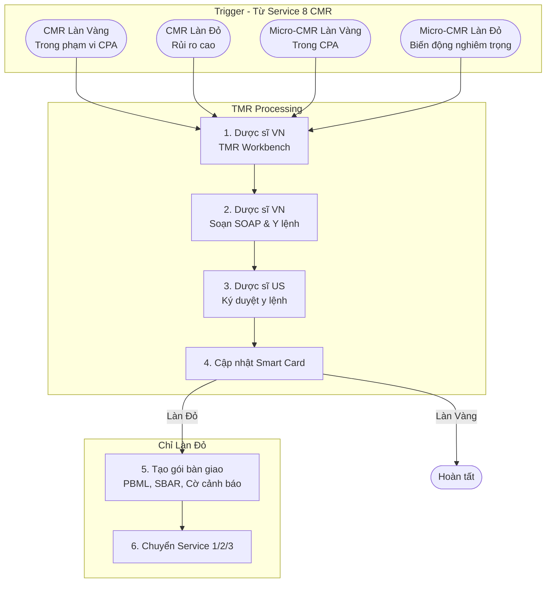

# High Level Flow - SERVICE 9 (TMR): Targeted Medication Review

---

## 1. Overview

Quy trình Đánh Giá Thuốc Mục Tiêu (TMR) — xem xét thuốc cụ thể theo vấn đề, tập trung vào medication-related problems. Được kích hoạt từ Service 8 (CMR) khi phát hiện rủi ro cần đánh giá chi tiết (Làn Vàng hoặc Làn Đỏ).

| Target Users                    | Platforms                  | Happy Paths | Type              |
| ------------------------------- | -------------------------- | ----------- | ----------------- |
| Dược sĩ VN, Dược sĩ US, PCP    | Web Portal, Provider Portal | 4           | Clinical Workflow |

---

## 2. Flow Diagram

### TMR Flow (Quy trình đánh giá thuốc mục tiêu)

---

## 3. Happy Paths

| HP       | Tên                                     | Điều kiện                                | Input                                      | Output                              | Duration   |
| -------- | --------------------------------------- | ---------------------------------------- | ------------------------------------------ | ----------------------------------- | ---------- |
| HP-TMR-01 | TMR từ CMR Làn Vàng - CPA Processing   | Rủi ro TB, trong phạm vi CPA             | Risk Score, Draft Med List, CPA scope      | SOAP Note, Y lệnh đã ký, Smart Card | 15-30 phút |
| HP-TMR-02 | TMR từ CMR Làn Đỏ - Full TMR           | Rủi ro cao, tương tác thuốc nghiêm trọng | Risk Score, Draft Med List, Risk alerts    | PBML, SBAR, Gói chuyển tuyến        | 30-60 phút |
| HP-TMR-03 | TMR từ Micro-CMR Làn Vàng - CPA Processing | Biến động TB, trong CPA               | Change signal, Risk Score, CPA scope       | SOAP Note, Y lệnh đã ký             | 15-25 phút |
| HP-TMR-04 | TMR từ Micro-CMR Làn Đỏ - Urgent Review | Biến động nghiêm trọng                  | Change signal, Risk Score, Critical alerts | PBML, SBAR, Gói chuyển tuyến        | 20-40 phút |

---

## 4. Quy trình TMR chi tiết

### Bước 1. Dược sĩ VN — TMR Workbench (F4)

- Nhận dữ liệu từ Service 8 (CMR): Risk Score, Draft Med List, Patient State
- Xem xét ngoại lệ trên TMR Workbench
- Review thuốc cụ thể theo vấn đề (medication-related problems):
  - Drug-drug interactions
  - Drug-disease interactions
  - Duplicate therapy
  - Dosage appropriateness
  - Adverse drug reactions
  - Medication adherence issues

### Bước 2. Dược sĩ VN — Soạn SOAP & Y lệnh

- Sử dụng SOAP Form (F5) + CPA Form (F6)
- Ghi nhận findings từ TMR Workbench
- Đề xuất thay đổi thuốc nếu cần

### Bước 3. Dược sĩ US — Ký duyệt y lệnh

- Xác nhận CPA scope
- Ký duyệt y lệnh

### Bước 4. Hệ thống — Cập nhật Smart Card

- Cập nhật Patient State với kết quả TMR

### Bước 5. (Chỉ Làn Đỏ) Dược sĩ VN — Tạo gói bàn giao

- Tạo PBML (F3), SBAR (F7), Cờ cảnh báo

### Bước 6. (Chỉ Làn Đỏ) Hệ thống — Chuyển Service 1/2/3

- Chuyển tuyến đến Service 1 (Access_to_Care_247) / Service 2 (Specialist_Referral) / Service 3 (Schedule_Video_Visit)

---

## 5. Actors & Responsibilities

| Actor          | Vai trò         | Trách nhiệm chính                                             |
| -------------- | --------------- | ------------------------------------------------------------- |
| **Dược sĩ VN** | Xử lý nghiệp vụ | Thực hiện TMR trên TMR Workbench, soạn SOAP, tạo gói bàn giao |
| **Dược sĩ US** | Ký duyệt        | Ký duyệt y lệnh, xác nhận CPA scope                           |
| **PCP/Bác sĩ** | Tiếp nhận       | Nhận gói bàn giao từ Service 1/2/3 (trường hợp Làn Đỏ)        |

---

## 6. Forms & Documents

| Mã  | Tên biểu mẫu                  | Sử dụng trong bước | Mục đích                            |
| --- | ----------------------------- | ------------------ | ----------------------------------- |
| F3  | PBML (Personal Best Med List) | Bước 5 (Làn Đỏ)   | Danh sách thuốc đã xác minh         |
| F4  | TMR Workbench                 | Bước 1             | Công cụ làm việc cho Dược sĩ VN     |
| F5  | SOAP Form                     | Bước 2             | Ghi nhận đánh giá lâm sàng          |
| F6  | CPA Form                      | Bước 2             | Xác nhận phạm vi thỏa thuận hợp tác |
| F7  | SBAR Form                     | Bước 5 (Làn Đỏ)   | Gói bàn giao khi chuyển tuyến       |

---

## 7. Integration Points

### 7.1 Internal Services

| Service                                      | Hướng    | Mục đích                                       |
| -------------------------------------------- | -------- | ---------------------------------------------- |
| Service 8 (CMR)                              | Inbound  | Nhận yêu cầu TMR khi Làn Vàng/Đỏ              |
| Service 1 (Access_to_Care_247)  | Outbound | Chuyển tuyến ca cấp tính (Làn Đỏ)              |
| Service 2 (Specialist_Referral)   | Outbound | Chuyển tuyến đến chuyên khoa (Làn Đỏ)          |
| Service 3 (Schedule_Video_Visit)     | Outbound | Chuyển tuyến ca phức tạp/mãn tính (Làn Đỏ)     |
| Care Plan                       | Outbound | Cập nhật kế hoạch chăm sóc                      |

---

## 8. HIPAA Compliance Notes

| Yêu cầu                | Cách thực hiện                                   |
| ---------------------- | ------------------------------------------------ |
| **PHI Access Control** | Chỉ Dược sĩ VN/US được phép xem chi tiết thuốc   |
| **Audit Logging**      | Mọi thao tác CRUD trên Med List được ghi log     |
| **Encryption**         | Ảnh thuốc và PBML được mã hóa AES-256            |
| **Minimum Necessary**  | Chỉ truy cập dữ liệu cần thiết cho đánh giá mục tiêu |
| **Authorization**      | Y lệnh phải có chữ ký của Dược sĩ US (licensed)  |

---

## 9. Version History

| Version | Date       | Author       | Changes                                              |
| ------- | ---------- | ------------ | ---------------------------------------------------- |
| 1.0.0   | 2026-04-06 | BA IT        | Tạo mới — tách TMR từ Service 8 (CMR_TMR) cũ        |

---

**Source Documents:**

- Tách từ `docs/02-product/ba-specs/service-8-CMR_TMR/` (phiên bản cũ)
- `docs/02-product/service-flows/services_latest_version/15.CMR-TMR/quy_trinh_CMR_TMR.md`

**Next Steps:**

1. Tạo chi tiết từng Happy Path (HP-TMR-01 đến HP-TMR-04)
2. Tạo Function Specs cho TMR Workbench
3. Cập nhật Function Index
